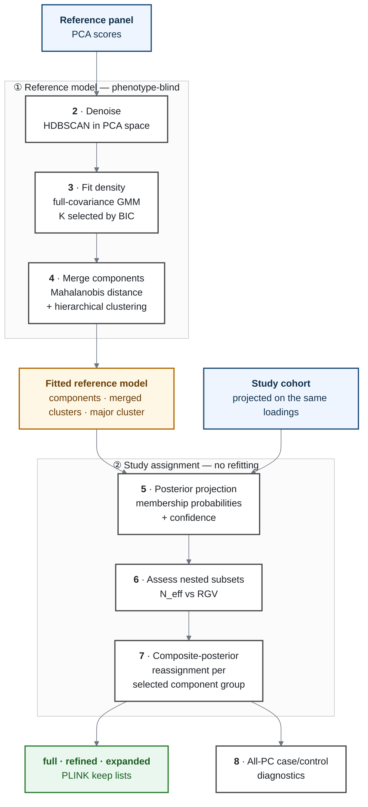

# PopGMM: Probabilistic Ancestry Inference and Population Stratification Control

**An Unsupervised Learning Approach via PCA + Gaussian Mixture Models (GMM)**

PopGMM identifies genetically coherent samples before case/control association
analysis. It learns population structure from a PCA reference panel, represents
that structure as a probability density, and projects the study cohort into the
fitted model — without letting study phenotypes influence ancestry estimation.

The deliverable is a set of PLINK-compatible `--keep` files defining nested study
subsets that make the trade-off between association power and residual
heterogeneity explicit. Posterior probabilities, model-selection evidence,
diagnostic figures, and run provenance accompany them, so every list can be
traced to the decisions that produced it.

PopGMM does not infer ethnicity or a definitive ancestry label. It describes
structure relative to the supplied reference panel and its PCA coordinate system.

---

## Motivation

### Stratification confounding

Allele frequencies vary across populations. If cases and controls differ in
ancestry composition, a variant can appear associated with disease because it
tracks ancestry rather than biology — inflating test statistics, creating
false-positive loci, and obscuring genuine signals.

Principal-component covariates and mixed models adjust for structure *during*
association testing. PopGMM addresses a complementary question earlier in the
analysis:

> Which samples form a sufficiently coherent ancestry subset for the intended
> case/control analysis, and what is lost or gained when that subset is made
> narrower or broader?

A single hard ancestry label cannot express that uncertainty, and a manually
drawn PCA boundary is difficult to reproduce or audit.

### From density elements to population structure

PCA turns genome-wide similarity into a coordinate system but does not decide
where one population region ends and another begins. Real PCA clouds are skewed,
elongated, overlapping, or joined by gradients, so one named population may
require several Gaussian components to describe its geometry.

PopGMM therefore works at two levels:

- a **component** $k$ is a local density element — on its own it makes no
  population claim;
- an **ancestry cluster** $c$ is a coherent region obtained by merging nearby
  components, and it is at this level that the model recovers documented
  structure ([§4](#4-merging-components-into-ancestry-regions)).

### Uncertainty is information

Samples near a population boundary are not as confidently placed as samples at a
cluster center. PopGMM assigns posterior membership probabilities rather than
nearest-centroid labels, so each study sample carries a distribution over the
fitted components alongside its assignment and confidence.

### Homogeneity versus power

A narrow sample set reduces residual genetic spread but discards usable cases and
controls; a broad set preserves sample size but retains more structure. In an
unbalanced study, raw count also overstates power — adding many controls to few
cases contributes less than the total suggests.

PopGMM makes the exchange visible by reporting effective sample size against
residual genetic spread, and emits several nested sample sets rather than hiding
the choice behind one threshold.

---

## Workflow



### 1. A shared PCA coordinate system

PopGMM starts from PCA scores generated upstream. Study samples must be projected
onto the reference loadings so that both datasets share axes, scale, and
orientation: a study point can only be evaluated under the reference density if
its coordinates carry the same meaning. The score table is split by IID
convention into a reference panel and a study cohort; case/control status is kept
for later assessment but never used to fit the density.

Density estimation uses the leading two principal components, so each sample is a
point $x_n \in \mathbb{R}^2$. Higher PCs are read from the input and used for
post-assignment diagnostics ([§8](#8-residual-structure-diagnostics)), never for
fitting.

### 2. Denoising the reference panel

A Gaussian mixture must explain every observation, so sparse isolated samples
attract a spurious component or inflate a covariance, and the distortion
propagates through merging and assignment. HDBSCAN removes them: dense reference
structure is retained, sparse off-manifold observations are marked as noise.

Density clustering compares distances across axes and is scale-sensitive, so it
runs on z-scaled PCs; the mixture is fitted on raw PCs, where a full covariance
absorbs any per-axis rescaling. Only the reference panel is denoised — study
samples keep their place until their probabilities have been evaluated.

### 3. Learning the reference density

The denoised panel is modelled as a mixture of $K$ components with full covariances,

```math
p(x \mid \theta) \;=\; \sum_{k=1}^{K} \pi_k \, \mathcal{N}(x \mid \mu_k, \Sigma_k),
\qquad \theta = \{\pi_k, \mu_k, \Sigma_k\}_{k=1}^{K}
```

fitted by expectation–maximization. The order $K$ is selected over a candidate
range by the Bayesian Information Criterion,

```math
\hat{K} \;=\; \arg\min_{K} \mathrm{BIC}(K),
\qquad \mathrm{BIC}(K) \;=\; -2\,\ell(\hat{\theta}_K) \;+\; p_K \log N
```

which penalises the parameter count $p_K$ against the maximised log-likelihood.
Each component contributes a weight, a center, and a covariance describing the
orientation and spread of a local ancestry cloud. $\hat{K}$ is a
density-modelling choice, not an estimate of how many human populations exist.

> The EM iteration behind the fit — initialization, E-step, M-step,
> regularization, convergence test — is derived in
> [`gmm_convergence_diagram.EN.md`](gmm_convergence_diagram.EN.md).

### 4. Merging components into ancestry regions

Components are compared by the Mahalanobis distance between their means under
their pooled covariance,

```math
S_{ij} \;=\; \tfrac{1}{2}\left(\Sigma_i + \Sigma_j\right),
\qquad d_{ij} \;=\; \sqrt{(\mu_i - \mu_j)^{\top} S_{ij}^{-1} (\mu_i - \mu_j)}
```

which — unlike Euclidean distance — accounts for scale, elongation, and
orientation. The matrix $D = [d_{ij}]$ is clustered by hierarchical linkage and
cut at a threshold, giving a map $k \mapsto c(k)$ from components to ancestry
clusters. Posterior mass follows the map,

```math
r_{nc} \;=\; \sum_{k \,:\, c(k) = c} r_{nk}
```

so probability is preserved as the description moves from local density elements
to broader regions. The **major cluster** follows an explicit rule: the merged
group containing the most components.

Merging is also what makes the model checkable. On a BioBank Japan panel the
merged clusters line up with independently published population structure, and a
tighter cut subdivides the same regions rather than rearranging them — so the
components do carry ancestry information, even though no single component is a
population.


*Illustrative, from an earlier fit of the same panel. Published structure
reproduced from Yamamoto et al. (2024),* Genetic legacy of ancient
hunter-gatherer Jomon in Japanese populations, *Nature Communications 15, 9780
(CC BY 4.0).*

### 5. Projecting the study cohort

The cohort is evaluated under the fitted model without refitting it. Each study
point $x_n$ receives responsibilities over the original components,

```math
r_{nk} \;=\; \frac{\pi_k \, \mathcal{N}(x_n \mid \mu_k, \Sigma_k)}
{\sum_{j=1}^{K} \pi_j \, \mathcal{N}(x_n \mid \mu_j, \Sigma_j)}
```

evaluated at the fixed estimate $\hat{\theta}$, together with an assignment
$\arg\max_k r_{nk}$ and a confidence $\max_k r_{nk}$.

The projection is one-way by design: cohort composition, disease status, and
case/control imbalance cannot move the learned boundaries. It also keeps
ambiguous samples visible — a low-confidence assignment stays available for
review instead of disappearing behind a hard label.

### 6. Assessing nested subsets

The major cluster can still contain internal structure. Its components are ranked
by observed case/control ratio, and each cumulative set is scored on two
complementary quantities — effective sample size and residual genetic spread:

```math
N_{\mathrm{eff}} \;=\; \frac{4}{n_{\mathrm{case}}^{-1} + n_{\mathrm{ctrl}}^{-1}},
\qquad
\mathrm{RGV} \;=\; \left(\det \Sigma_{\mathrm{PC}_{1,2}}\right)^{1/4}
```

$N_{\mathrm{eff}}$ is the harmonic form that association power actually scales
with, so an unbalanced set is penalised against its raw total. $\mathrm{RGV}$,
the root generalized variance, summarises dispersion while accounting for
correlation between the leading axes, which a per-axis variance would miss.

The resulting curve does not name a correct subset; it prices the exchange — how
much effective sample size is gained as the region broadens, and how much
residual spread comes with it. The cuts are analysis decisions, open to review.

### 7. Composite-posterior reassignment

A selected component set $\mathcal{G}$ is treated as one composite group.
Responsibilities are computed over the **original** components first, then summed
across $\mathcal{G}$, with every unselected component still competing:

```math
\tilde{r}_{n\mathcal{G}} \;=\; \sum_{k \in \mathcal{G}} r_{nk}
\qquad\text{and}\qquad
\hat{g}_n = \mathcal{G}
\;\;\Longleftrightarrow\;\;
\tilde{r}_{n\mathcal{G}} \;>\; \max_{k \notin \mathcal{G}} r_{nk}
```

> With $r_n = (0.30, 0.30, 0.40)$ over components $(A, B, C)$ and
> $\mathcal{G} = \lbrace A, B \rbrace$, the sample joins $\mathcal{G}$ at $0.60$ — not $C$.

The order matters. Merging first and projecting into the coarsened mixture would
discard exactly the joint evidence that places a borderline sample in the broader
region, so membership is a property of the group rather than of any single
component.

### 8. Residual-structure diagnostics

After assignment, case and control distributions are compared across all
available PCs, not only the two used for fitting. These checks surface residual
structure invisible in the fitting view; they are reported for quality control
and never redefine the model.

---

## Outputs

Final files are written to `results/keep_lists/`. Each `.fid_iid.txt` is a
headerless, tab-separated `FID IID` list accepted by PLINK/PLINK2.

| Output | Contents |
|---|---|
| `full_mainland.fid_iid.txt` | Study samples in the complete major cluster |
| `refined_mainland.fid_iid.txt` | Narrower primary-analysis subset |
| `expanded_mainland.fid_iid.txt` | Broader sensitivity subset, between refined and full |
| `reference_full_mainland.fid_iid.txt` | Reference-panel samples in the major cluster |
| `keep_list_summary.tsv` | The lists side by side: counts, balance, $N_{\mathrm{eff}}$, RGV, components |

`mainland` is the configured display label, not a model output.

```bash
plink2 --pfile <dataset> \
  --keep results/keep_lists/refined_mainland.fid_iid.txt \
  --make-pgen \
  --out <dataset>.popgmm
```

The rest of the tree documents how those lists were derived. Bracketed numbers
are the workflow stages above.

```text
results/
├── keep_lists/                    final PLINK-compatible sample lists
├── 01_reference_model/
│   ├── denoising/           [2]   noise labels, retained panel, figures
│   ├── mixture_model/       [3]   BIC search, fitted components, audit logs
│   └── component_merging/   [4]   merge map, distances, major cluster, robustness
├── 02_cohort_assignment/    [5,8] per-sample posteriors, confidence, diagnostics
├── 03_rank_selection/       [6]   cumulative subset metrics and trade-off figure
├── 04_subcluster_variants/  [7,8] full/refined/expanded reassignment and diagnostics
└── provenance/                    configuration and environment snapshots
```

---

## Inputs

| Input | Expected content |
|---|---|
| PCA eigenvalue file | One eigenvalue per line, used to annotate explained variance |
| PLINK2 `--score` file (`.sscore`) | `FID`, `IID`, phenotype, and numerically ordered PC score columns |

PC columns are detected automatically as `PC<n>` or `PC<n>_AVG`. The essential
requirement is that study scores were projected from the same reference loadings
that define the reference scores — PopGMM does not repair incompatible PCA
coordinate systems.

Inputs live under `data/` and are not tracked here. Paths, cohort labels, seeds,
and selection choices are centralized in
[`scripts/params.py`](scripts/params.py).

---

## Running the workflow

```bash
conda env create -f environment.yml
conda activate popgmm
python -m ipykernel install --user --name popgmm --display-name popgmm
```

Open [`workflow.ipynb`](workflow.ipynb), select the `popgmm` kernel, and run all
cells top to bottom from the repository root. The notebook orchestrates; the
modules in `scripts/` implement the stages.

Two environment variables redirect a run without editing source:

```bash
POPGMM_DATA_ROOT=/path/to/data
POPGMM_RESULTS_ROOT=/path/to/results
```

`RUN_MODE` selects `"fresh"` or `"resume"`. Use `"fresh"` for any final analysis:
resume reuses cached upstream computations, which leaves numeric results
unchanged but not the figures, since a stage that never executes cannot restore
the global plotting state the next one inherits.

---

## Interpretation and limitations

- PopGMM describes structure *within a supplied reference PCA space*. It does not
  establish ethnicity, identity, or ancestry independently of that reference.
- The major cluster is defined algorithmically. Its display name is an analyst's
  interpretation, requiring validation against the reference-panel design and
  prior population knowledge — not a model-discovered label.
- Responsibilities quantify uncertainty *under the fitted mixture*, not
  uncertainty in genotype processing, panel construction, or PCA projection.
- The refined and expanded cuts are analysis choices on a power-versus-homogeneity
  curve, not biological boundaries.
- A more homogeneous set removes one source of stratification, not all residual
  structure. Association-model covariates, relatedness handling, and sensitivity
  analyses may still be required.
- Case/control labels are excluded from model fitting but used afterwards to
  assess balance and effective sample size: ancestry learning is unsupervised,
  the final subset design is study-aware.

---

## Documentation and implementation

| Document | Contents |
|---|---|
| [`gmm_convergence_diagram.EN.md`](gmm_convergence_diagram.EN.md) | EM updates, convergence, BIC, component distance, merging, symbol definitions |
| [`gmm_convergence_diagram.CN.md`](gmm_convergence_diagram.CN.md) | Chinese version of the same document |
| [`docs/reproducibility_probe.md`](docs/reproducibility_probe.md) | Numerical reproducibility investigation |
| [`docs/environment_snapshot.txt`](docs/environment_snapshot.txt) | Environment used to produce the committed artifacts |

| Stage | Module |
|---|---|
| — | `scripts/data_loading.py` — input loading, cohort separation |
| **2** | `scripts/hdbscan_filtering.py` — reference denoising |
| **3** | `scripts/gmm_clustering.py` — mixture fitting and order selection |
| **4** | `scripts/gmm_component_merging.py` — merging and robustness |
| **5** | `scripts/cohort_assignment.py` — posterior assignment |
| **6** | `scripts/rank_selection.py` — $N_{\mathrm{eff}}$ vs RGV assessment |
| **7** | `scripts/subcluster_assignment.py` — composite-group reassignment |
| **8** | `scripts/major_cluster_all_pcs_kde.py`, `scripts/subcluster_all_pcs_kde.py` — all-PC diagnostics |
| — | `scripts/keep_lists.py` — PLINK keep-list generation |
