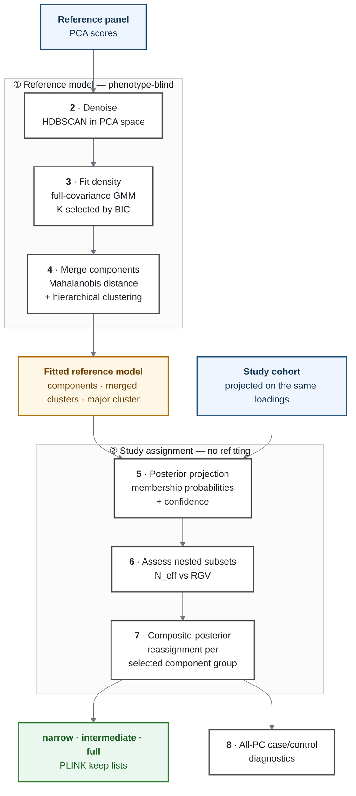

# PopGMM: Probabilistic Ancestry Inference and Population Stratification Control

**An Unsupervised Learning Approach via PCA + Gaussian Mixture Models (GMM)**

PopGMM identifies genetically coherent samples before case/control association
analysis. It learns population structure from a PCA reference panel, represents
that structure as a probability density, and projects the study cohort into the
fitted model — without letting study phenotypes influence ancestry estimation.

The deliverable is a set of PLINK-compatible `--keep` files defining nested study
subsets that make the trade-off between association power and residual
heterogeneity explicit.

---

## What you get

Three nested sample lists, plus the same selection applied to the reference panel:

| File in `results/keep_lists/` | Contents |
|---|---|
| `narrow_mainland.fid_iid.txt` | Tightest cut — least residual spread, fewest samples |
| `intermediate_mainland.fid_iid.txt` | Between narrow and full |
| `full_mainland.fid_iid.txt` | Every component of the major cluster — the widest defensible set |
| `reference_full_mainland.fid_iid.txt` | Reference-panel samples in the same region |
| `keep_list_summary.tsv` | The lists side by side: counts, balance, effective sample size, residual spread |

Each list is headerless, tab-separated `FID IID` — feed it straight to PLINK:

```bash
plink2 --pfile <dataset> \
  --keep results/keep_lists/narrow_mainland.fid_iid.txt \
  --make-pgen \
  --out <dataset>.popgmm
```

Posterior probabilities, model-selection evidence, diagnostic figures and run
provenance accompany the lists, so every list can be traced to the decisions that
produced it. See [`docs/outputs.md`](docs/outputs.md).

---

## How it works



The reference model is fitted without ever seeing a phenotype; the study cohort
is then evaluated under it without refitting, so cohort composition cannot move
the learned boundaries. Because a narrow set reduces residual structure while a
broad set preserves power, the pipeline emits several nested sets and reports
what each one costs, instead of hiding the choice behind one threshold.

**Why each step exists, with the derivations:** [`docs/method.md`](docs/method.md).

---

## Install

```bash
conda env create -f environment.yml
conda activate popgmm
python -m ipykernel install --user --name popgmm --display-name popgmm
```

## Run

Open [`workflow.ipynb`](workflow.ipynb), select the `popgmm` kernel, and run all
cells top to bottom **from the repository root**.

Three environment variables redirect a run without editing source. They must be
set before the kernel starts — they are read at import:

```bash
POPGMM_DATA_ROOT=/path/to/data
POPGMM_RESULTS_ROOT=/path/to/results
POPGMM_RUN_MODE=resume            # default "fresh"
```

`RUN_MODE` selects `"fresh"` or `"resume"`. **Use `"fresh"` for any final
analysis.** Resume reuses cached upstream computations, which leaves numeric
results unchanged but writes none of the cached stages' files, so the result tree
becomes a mix of two runs; `tools/verify_results.py` refuses to verify such a
tree. The environment variable exists so iterating with resume does not require
editing — and accidentally committing — the default.

---

## Inputs

| Input | Expected content |
|---|---|
| PCA eigenvalue file | One eigenvalue per line, used to annotate explained variance |
| PLINK2 `--score` file (`.sscore`) | `FID`, `IID`, phenotype, and numerically ordered PC score columns |

PC columns are detected automatically as `PC<n>` or `PC<n>_AVG`. The essential
requirement is that study scores were projected from **the same reference
loadings** that define the reference scores — PopGMM does not repair incompatible
PCA coordinate systems.

Inputs live under `data/` and are not tracked here. Paths, cohort labels, seeds
and selection choices are centralized in
[`scripts/params.py`](scripts/params.py).

---

## Outputs

```text
results/
├── keep_lists/              the deliverable, above
├── 01_reference_model/      denoising · mixture fit · component merging
├── 02_cohort_assignment/    per-sample posteriors and confidence
├── 03_rank_selection/       the power-versus-homogeneity evidence
├── 04_subcluster_variants/  narrow · intermediate · full
└── provenance/              configuration and environment snapshots
```

Every file is described in [`docs/outputs.md`](docs/outputs.md).

---

## Limitations

- PopGMM describes structure *within a supplied reference PCA space*. It does not
  infer ethnicity, identity, or ancestry independently of that reference.
- The major cluster is defined algorithmically; its display name is an analyst's
  interpretation, not a model-discovered label.
- The narrow and intermediate cuts are points on a power-versus-homogeneity
  curve, not biological boundaries. Neither is the "better" list: a narrower set
  buys homogeneity with effective sample size, and a broader one the reverse.
  Each is derived by a stated rule (`params.RANK_CUT_MODE = "auto"`) or set by
  hand (`"manual"`); either way both answers are computed and compared in
  `results/03_rank_selection/cut_record.tsv`.
- A more homogeneous set removes one source of stratification, not all residual
  structure. Association-model covariates, relatedness handling and sensitivity
  analyses may still be required.

The full list, with the reasoning, is in
[`docs/method.md`](docs/method.md#interpretation-and-limitations).

---

## Documentation

| Document | Answers |
|---|---|
| [`docs/method.md`](docs/method.md) | Why each stage exists, with the mathematics |
| [`docs/outputs.md`](docs/outputs.md) | What every file in `results/` contains |
| [`docs/gmm_convergence_diagram.EN.md`](docs/gmm_convergence_diagram.EN.md) | EM updates, convergence, BIC, component distance, merging |
| [`docs/gmm_convergence_diagram.CN.md`](docs/gmm_convergence_diagram.CN.md) | Chinese version of the same document |
| [`docs/reproducibility_probe.md`](docs/reproducibility_probe.md) | Is the pipeline bit-deterministic? |
| [`docs/environment_snapshot.txt`](docs/environment_snapshot.txt) | The machine that produced the committed artifacts |
