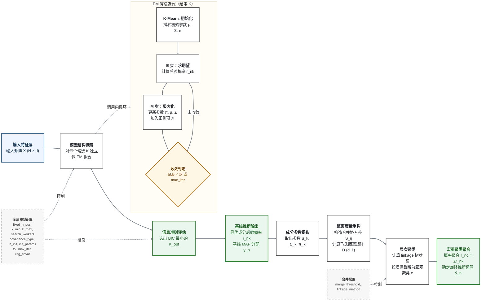

# GMM（EM）原理与收敛示意图

PopGMM 中参考面板的建模过程：用 EM 把高斯混合模型拟合到样本的低维特征上，用
贝叶斯信息准则选择成分数，再按马氏距离把拟合出的成分合并为祖源聚类。

> **适用范围。** 本文只覆盖参考模型这一侧的数学 —— EM 迭代、模型选择、成分合并。
> 去噪、把研究队列投射进已拟合的混合模型、子集选择，以及最终的 keep-list 交付物，
> 见 [`README.md`](../README.md)。



## 符号说明

| 符号 | 在流程中的含义 |
|---|---|
| $X \in \mathbb{R}^{N \times d}$ | **输入矩阵** —— $N$ 个样本，每个样本有 $d$ 个特征维度（主成分）。 |
| $K$ | **候选成分数** —— 结构探索阶段逐一评估的成分数量。 |
| $K_{\mathrm{opt}}$ | **选定成分数** —— 使 BIC 最小的模型复杂度。 |
| $\pi_k, \mu_k, \Sigma_k$ | **成分参数** —— 第 $k$ 个高斯的混合权重、均值向量、协方差矩阵。 |
| $r_{nk}$ | **责任度** —— 样本 $n$ 属于成分 $k$ 的后验概率（E 步，软分配）。 |
| $y_n$ | **基线标签** —— 合并之前，直接由 $r_{nk}$ 取最大后验得到的离散分配。 |
| $\lambda I$ | **协方差正则项** —— 即 `reg_covar`；保证每个 $\Sigma_k$ 可逆且数值稳定。 |
| $LB$ | **下界** —— sklearn 记录的每样本平均对数似然 $LB = \ell(\theta)/N$。 |
| $\Delta LB < \mathrm{tol}$ | **收敛判据** —— 单次迭代的 $LB$ 增量低于 `tol` 时停止。 |
| $S_{ij},\ d_{ij},\ D$ | **距离度量** —— 合并协方差、成分间马氏距离、以及完整距离矩阵。 |
| $c = \mathrm{map}(k)$ | **合并映射** —— 层次聚类把成分 $k$ 归入宏观聚类 $c$。 |
| $r_{nc}$ | **聚合概率** —— 属于宏观聚类 $c$ 的概率，由其所含成分求和得到。 |
| $\hat{y}_n$ | **最终标签** —— 对 $r_{nc}$ 取最大得到的离散分配。 |

## 怎么读这张图

混合模型是若干高斯的加权和，用隐变量 $z$ 表示成分归属。每一轮 EM 交替做两件事：
算出每个样本属于各成分的概率（E 步，**软**分配），再以 $r_{nk}$ 为权重重新估计
$\pi, \mu, \Sigma$ （M 步）。外层循环对每个候选 $K$ 重复这一过程并保留 BIC 最小的
模型；合并阶段再把选定的模型粗化为祖源聚类。

## 公式面板

### 记号与目标

数据 $X = \lbrace x_n \rbrace_{n=1}^{N}$，其中 $x_n \in \mathbb{R}^{d}$，维度 $d$
由 `fixed_n_pcs` 决定。参数
$\theta = \lbrace \pi_k, \mu_k, \Sigma_k \rbrace_{k=1}^{K}$，满足
$\sum_k \pi_k = 1$。

高斯密度：

```math
\mathcal{N}(x \mid \mu, \Sigma)
= (2\pi)^{-d/2}\,\lvert\Sigma\rvert^{-1/2}
\exp\!\left(-\tfrac{1}{2}(x-\mu)^{\top}\Sigma^{-1}(x-\mu)\right)
```

混合模型的对数似然：

```math
\ell(\theta) \;=\; \sum_{n=1}^{N} \log\!\left(\sum_{k=1}^{K} \pi_k\,\mathcal{N}(x_n \mid \mu_k, \Sigma_k)\right)
```

### EM 的核心（用 $Q$ 函数组织）

引入隐变量 $z_n \in \lbrace 1, \dots, K \rbrace$ 表示 $x_n$ 由哪个成分生成。记
$\theta^{(t)}$ 为当前估计，EM 迭代极大化完全数据对数似然的期望：

```math
Q\!\left(\theta, \theta^{(t)}\right)
= \mathbb{E}_{Z \mid X, \theta^{(t)}}\!\left[\log p(X, Z \mid \theta)\right]
```

期望是对离散隐变量取的，因此 $Q$ 可化为以责任度为权重的双重求和，从而可计算：

```math
Q\!\left(\theta, \theta^{(t)}\right)
= \sum_{n=1}^{N}\sum_{k=1}^{K} r_{nk}\left(\log \pi_k + \log \mathcal{N}(x_n \mid \mu_k, \Sigma_k)\right),
\qquad r_{nk} = p\!\left(z_n = k \mid x_n, \theta^{(t)}\right)
```

### E 步 —— 责任度

```math
r_{nk} \;\equiv\; p\!\left(z_n = k \mid x_n, \theta^{(t)}\right)
\;=\; \frac{\pi_k\,\mathcal{N}(x_n \mid \mu_k, \Sigma_k)}
{\sum_{j=1}^{K} \pi_j\,\mathcal{N}(x_n \mid \mu_j, \Sigma_j)}
```

每个样本按比例分摊到所有成分 —— 正是这一点保留了硬性最近质心规则会丢掉的不确定性。

### M 步 —— 加权极大似然更新

记有效成分规模 $N_k = \sum_{n=1}^{N} r_{nk}$：

```math
\begin{aligned}
\pi_k &\leftarrow \frac{N_k}{N}, \\[2pt]
\mu_k &\leftarrow \frac{1}{N_k}\sum_{n=1}^{N} r_{nk}\,x_n, \\[2pt]
\Sigma_k &\leftarrow \frac{1}{N_k}\sum_{n=1}^{N} r_{nk}\,(x_n-\mu_k)(x_n-\mu_k)^{\top} \;+\; \lambda I
\end{aligned}
```

其中的岭项 $\lambda I$ 即 `reg_covar`；没有它，某个成分坍缩到少数几个点时协方差会奇异，
似然随之发散。

### 收敛

sklearn 在每轮 EM 记录 `lower_bound`，即每样本平均对数似然 $LB = \ell(\theta)/N$，
当其增量低于容差时停止：

```math
\Delta LB \;=\; LB^{(t)} - LB^{(t-1)} \;<\; \mathrm{tol}
```

- `tol` 取 sklearn 默认值 $10^{-3}$；`GMMConfig` 未暴露该字段，本项目从不显式传入。
- 未达到容差时，由 `max_iter` 限制迭代上限。
- 似然非凸，因此用 `n_init` 次相互独立的初始化重启，保留 $LB$ 最大的那一次。

### 模型选择（BIC）

```math
\mathrm{BIC}(K) \;=\; -2\,\ell(\hat{\theta}_K) \;+\; p_K \log N
```

在协方差不加约束（`covariance_type="full"`）时，自由参数个数为

```math
p_K \;=\; \underbrace{(K-1)}_{\text{权重}} \;+\; \underbrace{K\,d}_{\text{均值}} \;+\; \underbrace{K\,\frac{d(d+1)}{2}}_{\text{协方差}}
```

即 $p_K$ 随 $d$ 二次增长 —— 这正是要在低维主成分空间而非完整特征上拟合混合模型的原因。
其他 `covariance_type` 会约束 $\Sigma_k$，而 $p_K$ 的形式随之改变。留有空成分的模型在取
最小值之前会被剔除。

### 成分距离与合并

选定的模型能很好地描述密度，但会**过分割**：一个祖源区域通常由若干高斯共同表示。
合并这一步把区域还原出来。

**两两距离。** 成分之间按其均值在合并协方差下的马氏距离比较 —— 与质心间的欧氏距离
不同，这个度量会计入所比较的两个成分各自的尺度、拉伸方向与朝向：

```math
S_{ij} \;=\; \tfrac{1}{2}\Sigma_i + \tfrac{1}{2}\Sigma_j,
\qquad
d_{ij} \;=\; \sqrt{(\mu_i-\mu_j)^{\top} S_{ij}^{-1} (\mu_i-\mu_j)}
```

**层次截断。** 对矩阵 $D = [d_{ij}]$ 用 `linkage_method` 做层次聚类，并以
`merge_threshold` 按 distance 准则截断，得到合并映射 $c = \mathrm{map}(k)$。

**后验聚合。** 概率质量随映射一并聚合，因此没有任何样本被硬性重新指派，聚合后的
后验仍是一个合法的概率分布：

```math
r_{nc} \;=\; \sum_{k \,:\, \mathrm{map}(k) = c} r_{nk},
\qquad
\hat{y}_n \;=\; \arg\max_{c}\; r_{nc}
```

## 参数与符号对照

| 配置项 | 符号 | 作用 | 已提交运行 |
|---|---|---|---|
| `fixed_n_pcs` | $d$ | 特征维度 | `2` |
| `k_min` … `k_max` | $K$ 的范围 | BIC 最小值的搜索区间 | `2` … `100` |
| `covariance_type` | $\Sigma_k$ 的形式 | 协方差约束，决定 $p_K$ | `full` |
| `n_init` | — | 独立重启次数，取 $LB$ 最大者 | `3` |
| `init_params` | — | $\mu, \Sigma, \pi$ 的播种策略 | `kmeans`（覆盖类默认值 `k-means++`） |
| `tol` | $\mathrm{tol}$ | $\Delta LB <$ `tol` 时停止 | sklearn 默认 $10^{-3}$，未显式传入 |
| `max_iter` | — | 迭代次数上限 | `200` |
| `reg_covar` | $\lambda$ | 协方差岭项，保证数值稳定 | `1e-6` |
| `random_state` | — | 初始化随机种子，固定拟合结果 | `42` |
| `require_non_empty_clusters` | — | 剔除含空成分的模型 | `True` |
| `search_workers` | — | 候选 $K$ 之间的并行度 | 按运行配置 |
| `merge_threshold` | $t$ | 树状图截断高度 | `6.0` |
| `linkage_method` | — | 层次聚类的连接方式 | `average` |
