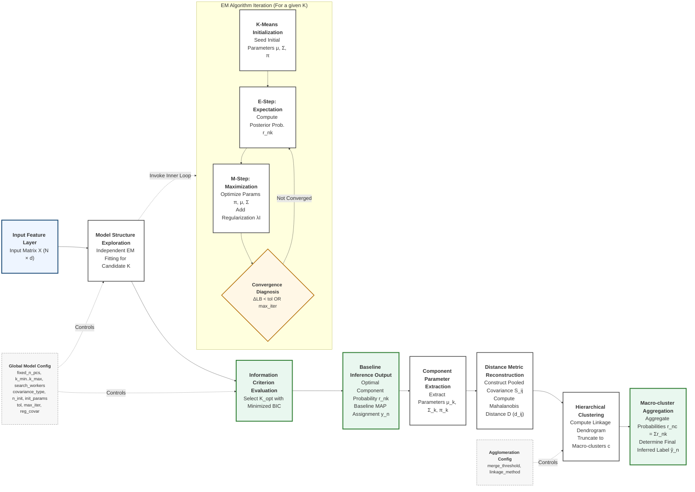

# GMM（EM）原理与收敛示意图

目标：用 GMM 对样本的低维特征（例如前若干 PC）进行无监督建模；用 EM 最大化对数似然获得参数；用 BIC 在不同的 $K$（成分数）之间做模型选择。

| Diagram Notation / Variable | Interpretation and Functional Role in the Pipeline |
|---|---|
| $X (N \times d)$ | **Input Matrix**: Subject feature matrix comprising $N$ samples and $d$ feature dimensions (e.g., PCs). |
| $K$ | **Candidate Components**: Number of GMM components evaluated during the model structure exploration. |
| $K_{\mathrm{opt}}$ | **Optimal Components**: Final model complexity selected by minimizing the Bayesian Information Criterion (BIC). |
| $\text{K-Means}$ | **Initialization strategy**: Seeds robust starting parameters ($\mu, \Sigma, \pi$) to mitigate local optima entrapment. |
| $r_{nk}$ | **Posterior Probability**: Baseline probability of a sample belonging to component $k$ (E-Step responsibility). |
| $y_n$ | **Baseline Assignment**: Maximum A Posteriori (MAP) discrete label derived directly from $r_{nk}$ before merging. |
| $\pi_k, \mu_k, \Sigma_k$ | **Component Parameters**: The prior weight, mean vector, and covariance matrix defining the $k$-th Gaussian. |
| $\lambda I$ | **Covariance Regularization**: Corresponds to `reg_covar`; ensures numerical stability and invertible matrices in the M-Step. |
| $\Delta LB < \mathrm{tol}$ | **Convergence Criterion**: EM iteration halts when the increment of the average log-likelihood bound ($\Delta LB$) falls below $\mathrm{tol}$. |
| $S_{ij}, d_{ij}, D$ | **Distance Metrics**: Pooled covariance ($S_{ij}$), pairwise Mahalanobis distance ($d_{ij}$), and the comprehensive distance matrix ($D$). |
| $c, \mathrm{linkage}, \mathrm{threshold}$ | **Agglomeration Logic**: Target macro-cluster $c$ formed via hierarchical clustering using defined `linkage` and `threshold`. |
| $r_{nc}$ | **Aggregated Probability**: Cumulative probability of a sample belonging to macro-cluster $c$ (sum of intra-cluster $r_{nk}$). |
| $\hat{y}_n$ (\`ŷ_n\`) | **Final Inferred Label**: Ultimate discrete classification output derived by maximizing the macro-cluster probabilities ($r_{nc}$). |

## 图中要点

- GMM 是“多个高斯的加权和”，用隐变量 $z$ 表示成分归属。
- E-step 给出每个样本属于各成分的概率（软分配 $r_{nk}$）。
- M-step 用 $r_{nk}$ 做加权平均，更新 $\pi,\mu,\Sigma$；`reg_covar` 可视为 $\lambda I$ 增强稳定性。
- 收敛参考审计日志：以 `lower_bound`（即 $LB$）的相邻迭代改变量与 `tol` 比较决定停止；多次初始化 (`n_init`) 用于缓解局部最优。

## 公式面板

**记号与目标**

- 数据：$X=\{x_n\}_{n=1}^{N}$，$x_n\in\mathbb{R}^d$（这里 $d$ 通常对应 `fixed_n_pcs`）。
- 参数：$\theta = \{\pi_k,\mu_k,\Sigma_k\}_{k=1}^{K}$，$\sum_k\pi_k=1$。
- 高斯密度：
$$
\mathcal{N}(x\mid\mu,\Sigma)=(2\pi)^{-d/2}|\Sigma|^{-1/2}\exp\Big(-\tfrac{1}{2}(x-\mu)^T\Sigma^{-1}(x-\mu)\Big).
$$
- 对数似然：
$$
\ell(\theta)=\sum_{n=1}^{N} \log\Big(\sum_{k=1}^{K} \pi_k\,\mathcal{N}(x_n\mid\mu_k,\Sigma_k)\Big).
$$

**EM 的核心（用 $Q$ 函数组织推导）**

引入隐变量 $z_n\in\{1,\dots,K\}$，EM 迭代最大化
$$
Q(\theta,\theta^{old}) = \mathbb{E}_{Z\mid X,\theta^{old}}\big[\log p(X,Z\mid\theta)\big].
$$

将 $Q$ 写成可计算的求和形式：
$$
Q(\theta,\theta^{old})=\sum_{n=1}^{N}\sum_{k=1}^{K} r_{nk}\Big(\log\pi_k + \log\mathcal{N}(x_n\mid\mu_k,\Sigma_k)\Big),
\quad r_{nk}=p(z_n=k\mid x_n,\theta^{old}).
$$

**E-step（责任度 / 后验概率，软分配）**
$$
r_{nk} \equiv p(z_n=k\mid x_n,\theta^{old})
= \frac{\pi_k\,\mathcal{N}(x_n\mid\mu_k,\Sigma_k)}{\sum_{j=1}^{K} \pi_j\,\mathcal{N}(x_n\mid\mu_j,\Sigma_j)}.
$$

**M-step（加权极大似然更新）**
令 $N_k=\sum_{n=1}^{N} r_{nk}$：
$$
\begin{aligned}
\pi_k &\leftarrow \frac{N_k}{N},\\
\mu_k &\leftarrow \frac{1}{N_k}\sum_{n=1}^{N} r_{nk}x_n,\\
\Sigma_k &\leftarrow \frac{1}{N_k}\sum_{n=1}^{N} r_{nk}(x_n-\mu_k)(x_n-\mu_k)^T + \lambda I.
\end{aligned}
$$
其中 $\lambda I$ 是数值稳定项（对应 `reg_covar`）。

**收敛（停止条件）**

- 本项目审计日志显示：sklearn 在每次 EM 迭代记录 `lower_bound`（记作 $LB$），其数值可理解为平均对数似然估计（每样本平均对数似然）$LB=\ell(\theta)/N$。
- 停止判据为相邻迭代的改变量：
$$
\Delta LB = LB^{(t)}-LB^{(t-1)} < \mathrm{tol}.
$$
- 本项目的 `tol=0.001` 与 sklearn 默认一致（代码中未显式传入 `tol`）。
- `max_iter` 由配置给定。
- 由于似然非凸，常用 `n_init` 多次初始化，取 $LB$ 最大者（等价于取对数似然最高的初始化）。

**模型选择（BIC）**
$$
\mathrm{BIC}(K) = -2\,\ell(\hat\theta_K) + p_K\log N.
$$

若采用 full covariance（`covariance_type=full`），参数量常写为：
$$
p_K = (K-1) + K\,d + K\,\frac{d(d+1)}{2}.
$$
（不同 `covariance_type` 时 $p_K$ 形式会随协方差约束改变。）

**组件距离与合并（Mahalanobis + H-cluster）**

对已拟合的 $K$ 个 GMM 组分，取每个组分的均值向量与协方差矩阵：$\mu_k,\Sigma_k$。

1) 组分均值的 pooled Mahalanobis 距离（代码实现）
$$
S_{ij}=\tfrac{1}{2}\Sigma_i+\tfrac{1}{2}\Sigma_j,\qquad
d_{ij}=\sqrt{(\mu_i-\mu_j)^T S_{ij}^{-1} (\mu_i-\mu_j)}.
$$

2) 基于距离矩阵 $D=[d_{ij}]$ 做层次聚类（hierarchical clustering）并按阈值切分
- `linkage_method` 用于构建 linkage
- `merge_threshold` 作为 distance criterion 的 cut 阈值

3) 合并后后验与标签

将旧组分集合按合并映射 $c=\mathrm{map}(k)$ 聚合：
$$
r_{n c}=\sum_{k\,:\,\mathrm{map}(k)=c} r_{n k},\qquad
\hat y_n=\arg\max_c r_{n c}.
$$

## 参数与符号对照

| config | 数学符号 | 作用 |
|---|---|---|
| `fixed_n_pcs` | $d$ | 特征维度（PC 数） |
| `k_min..k_max` | $K$ 候选范围 | BIC 搜索的成分数范围 |
| `covariance_type` | $\Sigma_k$ 的结构 | 协方差形式约束 |
| `n_init` + `init_params` | 初始化 | 缓解局部最优（默认 `k-means++`） |
| `tol` | 收敛阈值 | 以 $\Delta LB$ 与 `tol` 比较决定停止（sklearn 默认 $10^{-3}$） |
| `max_iter` | 迭代上限 | EM 最大迭代次数 |
| `reg_covar` | $\lambda I$ | 协方差数值稳定 |
| `search_workers` | 并行 | 加速 K 搜索 |
| `merge_threshold` | 阈值 $t$ | dendrogram cut 阈值，按 distance criterion 合并组分 |
| `linkage_method` | linkage | 层次聚类的 linkage 方法 |
