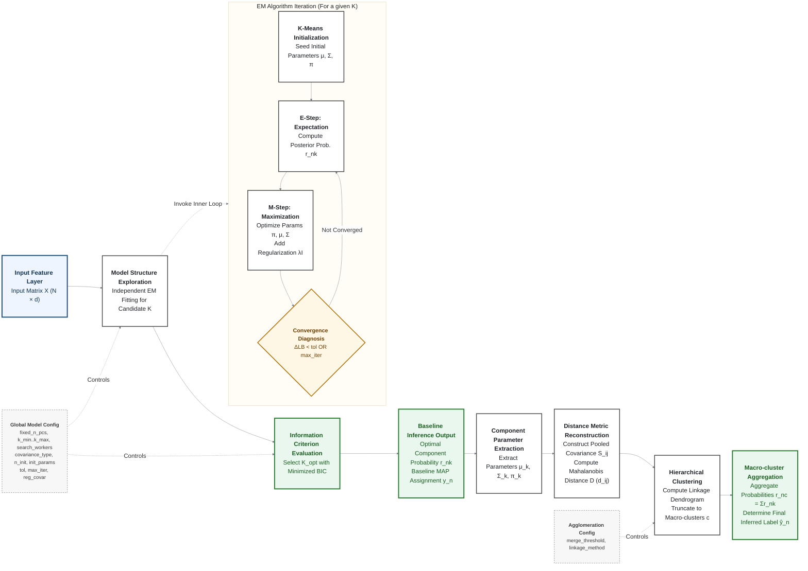

# GMM (EM) Principles and Convergence Diagram

Reference-panel modelling in PopGMM: a Gaussian mixture is fitted to
low-dimensional sample features by expectation–maximization, the number of
components is chosen by the Bayesian Information Criterion, and the fitted
components are merged into ancestry clusters by Mahalanobis distance.

> **Scope.** This document covers the reference-model mathematics only — the EM
> iteration, model selection, and component merging. Denoising, projection of a
> study cohort into the fitted mixture, subset selection, and the keep-list
> deliverable are described in [`README.md`](README.md).



## Notation

| Symbol | Role in the pipeline |
|---|---|
| $X \in \mathbb{R}^{N \times d}$ | **Input matrix** — $N$ samples in $d$ feature dimensions (principal components). |
| $K$ | **Candidate order** — the component count evaluated during structure exploration. |
| $K_{\mathrm{opt}}$ | **Selected order** — the model complexity minimising BIC. |
| $\pi_k, \mu_k, \Sigma_k$ | **Component parameters** — mixing weight, mean vector, and covariance of Gaussian component $k$. |
| $r_{nk}$ | **Responsibility** — posterior probability that sample $n$ belongs to component $k$ (E-step, soft assignment). |
| $y_n$ | **Baseline label** — maximum a posteriori assignment taken from $r_{nk}$, before merging. |
| $\lambda I$ | **Covariance regularization** — the `reg_covar` term; keeps every $\Sigma_k$ invertible and numerically stable. |
| $LB$ | **Lower bound** — sklearn's per-sample average log-likelihood, $LB = \ell(\theta)/N$. |
| $\Delta LB < \mathrm{tol}$ | **Convergence criterion** — EM stops when the per-iteration gain in $LB$ falls below `tol`. |
| $S_{ij},\ d_{ij},\ D$ | **Distance metrics** — pooled covariance, pairwise Mahalanobis distance, and the full distance matrix. |
| $c = \mathrm{map}(k)$ | **Merge map** — assignment of component $k$ to macro-cluster $c$ by hierarchical clustering. |
| $r_{nc}$ | **Aggregated probability** — probability of belonging to macro-cluster $c$, summed over its components. |
| $\hat{y}_n$ | **Final label** — discrete assignment obtained by maximising $r_{nc}$. |

## How to read the diagram

The mixture is a weighted sum of Gaussians with a latent variable $z$ indicating
component membership. Each EM iteration alternates between computing every
sample's membership probabilities (E-step, a *soft* assignment) and re-estimating
$\pi, \mu, \Sigma$ as averages weighted by $r_{nk}$ (M-step). The outer loop repeats
this for each candidate $K$ and keeps the model with the lowest BIC; the merging
stage then coarsens the selected model into ancestry clusters.

## Formula panel

### Notation and objective

Data $X = \lbrace x_n \rbrace_{n=1}^{N}$ with $x_n \in \mathbb{R}^{d}$, where $d$
is set by `fixed_n_pcs`. Parameters
$\theta = \lbrace \pi_k, \mu_k, \Sigma_k \rbrace_{k=1}^{K}$ subject to
$\sum_k \pi_k = 1$.

Gaussian density:

```math
\mathcal{N}(x \mid \mu, \Sigma)
= (2\pi)^{-d/2}\,\lvert\Sigma\rvert^{-1/2}
\exp\!\left(-\tfrac{1}{2}(x-\mu)^{\top}\Sigma^{-1}(x-\mu)\right)
```

Log-likelihood of the mixture:

```math
\ell(\theta) \;=\; \sum_{n=1}^{N} \log\!\left(\sum_{k=1}^{K} \pi_k\,\mathcal{N}(x_n \mid \mu_k, \Sigma_k)\right)
```

### Core of EM (via the $Q$ function)

Introduce a latent variable $z_n \in \lbrace 1, \dots, K \rbrace$ indicating
which component generated $x_n$. Writing $\theta^{(t)}$ for the current estimate,
EM iteratively maximises the expected complete-data log-likelihood:

```math
Q\!\left(\theta, \theta^{(t)}\right)
= \mathbb{E}_{Z \mid X, \theta^{(t)}}\!\left[\log p(X, Z \mid \theta)\right]
```

Because the expectation is taken over a discrete latent variable, $Q$ reduces to
a computable double sum weighted by the responsibilities:

```math
Q\!\left(\theta, \theta^{(t)}\right)
= \sum_{n=1}^{N}\sum_{k=1}^{K} r_{nk}\left(\log \pi_k + \log \mathcal{N}(x_n \mid \mu_k, \Sigma_k)\right),
\qquad r_{nk} = p\!\left(z_n = k \mid x_n, \theta^{(t)}\right)
```

### E-step — responsibilities

```math
r_{nk} \;\equiv\; p\!\left(z_n = k \mid x_n, \theta^{(t)}\right)
\;=\; \frac{\pi_k\,\mathcal{N}(x_n \mid \mu_k, \Sigma_k)}
{\sum_{j=1}^{K} \pi_j\,\mathcal{N}(x_n \mid \mu_j, \Sigma_j)}
```

Each sample contributes fractionally to every component, which is what preserves
the uncertainty that a hard nearest-centroid rule would discard.

### M-step — weighted maximum-likelihood updates

With the effective component size $N_k = \sum_{n=1}^{N} r_{nk}$:

```math
\begin{aligned}
\pi_k &\leftarrow \frac{N_k}{N}, \\[2pt]
\mu_k &\leftarrow \frac{1}{N_k}\sum_{n=1}^{N} r_{nk}\,x_n, \\[2pt]
\Sigma_k &\leftarrow \frac{1}{N_k}\sum_{n=1}^{N} r_{nk}\,(x_n-\mu_k)(x_n-\mu_k)^{\top} \;+\; \lambda I
\end{aligned}
```

The ridge $\lambda I$ is `reg_covar`; without it a component collapsing onto a
few points yields a singular covariance and an unbounded likelihood.

### Convergence

sklearn records `lower_bound` at every EM iteration — the per-sample average
log-likelihood $LB = \ell(\theta)/N$ — and stops when its increment falls below
the tolerance:

```math
\Delta LB \;=\; LB^{(t)} - LB^{(t-1)} \;<\; \mathrm{tol}
```

- `tol` is sklearn's default $10^{-3}$; `GMMConfig` does not expose it, so it is
  never passed explicitly in this project.
- `max_iter` bounds the iteration count when the tolerance is not reached.
- The likelihood is non-convex, so `n_init` restarts are run from independent
  initializations and the one with the largest $LB$ is kept.

### Model selection (BIC)

```math
\mathrm{BIC}(K) \;=\; -2\,\ell(\hat{\theta}_K) \;+\; p_K \log N
```

For an unconstrained covariance (`covariance_type="full"`) the free-parameter
count is

```math
p_K \;=\; \underbrace{(K-1)}_{\text{weights}} \;+\; \underbrace{K\,d}_{\text{means}} \;+\; \underbrace{K\,\frac{d(d+1)}{2}}_{\text{covariances}}
```

so $p_K$ grows quadratically in $d$ — the reason a mixture is fitted in a low
dimensional PC space rather than on the full feature set. Other
`covariance_type` settings constrain $\Sigma_k$ and change $p_K$ accordingly.
Models that leave a component empty are rejected before the minimum is taken.

### Component distance and merging

The selected model describes the density well but over-segments it: one
ancestry region is typically represented by several Gaussians. Merging recovers
the regions.

**Pairwise distance.** Components are compared by the Mahalanobis distance
between their means under their pooled covariance, which — unlike a Euclidean
distance between centroids — accounts for the scale, elongation, and orientation
of the two components being compared:

```math
S_{ij} \;=\; \tfrac{1}{2}\Sigma_i + \tfrac{1}{2}\Sigma_j,
\qquad
d_{ij} \;=\; \sqrt{(\mu_i-\mu_j)^{\top} S_{ij}^{-1} (\mu_i-\mu_j)}
```

**Hierarchical cut.** The matrix $D = [d_{ij}]$ is clustered with
`linkage_method` and cut at `merge_threshold` under the distance criterion,
yielding the merge map $c = \mathrm{map}(k)$.

**Posterior aggregation.** Probability mass follows the map, so no sample is
reassigned by fiat and the aggregated posteriors remain a proper distribution:

```math
r_{nc} \;=\; \sum_{k \,:\, \mathrm{map}(k) = c} r_{nk},
\qquad
\hat{y}_n \;=\; \arg\max_{c}\; r_{nc}
```

## Parameter-to-symbol mapping

| Config | Symbol | Role | Committed run |
|---|---|---|---|
| `fixed_n_pcs` | $d$ | Feature dimensionality | `2` |
| `k_min` … `k_max` | range of $K$ | Search range for the BIC minimum | `2` … `100` |
| `covariance_type` | form of $\Sigma_k$ | Covariance constraint; sets $p_K$ | `full` |
| `n_init` | — | Independent restarts; largest $LB$ wins | `3` |
| `init_params` | — | Seeding strategy for $\mu, \Sigma, \pi$ | `kmeans` (overrides the class default `k-means++`) |
| `tol` | $\mathrm{tol}$ | Stop when $\Delta LB <$ `tol` | sklearn default $10^{-3}$, not passed explicitly |
| `max_iter` | — | Iteration upper bound | `200` |
| `reg_covar` | $\lambda$ | Covariance ridge for numerical stability | `1e-6` |
| `random_state` | — | Seed for initialization; fixes the fit | `42` |
| `require_non_empty_clusters` | — | Reject models with an empty component | `True` |
| `search_workers` | — | Parallelism across candidate $K$ | configured per run |
| `merge_threshold` | $t$ | Dendrogram cut height | `6.0` |
| `linkage_method` | — | Linkage rule for hierarchical clustering | `average` |
