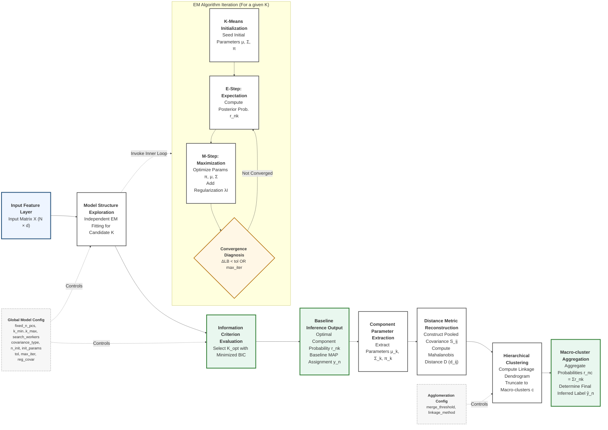

# GMM (EM) Principles and Convergence Diagram

Objective: Use GMM to perform unsupervised modeling on low-dimensional sample features (for example, the first several PCs); use EM to maximize the log-likelihood and estimate parameters; and use BIC for model selection across different values of $K$ (number of components).

| Diagram Notation / Variable | Interpretation and Functional Role in the Pipeline |
|---|---|
| $X (N \times d)$ | **Input Matrix**: Subject feature matrix comprising $N$ samples and $d$ feature dimensions (e.g., PCs). |
| $K$ | **Candidate Components**: Number of GMM components evaluated during model structure exploration. |
| $K_{\mathrm{opt}}$ | **Optimal Components**: Final model complexity selected by minimizing the Bayesian Information Criterion (BIC). |
| $\text{K-Means}$ | **Initialization Strategy**: Seeds robust starting parameters ($\mu, \Sigma, \pi$) to mitigate local optima entrapment. |
| $r_{nk}$ | **Posterior Probability**: Baseline probability of a sample belonging to component $k$ (E-step responsibility). |
| $y_n$ | **Baseline Assignment**: Maximum a posteriori (MAP) discrete label derived directly from $r_{nk}$ before merging. |
| $\pi_k, \mu_k, \Sigma_k$ | **Component Parameters**: The prior weight, mean vector, and covariance matrix defining the $k$-th Gaussian. |
| $\lambda I$ | **Covariance Regularization**: Corresponds to `reg_covar`; ensures numerical stability and invertible matrices in the M-step. |
| $\Delta LB < \mathrm{tol}$ | **Convergence Criterion**: EM iteration stops when the increment of the average log-likelihood bound ($\Delta LB$) falls below $\mathrm{tol}$. |
| $S_{ij}, d_{ij}, D$ | **Distance Metrics**: Pooled covariance ($S_{ij}$), pairwise Mahalanobis distance ($d_{ij}$), and the full distance matrix ($D$). |
| $c, \mathrm{linkage}, \mathrm{threshold}$ | **Agglomeration Logic**: Target macro-cluster $c$ formed via hierarchical clustering with specified `linkage` and `threshold`. |
| $r_{nc}$ | **Aggregated Probability**: Cumulative probability of a sample belonging to macro-cluster $c$ (sum of intra-cluster $r_{nk}$). |
| $\hat{y}_n$ (`ŷ_n`) | **Final Inferred Label**: Final discrete classification output obtained by maximizing the macro-cluster probabilities ($r_{nc}$). |

## Key Points in the Diagram

- GMM is a weighted sum of multiple Gaussians, with latent variable $z$ indicating component membership.
- The E-step computes each sample's probability of belonging to each component (soft assignment $r_{nk}$).
- The M-step uses weighted averages based on $r_{nk}$ to update $\pi,\mu,\Sigma$; `reg_covar` can be interpreted as $\lambda I$ to improve stability.
- Convergence follows audit logs: compare iteration-to-iteration change in `lower_bound` (denoted as $LB$) against `tol`; multiple initializations (`n_init`) help reduce local-optimum risk.

## Formula Panel

**Notation and Objective**

- Data: $X=\{x_n\}_{n=1}^{N}$, $x_n\in\mathbb{R}^d$ (here $d$ usually corresponds to `fixed_n_pcs`).
- Parameters: $\theta = \{\pi_k,\mu_k,\Sigma_k\}_{k=1}^{K}$, with $\sum_k\pi_k=1$.
- Gaussian density:
$$
\mathcal{N}(x\mid\mu,\Sigma)=(2\pi)^{-d/2}|\Sigma|^{-1/2}\exp\Big(-\tfrac{1}{2}(x-\mu)^T\Sigma^{-1}(x-\mu)\Big).
$$
- Log-likelihood:
$$
\ell(\theta)=\sum_{n=1}^{N} \log\Big(\sum_{k=1}^{K} \pi_k\,\mathcal{N}(x_n\mid\mu_k,\Sigma_k)\Big).
$$

**Core of EM (organized via the $Q$ function)**

Introduce latent variable $z_n\in\{1,\dots,K\}$. EM iteratively maximizes
$$
Q(\theta,\theta^{old}) = \mathbb{E}_{Z\mid X,\theta^{old}}\big[\log p(X,Z\mid\theta)\big].
$$

Rewrite $Q$ into a computable summation:
$$
Q(\theta,\theta^{old})=\sum_{n=1}^{N}\sum_{k=1}^{K} r_{nk}\Big(\log\pi_k + \log\mathcal{N}(x_n\mid\mu_k,\Sigma_k)\Big),
\quad r_{nk}=p(z_n=k\mid x_n,\theta^{old}).
$$

**E-step (responsibility / posterior probability, soft assignment)**
$$
r_{nk} \equiv p(z_n=k\mid x_n,\theta^{old})
= \frac{\pi_k\,\mathcal{N}(x_n\mid\mu_k,\Sigma_k)}{\sum_{j=1}^{K} \pi_j\,\mathcal{N}(x_n\mid\mu_j,\Sigma_j)}.
$$

**M-step (weighted maximum-likelihood updates)**
Let $N_k=\sum_{n=1}^{N} r_{nk}$:
$$
\begin{aligned}
\pi_k &\leftarrow \frac{N_k}{N},\\
\mu_k &\leftarrow \frac{1}{N_k}\sum_{n=1}^{N} r_{nk}x_n,\\
\Sigma_k &\leftarrow \frac{1}{N_k}\sum_{n=1}^{N} r_{nk}(x_n-\mu_k)(x_n-\mu_k)^T + \lambda I.
\end{aligned}
$$
where $\lambda I$ is a numerical stabilization term (corresponding to `reg_covar`).

**Convergence (stopping condition)**

- Audit logs in this project show that sklearn records `lower_bound` at each EM iteration (denoted as $LB$), which can be interpreted as an average log-likelihood estimate (per-sample average), i.e., $LB=\ell(\theta)/N$.
- Stopping criterion uses change between adjacent iterations:
$$
\Delta LB = LB^{(t)}-LB^{(t-1)} < \mathrm{tol}.
$$
- In this project, `tol=0.001`, consistent with sklearn's default (not explicitly passed in code).
- `max_iter` is set by configuration.
- Because the likelihood is non-convex, `n_init` with multiple starts is commonly used; select the run with the largest $LB$ (equivalently highest log-likelihood).

**Model Selection (BIC)**
$$
\mathrm{BIC}(K) = -2\,\ell(\hat\theta_K) + p_K\log N.
$$

For full covariance (`covariance_type=full`), parameter count is commonly written as:
$$
p_K = (K-1) + K\,d + K\,\frac{d(d+1)}{2}.
$$
(Under other `covariance_type` settings, the form of $p_K$ changes with covariance constraints.)

**Component Distance and Merging (Mahalanobis + Hierarchical Clustering)**

For fitted $K$ GMM components, use each component's mean vector and covariance matrix: $\mu_k,\Sigma_k$.

1) Pooled Mahalanobis distance between component means (as implemented in code)
$$
S_{ij}=\tfrac{1}{2}\Sigma_i+\tfrac{1}{2}\Sigma_j,\qquad
d_{ij}=\sqrt{(\mu_i-\mu_j)^T S_{ij}^{-1} (\mu_i-\mu_j)}.
$$

2) Perform hierarchical clustering on distance matrix $D=[d_{ij}]$, then cut by threshold
- `linkage_method` is used to build linkage
- `merge_threshold` is used as the distance-criterion cut threshold

3) Post-merge posterior and labels

Aggregate old components by merge map $c=\mathrm{map}(k)$:
$$
r_{n c}=\sum_{k\,:\,\mathrm{map}(k)=c} r_{n k},\qquad
\hat y_n=\arg\max_c r_{n c}.
$$

## Parameter-to-Symbol Mapping

| config | Mathematical Symbol | Role |
|---|---|---|
| `fixed_n_pcs` | $d$ | Feature dimensionality (number of PCs) |
| `k_min..k_max` | Candidate range of $K$ | Component-count search range for BIC |
| `covariance_type` | Structure of $\Sigma_k$ | Covariance-form constraint |
| `n_init` + `init_params` | Initialization | Mitigates local optima. The committed run uses `n_init=3`, `init_params="kmeans"` (the notebook overrides the class default of `k-means++`) |
| `tol` | Convergence threshold | Stop when $\Delta LB$ is below `tol` (sklearn default $10^{-3}$) |
| `max_iter` | Iteration upper bound | Maximum EM iteration count |
| `reg_covar` | $\lambda I$ | Covariance numerical stabilization |
| `search_workers` | Parallelism | Accelerates K search |
| `merge_threshold` | Threshold $t$ | Dendrogram cut threshold; merges components by distance criterion |
| `linkage_method` | linkage | Linkage method for hierarchical clustering |
