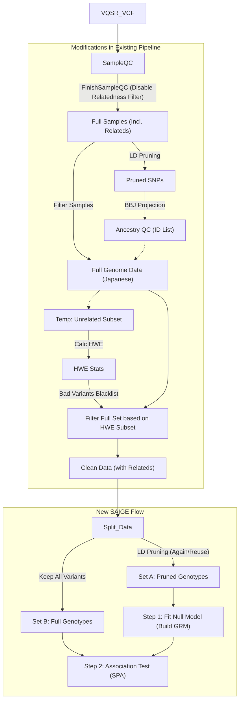

# PLINK2 --glm 与 SAIGE 在二分类性状关联分析中的详细方法对比

本文档详细介绍了针对二分类变量（如本研究中的 CTEPH vs Healthy），PLINK2 的 `--glm` 模块与 SAIGE (Scalable and Accurate Implementation of GEneralized mixed model) 在统计原理、模型构建及适用场景上的具体差异。

## 1. PLINK2 `--glm` (Generalized Linear Model)

PLINK2 的 `--glm` 也就是广义线性模型 (Generalized Linear Model)。针对二分类性状（Case/Control），它实际上执行的是**逻辑回归 (Logistic Regression)**。

### 1.1 统计模型
对于第 $j$ 个个体，假设 $Y_j$ 为表型（1=Case, 0=Control），$g_j$ 为目标变异的基因型（通常为 0, 1, 2 的剂量值），$\mathbf{X}_j$ 为协变量向量（如年龄、性别、PCs）。

模型形式为逻辑回归 (Logistic Regression)：

$$
\text{logit}(P(Y_j=1)) = \ln\left(\frac{P(Y_j=1)}{1-P(Y_j=1)}\right) = \beta_0 + g_j \beta + \mathbf{X}_j^T \boldsymbol{\alpha}
$$

**变量详解**：
*   $j$: 个体编号 ($j = 1, \dots, N$)。
*   $Y_j$: 第 $j$ 个个体的二分类表型状态 (Case=1, Control=0)。
*   $P(Y_j=1)$: 该个体患病的概率。
*   $\beta_0$: **截距 (Intercept)**，代表在所有自变量均为 0 时的基准对数几率。
*   $g_j$: 第 $j$ 个个体在目标位点上的**基因型剂量 (Genotype Dosage)**，取值通常为 0, 1, 2 (加性模型)。
*   $\beta$: **目标遗传效应值 (Genetic Effect Size)**，即我们需要检验的目标参数。其指数形式 $e^{\beta}$ 即为优势比 (Odds Ratio, OR)。
*   $\mathbf{X}_j$: 第 $j$ 个个体的**协变量向量 (Covariates)**，维度为 $K \times 1$。
*   $\boldsymbol{\alpha}$: **协变量效应向量 (Covariate Coefficients)**，维度为 $K \times 1$，代表年龄、性别、PCs 等对患病风险的固定影响。

*   **假设检验**: 检验零假设 $H_0: \beta = 0$。PLINK2 默认使用 Wald Test 或 Score Test。

### 1.2 群体结构与亲缘关系的处理
*   **固定效应 (Fixed Effects)**: PLINK2 `--glm` 将群体结构（Population Stratification）视为固定效应，即通过 $\mathbf{X}_j$ 中的主成分 (PCs) 项来校正。
*   **局限性**: 这种方法主要适用于**非亲缘关系 (Unrelated)** 的样本。如果样本中存在家系结构或隐性亲缘关系（Cryptic Relatedness），单纯使用 PCs 可能无法完全校正，导致 I 类错误率（Type I error）膨胀。

### 1.3 针对不平衡数据的处理 (Firth Regression)
*   在二分类只有少量 Case 或等位基因频率极低时，标准逻辑回归的极大似然估计可能不收敛或有偏差 (Bias)。
*   PLINK2 实现了 **Firth Bias-Corrected Regression** (惩罚似然估计)。当检测到 count 数过少时，它会自动应用 Firth 回归来提供更稳健的 P 值和效应估计。

---

## 2. SAIGE (Generalized Linear Mixed Model)

SAIGE 是专门为大规模生物样本库设计的，旨在解决**样本亲缘关系**和**极度不平衡的 Case-Control 比例**问题。

### 2.1 统计模型
SAIGE 使用**广义线性混合模型 (GLMM)**。所有的符号定义与上述 GLM 保持一致，但增加了一个关键的**随机效应项**。

$$
\text{logit}(P(Y_j=1)) = \beta_0 + g_j \beta + \mathbf{X}_j^T \boldsymbol{\alpha} + b_j
$$

**新增变量详解**：
*   $b_j$: 第 $j$ 个个体的**随机效应 (Random Effect)**。它代表了除已知协变量外，由个体间遗传关系导致的表型易感性差异。
*   分布假设: 全体样本的随机效应向量 $\mathbf{b} = (b_1, \dots, b_N)^T$ 服从多元正态分布：
    $$
    \mathbf{b} \sim N(\mathbf{0}, \tau \mathbf{K})
    $$
*   $\tau$: **遗传方差组分 (Genetic Variance Component)**。它是一个标量，衡量了全基因组遗传背景对表型变异的贡献程度。
*   $\mathbf{K}$: **遗传关系矩阵 (GRM, Genetic Relationship Matrix)**，维度 $N \times N$。
    *   **核心作用**: 这个矩阵像一张巨大的“关系网”，定量地承载了样本间所有可能的遗传联系（包括已知亲缘与未知微结构）。
    *   **校正机理**: 当检验某一个特定 SNP 是否与疾病相关时，GLMM 实际上是在问：“**在扣除了由 GRM 解释的全基因组背景相似性（亲缘关系、群体结构）造成的表型相似性之后**，这个 SNP 是否依然显著？”
    *   **计算公式**: 第 $i$ 个个体和第 $j$ 个个体的遗传相关性 $K_{ij}$ 计算如下（Standardized GRM）：
        $$
        K_{ij} = \frac{1}{M} \sum_{m=1}^{M} \frac{(g_{im} - 2p_m)(g_{jm} - 2p_m)}{2p_m(1-p_m)}
        $$
        其中：
        *   $M$: 用于构建 GRM 的 SNP 总数（成千上万个 Pruned SNPs）。
        *   $g_{im}, g_{jm}$: 个体 $i$ 和 $j$ 在第 $m$ 个 SNP 上的基因型剂量 (0, 1, 2)。
        *   $p_m$: 第 $m$ 个 SNP 的次等位基因频率 (MAF)。
    *   **矩阵结构解读**:
        *   **对角线元素 ($K_{ii}$)**: 代表个体的近交系数 (Self-relatedness)。通常在 1 附近（若无近交）。
        *   **非对角线元素 ($K_{ij}$)**: 量化两人的亲缘关系。
            *   若 $i$ 和 $j$ 无亲缘关系：值接近 0。
            *   若 $i$ 和 $j$ 是 亲兄弟/亲子：值接近 0.5。
            *   若 $i$ 和 $j$ 是 表亲：值接近 0.125。

### 2.2 两步法 (Two-Step Approach)
为了提高计算效率，SAIGE 不会对每个变异位点都拟合完整的 GLMM，而是采用两步法：

1.  **Step 1（拟合零模型 Null Model）及 LOCO 策略**:
    *   **目标**: 即使在没有特定遗传变异 $g_j$ 的情况下，先估计模型中的方差组分 $\tau$ 和协变量的固定效应系数。
    *   **LOCO (Leave-One-Chromosome-Out) 详解**:
        *   **为什么要这样做？（近端污染问题）**: 混合模型假设随机效应代表“剩余的多基因背景”。如果我们正在检验的 SNP (比如位于 Chr 1) 本身也被包含在构建 GRM 的 SNP 列表中，那么该 SNP 的效应就会被错误地吸收到随机效应（背景噪音）中，导致我们在检验该 SNP 自身的固定效应时信号显著减弱（统计功效降低）。这被称为**近端污染 (Proximal Contamination)**。
        *   **SAIGE 是如何实施的？**: 
            *   SAIGE 并不只拟合一个“通用”的 Null Model。相反，它采用 LOCO 策略遍历所有常染色体。
            *   当准备分析 **第 $i$ 号染色体**（例如 Chr 1）上的变异时，SAIGE 会使用由 **除第 $i$ 号染色体以外的所有其他染色体**（Chr 2-22）上的 SNP 构建的 GRM，记为 $\mathbf{K}_{-i}$。
            *   基于这个 $\mathbf{K}_{-i}$，SAIGE 计算出一套专门用于分析 Chr 1 的模型参数（包括方差组分 $\tau_{-i}$ 和对应的残差）。
        *   **结果**: SAIGE 的 Step 1 最终生成的模型文件（`.rda`）实际上包含了 22 套（针对 22 条常染色体）独立的模型参数。在 Step 2 分析 Chr 1 的变异时，程序会自动调用排除了 Chr 1 的那套参数，从而彻底消除了近端污染。
    *   **数学模型 (Null Model)**:
        由于 Step 1 不需要考虑具体某个候选 SNP 的效应（即假设 $\beta=0$），模型简化为：
        $$
        \text{logit}(\mu_j) = \beta_0 + \mathbf{X}_j^T \boldsymbol{\alpha} + b_j^{(-i)}
        $$
        **变量详解**：
        *   $\mu_j = P(Y_j=1 | \mathbf{X}_j, b_j)$: 给定协变量和随机效应下的患病概率。
        *   $\beta_0, \boldsymbol{\alpha}$: 待估计的零模型固定效应参数（截距和协变量系数）。
        *   $b_j^{(-i)}$: **由 LOCO 策略调整后的随机效应**。它服从 $N(\mathbf{0}, \tau \mathbf{K}_{-i})$，其中 $\mathbf{K}_{-i}$ 是剔除了第 $i$ 号染色体上所有标记后构建的 GRM。
        *   **输出**: 这一步的主要产出是估算出的随机方差 $\hat{\tau}$、固定效应系数 $\hat{\beta_0}, \hat{\boldsymbol{\alpha}}$ 以及每个个体的预测概率 $\hat{\mu}_j$。

2.  **Step 2（关联分析 Association Test）**:
    *   **核心任务**: 针对全基因组每一个变异位点（哪怕是低频变异），检验其基因型 $g$ 与表型是否显著相关。
    *   **数学模型 (Full Model for Genotype $g$)**:
        $$
        \text{logit}(\mu_j) = \beta_0 + g_{j} \beta + \mathbf{X}_j^T \boldsymbol{\alpha} + b_j
        $$
        *   对比 Step 1 的 Null Model，这里多了一个 **$g_j \beta$** 项。
        *   $g_j$: 当前正在检验的 SNP 的基因型剂量。
        *   $\beta$: 该 SNP 的效应值 (Log OR)。
        *   **假设检验目标**: 检验零假设 $H_0: \beta = 0$。
    *   **统计方法的选择：Score Test vs Wald Test**:
        *   **Wald Test (PLINK2 / 标准 GLM)**: 需要对**每一个 SNP** 都单独拟合一次完整的回归模型（包含 SNP 效应）。这意味着如果有 1000 万个 SNP，就需要进行 1000 万次迭代回归计算，计算成本极高。
        *   **Score Test (SAIGE)**: 仅依赖于**零模型 (Null Model)** 的参数（在 Step 1 中已计算完毕）。它通过计算在 $\beta_g=0$ 处的对数似然函数的一阶导数（即 Score），来评估加入该 SNP 后模型拟合度是否会有显著提升。
            *   **Score 统计量公式**:
                $$
                T = \sum_{j=1}^N g_j (Y_j - \hat{\mu}_j)
                $$
                *   $g_j$: 基因型剂量 (0, 1, 2)。
                *   $Y_j - \hat{\mu}_j$: 零模型下的残差（即实际患病情况 - 模型预测的患病概率）。
                *   **直观理解**: 统计量 $T$ 本质上是**基因型与残差的内积**。如果 SNP 与疾病正相关，那么在 $Y_j=1$ (Case) 且残差很大（模型预测不准）的那些人身上，我们也应该观察到更多的 $g_j$ (比如 = 2)。两者乘积之和 $T$ 就会显著偏离 0。
        *   **优势**: Score Test **极大地提高了计算速度**。因为它不需要对数千万个变异逐一进行繁重的模型拟合，而是直接利用 Step 1 算好的背景参数快速计算统计量。这使得在全基因组尺度上运行复杂的混合模型成为可能。

### 2.3 核心优势：鞍点近似 (Saddlepoint Approximation, SPA)

这是 SAIGE 区别于传统混合模型（如 GMMAT）的核心必杀技，专门解决**Case-Control 比例极度不平衡**的问题。

#### 2.3.1 为什么传统的 Test 会失效？（正态分布假设的崩塌）
*   **理想情况 (很多 Case)**: 根据中心极限定理，统计检验量通常服从**正态分布 (Normal Distribution)**（即标准的钟形曲线）。只要你的统计量落在钟形曲线的两端（尾部），就算显著。
*   **现实困境 (极少 Case + 罕见变异)**:
    *   想象一下，假如你有 10,000 个健康人，但只有 50 个病人。
    *   此时，对于一个只有 3 个人携带的罕见变异，它的统计分布不再是对称的钟形，而是**严重偏斜 (Highly Skewed)** 的。
    *   **后果**: 如果你依然强行用“正态分布”的尺子去衡量这个偏斜的分布，你会严重低估 P 值（例如，原本 P=0.01 的不显著信号，可能被算成 P=1e-5），从而导致产生大量的**假阳性 (False Positives)**。

#### 2.3.2 SPA 是如何拯救局面的？（从“猜形状”到“算形状”）

SPA 的核心在于它不再依赖“正态分布”这个通用模板，而是利用数学工具直接**重建**统计量及其尾部概率的真实形状。

**具体做了什么？（三步走）**

1.  **拿到“基因” (CGF)**: 
    *   虽然 Score 统计量 $T$ 的最终分布长得很歪（未知且复杂），但它的每一个组成部分（即每个个体的贡献）是已知的。
    *   SPA 利用这些已知信息，构建出统计量 $T$ 的 **累积量生成函数 (CGF, Cumulant Generating Function)**，记为 $K(t)$。
    *   *直白理解*: CGF 就像是分布的 DNA，它蕴含了这个歪歪扭扭分布的所有信息（不仅仅是均值和方差，还包括偏度、峰度等所有高阶矩）。

2.  **寻找“鞍点” (Solving Saddlepoint)**:
    *   对于你实际观测到的每一个 Score 值 $q$，SPA 会通过解方程 $K'(\zeta) = q$，找到一个特殊的参数 $\zeta$，这个点就被称为**鞍点 (Saddlepoint)**。
    *   *直白理解*: 这一步相当于在复杂的概率曲面上找到了一个关键的观测支点。

3.  **精准打击 (Calculated Approximation)**:
    *   利用找到的鞍点 $\zeta$ 和 CGF 函数 $K(t)$，SPA 将其代入著名的 **Lugannani-Rice 公式**：
        $$
        P \approx 1 - \Phi(w) + \phi(w) \left( \frac{1}{u} - \frac{1}{w} \right)
        $$
        **变量详解**：
        *   $P$: 修正后的尾部 P 值。
        *   $\Phi(\cdot)$: 标准正态分布的**累积分布函数 (CDF)**。
        *   $\phi(\cdot)$: 标准正态分布的**概率密度函数 (PDF)**。
        *   $w$: **似然比统计量的变换形式**，计算公式为 $w = \text{sign}(\zeta)\sqrt{2(\zeta q - K(\zeta))}$。它捕捉了分布的主要偏移。
        *   $u$: **调整因子**，计算公式为 $u = \zeta \sqrt{K''(\zeta)}$。它利用 CGF 的二阶导数（方差信息）对局部曲率进行校正。
        *   $\zeta$: **鞍点 (Saddlepoint)**，即方程 $K'(\zeta) = q$ 的解。
        *   $q$: 实际观测到的 Score 统计量。

    *   *直白理解*: 这是一个数学上的“魔法公式”。它不需要像传统方法那样去进行复杂的积分（算面积），而是通过简单的代数运算，就能极其精确地算出尾部概率（P值）。且越是极端（尾部越远），这个公式反而越准。

**总结对比**:
*   **传统方法 (Normal Approx)**: 仅使用**前两阶矩**（均值和方差）。它天真地以为只要知道大小和胖瘦，所有分布就都是钟形曲线。——**盲目自信**。
*   **SPA 方法**: 使用**全阶矩**（通过 CGF）。它根据数据的真实情况，“依样画葫芦”地描绘出分布的每一个弯曲细节。——**实事求是**。

#### 2.3.3 一个具体的假阳性灾难案例
为了让你彻底明白 SPA 的威力，我们来看一个**极端但真实**的场景：

*   **场景设定**:
    *   **样本**: 10,000 个健康人 (Controls) + **100 个病人 (Cases)**。 (Case 比例 ≈ 1%)
    *   **变异**: 一个罕见变异 `rs999`，总共只在 **3 个人** 身上出现了。
    *   **观测数据**: 这 3 个携带者中，恰巧有 **1 个是 Case**，2 个是 Controls。

*   **直觉判断**:
    *   虽然 Case 只有 1%，但携带者里却有 33% (1/3) 是 Case。这看起来像个很强的富集信号，对吧？

*   **传统方法的判决 (Score Test w/o SPA)**:
    *   **Z 分数是如何算出来的？（简单推演）**:
        *   **公式本意**: 
            $$
            Z \approx \frac{S - E[S]}{\sqrt{\text{Var}(S)}}
            $$
            其中 $S$ 是观测到的统计量（如 Case 中变异等位基因的总数），$E[S]$ 是在零假设下的期望值，$\text{Var}(S)$ 是方差。
        *   **算期望**: 全人群携带率是 $3/10100 \approx 0.0003$。那么在 100 个 Case 里，按随机分配，理应只有 $100 \times 0.0003 = \mathbf{0.03}$ 个人携带。
        *   **看观测**: 实际上观测到 **1** 个人携带 ($S=1$)。
        *   **算偏差**: 比期望多了 $1 - 0.03 = 0.97$。
        *   **得结论**: 因为变异太罕见，方差（分母）通常极小（比如 $\sqrt{\text{Var}(S)} \approx 0.2$）。当你用 $0.97$ 除以一个很小的数，就会得到一个巨大的 Z 值（$0.97 / 0.2 \approx 4.85 \approx 5.0$）。
    *   **查表求 P**: 传统方法假设 Z 服从**正态分布**。去查正态分布表，Z=5.0 发生的概率微乎其微，于是给出了 **P ≈ 2.8 × 10⁻⁷**。
    *   **错误根源**: 在“100个Case里只抓到1人”这种离散的小概率事件中，**Z 分数根本就不服从正态分布**。正态分布表在这里失效了，它过度夸张了这个 Z=5.0 的稀有程度。
    *   **后果**: 达到了全基因组显著性水平 (5 × 10⁻⁸ 的量级)！**你以为你发现了一个致病位点！**

*   **SAIGE SPA 的判决 (还原真实概率)**:
    *   **Step 1: 构建包含了“离散性”的 CGF**:
        *   SPA 通过 CGF 函数 $K(t)$ 捕捉到了数据的本质：这个统计量是由**仅有的 3 个携带者**贡献的。
        *   CGF 包含了这种**高度离散**和**极度偏斜**的信息。它“知道”统计量 $T$ 不可能取任何值，它本质上更像是一个掷 3 次硬币的试验（二项分布逻辑），而不是连续的钟形曲线。
    *   **Step 2: 鞍点定位**:
        *   针对观测到的 $T \approx 0.97$（对应 1 个 Case 携带者），SPA 解方程 $K'(\zeta) = 0.97$ 找到鞍点。这一步确定了我们正处于分布长尾的哪个具体位置。
    *   **Step 3: 概率修正 (Lugannani-Rice)**:
        *   代入公式计算后，SPA 发现：在全人群患病率仅 1% 的背景下，3 个携带者中有 1 个是 Case，这虽然是小概率事件，但**绝不是**正态分布所预测的 $10^{-7}$ 这种“几千万年一遇”的奇迹。
        *   它给出的概率更接近于简单的二项分布估算（$1 - 0.99^3 \approx 0.03$）。
    *   **最终结果**:
        *   SPA 修正后的 P 值可能是 **P ≈ 1.0 × 10⁻³** 或 **0.03**（取决于具体协变量）。
        *   **结论**: 根本不显著。**SPA 成功识破了这个假阳性，把一个被传统方法吹捧为“重大发现”的信号打回了原形（随机波动）。**

这就是为什么 SAIGE 敢于宣称它可以处理 Case:Control = 1:100 甚至更悬殊的比例，而不会产生大量的假信号。

---

## 3. 总结对比

| 特性 | PLINK2 `--glm` | SAIGE |
| :--- | :--- | :--- |
| **模型基础** | 广义线性模型 (GLM) <br> *Logistic Regression* | 广义线性混合模型 (GLMM) <br> *Logistic Mixed Model* |
| **亲缘关系处理** | 仅通过协变量 (PCs) <br> *无法处理复杂家系结构* | 通过 GRM (随机效应) <br> *由全基因组数据构建，可处理近亲/家系* |
| **不平衡样本 (Case << Control)** | 使用 Firth 回归校正偏差 | 使用 **SPA (Saddlepoint Approximation)** 校正 P 值分布 |
| **适用场景** | 常见变异、无关样本、Case/Control 比例较平衡 | 罕见变异、包含亲缘关系的样本、**极度不平衡的 Case/Control** |
| **计算速度** | 极快 | 较慢 (Step 1 构建 GRM 耗时，但 Step 2 较快) |
| **P 值准确性** | 在不平衡数据或罕见变异下可能膨胀 | 在极端不平衡和罕见变异下依然稳健 |

### 4. 针对本研究 (CTEPH vs Healthy) 的建议

如果 CTEPH 的样本量相对于 Healthy Control 非常少（高度不平衡），或者样本中可能包含未知的亲缘关系：

1.  **SAIGE** 是理论上更严谨的选择，因为它通过 GRM 考虑了相关性，并通过 SPA 修正了不平衡带来的 P 值偏差。
2.  **PLINK2** 可以作为快速筛选或在大样本、常见变异下的验证工具。如果使用 PLINK2，建议开启 Firth 回归选项，并且必须严格进行 PCA 校正。

---

## 5. SAIGE 针对亲缘样本及复杂遗传结构的适用性详解

### 5.1 是否可以纳入亲缘样本及不同群体结构的样本？
**可以，但需区分情况。**

SAIGE 的设计初衷之一就是解决单纯依靠 PCs 无法完全校正的复杂样本结构。

1.  **亲缘样本 (Related Samples)**:
    *   **完全可以**。这是 SAIGE 的强项。无论是家系数据还是人群中的隐性亲缘关系，GRM 都能很好地建模并校正，无需剔除。

2.  **不同群体结构同时纳入 (Simultaneous Inclusion of Different Population Structures)**:
    *   **亚群结构 (Sub-structures)**: 例如日本本州人与琉球人混杂，或者存在某些地域性的微细结构。**完全可以**。SAIGE 的 GRM 配合主成分 (PCs) 能非常有效地校正这种程度的分层，防止假阳性。
    *   **跨人种混合 (Cross-Ethnicity, e.g., Asian + European)**: 
        *   **技术上可行**：SAIGE 的数学模型（GLMM）有能力通过 GRM 吸收掉这种巨大的遗传背景差异，从而控制 I 类错误（假阳性）。
        *   **分析策略建议**：虽然 SAIGE 能控制假阳性，但如果将遗传背景差异极大的群体混在一起（例如 50% 欧洲人 + 50% 东亚人），可能会引入**异质性 (Heterogeneity)** 问题（即同一个变异在不同人种中的效应值不同）。
        *   通常建议优先进行**分层分析 (Stratified Analysis)** 然后做 **Meta 分析**。
        *   但如果样本量较小（如 CTEPH），为了最大化统计功效，**可以将不同群体合并分析**，但务必确保：
            1.  **GRM 构建准确**（使用全基因组 Pruned SNPs）。
            2.  **必须加入足量的前几位 PCs**（如 PC1-PC10）作为固定效应协变量，以最大程度捕捉宏观的人种差异。

**结论**：对于本研究（主要是日本群体内部结构），**可以且建议**将所有样本同时纳入分析，利用 SAIGE 自动校正群体分层。

### 5.2 既然有了 GRM，SAIGE 还需要主成分 (PCs) 作为协变量吗？

**建议保留。**

虽然 SAIGE 的混合模型通过 GRM 处理了主要的群体结构和亲缘关系，但在实际操作中，**仍然强烈建议将前几个主成分 (如 PC1-PC5 或 PC1-PC10)** 作为固定效应协变量（Fixed Effect Covariates）纳入 Step 1 的模型中。

**原因如下：**
1.  **捕捉不同层面的结构**: 
    *   **GRM (随机效应)** 擅长捕捉较近的亲缘关系和精细的局部结构。
    *   **PCs (固定效应)** 擅长捕捉全基因组水平上的**宏观群体分层**（即 Global Ancestry，例如明确的种族差异或大的地理亚群差异）。
2.  **计算效率**: 将大的群体结构通过 PCs 作为固定效应移除，可以让混合模型中的随机效应项更专注于处理剩下的细微结构和亲缘关系，有助于模型收敛。
3.  **双重保障**: 许多文献和 SAIGE 的官方推荐实践都指出，同时使用 GRM 和 PCs 能提供对群体分层的最佳控制，确保结果的稳健性。

**结论**: 在运行 SAIGE 时，请继续将计算好的 PCs（通常是前 5-20 个）包含在 `covarFile` 中。

---

## 6. 基于 SAIGE (GLMM) 策略的样本筛选流程调整

**核心变更总结：** 筛选标准从传统的“亲缘剔除 (Relatedness Filtering)”转变为更为宽松但精准的“族群质控 (Ancestry QC)”。

### 6.1 保留步骤：族群背景一致性质控 (Ancestry QC)
*   **目的**：确保纳入分析的所有样本在宏观遗传背景上的一致性（如均为东亚/日本血统），排除明显的种族离群值。
*   **必要性**：
    *   **防止分层干扰**：如果样本中混杂了完全不同的人种（如非东亚裔），这种剧烈的遗传背景差异（Population Stratification）会严重降低 GLMM 的拟合效率，甚至导致统计功效显著下降。
    *   **离群点识别**：BBJ-Projection 是识别异常样本（包括种族不匹配或严重的测序质量问题）的最佳手段。
    *   **操作建议**：继续执行 BBJ-Projection，并剔除在 PC1/PC2 投影图上显著偏离日本人群核心簇的离群样本。

### 6.2 移除步骤：亲缘样本剔除 (Relatedness Filtering)
*   **传统 PLINK 流程**：通常必须使用 `king-cutoff` (如 0.177) 或 `pi-hat` (如 0.2) 阈值剔除家系成员，确保每个家系仅保留一个个体（Unrelated Set）。
*   **SAIGE 流程**：**不再需要剔除**。
*   **依据**：SAIGE 的核心优势正是利用 GRM (遗传关系矩阵) 将样本间的亲缘关系作为随机效应纳入模型。保留亲缘样本不仅不会引入偏差，反而能增加样本量，提升检测罕见变异的统计功效。

### 6.3 核心疑问：保留亲缘样本是否会干扰 BBJ-Projection (PCA) 的准确性？

这是一个非常关键的方法学问题。答案取决于 PCA 的构建方式：是基于外部参考集的**投影 (Projection PCA)**，还是基于自身数据的**重新计算 (In-house PCA)**。

#### 6.3.1 场景一：基于 BBJ 参考集的投影 (Projection PCA) —— **本研究采用模式**
**结论：完全不影响准确性，安全可行。**

在 "BBJ Projection" 模式下，PCA 的过程被拆分为“定义”和“应用”两步：
1.  **构建坐标系 (Map Construction)**: PCA 的主元（Eigenvectors/Axes）是完全基于独立且经过严格质控的 **BBJ 参考数据集** 计算得出的。这相当于绘制了一张标准的“遗传地图”。
2.  **样本投影 (Sample Projection)**: 此步骤仅将 CTEPH 样本（无论是否存在亲缘关系）“投射”到并未被改变的这张地图上。

**原理分析：坐标系的独立性**
*   **坐标轴固定**：坐标轴（即打分公式）是由 BBJ 数据决定的，完全不受 CTEPH 样本内部结构（包括亲缘关系）的影响。
*   **真实反映**：如果样本中存在亲缘关系（如一对兄弟），投影后他们在 PC 空间中的坐标会自然聚集在一起。这客观反映了他们的遗传相似性，而这些信息正是 SAIGE 后续通过 GRM 进行建模所需要的。

**现有 Pipeline (`wgs/select.nf`) 的验证**
我们的流程逻辑严谨地遵循了上述模式：
1.  **定义阶段**: 在 `prepare_bbj_pca_inputs` 环节，我们仅使用 **BBJ 数据** 执行 `plink2 --pca allele-wts`。这生成的 `*.eigenvec.allele` 文件（等位基因权重）即为固定的“地图标准”。
2.  **投影阶段**: 在 `run_bbj_projection` 环节，我们利用上述权重文件对 CTEPH 样本执行 `plink2 --score ... read-freq ...`。这意味着我们没有重新计算 PCA 主成分，而是直接计算样本在既定坐标系下的位置。

**【案例演示：投影机制的稳定性】**
为了直观理解，我们可以将 PCA 投影类比为一场**“标准化考试”**：

1.  **制定标准 (BBJ)**：
    出题组分析了数千名无亲缘关系的 BBJ 样本，制定了一套评分标准（即 Principal Components），例如：
    *   `PC1 分数 = 0.35 * rs123_数量 + 0.12 * rs456_数量 + ...`
    *   这套公式（对应 `*.eigenvec.allele`）一旦发布，就作为标准**固定不可变**。

2.  **参加考试 (CTEPH)**：
    现在 CTEPH 队列中有一对**亲兄弟 (Brother A & Brother B)** 进场参考。我们直接套用上述固定公式给他们打分：
    *   由于兄弟俩基因型高度相似，他们算出的 `PC1` 分数必然极为接近。
    *   **结果**：两人在成绩单（PC Plot）上的排名紧挨在一起。
    *   **核心逻辑**：兄弟俩的参赛仅仅是在成绩单上增加了两个相近的数据点，**完全没有能力去修改那套已经固定的评分公式**。考试标准（地图）依然保持客观中立，不会因为这组亲缘样本的加入而被“拉歪”。

因此，在 Projection 模式下，保留亲缘样本是绝对安全的。

#### 6.3.2 场景二：仅基于内部样本的 PCA (In-house PCA) —— **需警惕的风险**
**结论：会有严重偏差（若不预先处理）。**

如果您不通过 BBJ 投影，而是直接对这几百个 CTEPH 样本运行 `plink2 --pca`：
*   **风险机制**: PCA 算法旨在最大化数据方差。如果样本中包含显著的亲缘簇（如一个大家族），PCA 往往会优先捕捉这种强烈的家族差异，导致前几个主成分（Top PCs）变成“家族成分”而非我们期望的“群体结构成分”。
*   **后果**: PC1/PC2 会将该家族与其他样本分开，而非区分真实的地理/人种亚群，导致校正失效。

**正确操作流程 (如果必须做 In-house PCA)**:
1.  **预筛选**: 先剔除亲缘样本，构建一个 **Unrelated Set**。
2.  **定坐标**: 仅利用该 Unrelated Set 计算 PCA 的 Eigenvectors（构建坐标系）。
3.  **回投影**: 将剩余的 Related Samples **投影 (Project)** 回这个由无关个体确定的坐标系中（可利用 PLINK2 的 `--pca-allelic-frame` 参数）。

### 6.4 总结建议
鉴于您的 Pipeline 已经正确实施了 **BBJ Projection** 策略，您可以放心地在样本筛选阶段**保留所有通过 QC 的亲缘样本**。这不仅不会破坏 PCA 的准确性，反而能最大化利用 SAIGE 的模型优势。

---

## 7. 基于现有 Pipeline (`wgs/select.nf`) 的 SAIGE 迁移方案

针对你当前的 Nextflow 流程 (`select.nf`)，从 PLINK2 转换到 SAIGE 需要对特定模块进行参数调整和新增 Process。以下是详细的设计方案：

### 8.1 关键节点的逻辑变更

#### 1. 样本质控阶段 (Step 11: `RunSampleQC` & `FinishSampleQC`)
*   **原始逻辑**: `RunSampleQC` 生成 Pi-hat (IBD) 统计，`FinishSampleQC` 通常会应用阈值 (如 0.2) 剔除亲缘关系较近的样本，保留 Unrelated Set。
*   **SAIGE 改造**:
    *   **操作**: 修改 `FinishSampleQC` 的调用参数（或其内部 Python 脚本 `sample_qc_pipeline.py`）。
    *   **目的**: **关闭** 基于 Pi-hat 的样本剔除功能。
    *   **结果**: 输出的 PLINK 文件应包含所有通过了 Call Rate/Heterozygosity 检查的样本，**包括亲属 (Relateds)**。

#### 2. 族群筛选 (BBJ Projection相关步骤)
*   **保持不变**: `RunBBJPCA` -> `RunBBJProjection` -> `BBJSampleKeep`。
*   **特别注意 (LD Pruning)**: **BBJ Projection 必须使用 LD Pruned (去连锁) 的变异集合**。
    *   虽然我们在下游才正式拆分 Set A (给 SAIGE 模型用的 Pruned Set)，但在此处进行投影计算时，也必须对输入数据进行同样的 LD Pruning（或直接使用 Set A 的早期版本）。
    *   **原因**: BBJ 的参考 PCA 空间是基于 Pruned SNPs 构建的，投影时输入变异的集合必须与参考集一致。
*   **逻辑**: 继续使用 BBJ 投影结果来识别非东亚/非日本血统的离群点。即使样本中有亲缘关系，投影也是准确的。最终的“保留样本列表”将被应用到**全量数据 (Full Variants)** 上。

#### 3. 变异质控 (Step 13: `RunVariantQC`)
*   **调整需求**: 你希望在 HWE 计算时排除亲缘样本的影响，以获得更准确的质控指标，但在最终分析时保留亲缘样本。
*   **推荐方案 (Subset-based HWE)**:
    1.  **临时子集**: 在 `RunVariantQC` 内部或之前，先临时生成一份 `Unrelated_Subset` (使用 `king-cutoff` 或 `pi-hat` 剔除亲缘)。
    2.  **计算 HWE**: 仅在这个 `Unrelated_Subset` 上计算 HWE P-value。
    3.  **应用过滤**: 将不满足 HWE 阈值的变异 ID 记录下来。
    4.  **回溯清洗**: 使用这份“坏变异黑名单”去清洗**全量样本集 (Full Set with Relateds)**。
*   **结果**: 这样做既保证了 HWE 统计量的严谨性（不受亲缘结构干扰），又在最终 SAIGE 分析中最大化了样本量。

### 8.2 数据分流设计 (Prepare Inputs for SAIGE)

在完成上述 QC 后，流程需要在此处分叉，准备两套数据：

#### Input Set A: 用于 SAIGE Step 1 (拟合 Null Model)
*   **需求**: 必须是 **LD 去连锁 (Pruned)** 的常染色体变异。
*   **来源**: 利用 **Step 14 `RunPCA`** 的副产物。
    *   `RunPCA` 会生成 `*.prune.in` 文件。
    *   使用 `plink2 --extract *.prune.in` 从 `Clean_Data_With_Relateds` 中提取变异。
*   **用途**: 构建高精度的 GRM (遗传关系矩阵)。

#### Input Set B: 用于 SAIGE Step 2 (关联分析)
*   **需求**: 全基因组所有通过 QC 的变异 (包括 Rare Variants)。
*   **来源**: 直接使用 **Step 13 `RunVariantQC`** 的输出结果 (`Clean_Data_With_Relateds`)。
*   **用途**: 逐个位点进行关联检验。

### 8.3 新增 Process 设计

你需要编写两个新的 Nextflow process 来对接 SAIGE：

```groovy
// 伪代码示例

// 1. 拟合零模型 (计算量大，内存需求大)
process SAIGE_Step1_FitNullModel {
    input:
    tuple file(bed), file(bim), file(fam) from pruned_data_ch // Input Set A
    file pheno_file
    file covar_file // 必须包含 BBJ-Projection PCs (PC1-PC5) + Age + Sex

    output:
    file "metrics/model_file.rda" into saige_model_ch
    file "metrics/varianceRatio.txt"

    script:
    """
    Rscript step1_fitNULLGLMM.R \
        --plinkFile=... \
        --phenoFile=${pheno_file} \
        --covarFile=${covar_file} \
        --traitType=binary \
        --outputPrefix=./metrics/ \
        --nThreads=32 \
        --IsOverwriteVarianceRatioFile=TRUE
    """
}

// 2. 全基因组关联分析 (高度并行化，按染色体运行)
process SAIGE_Step2_Association {
    tag "chr${chr}"
    
    input:
    file model_file from saige_model_ch
    tuple chr, file(vcf), file(tbi) from clean_full_vcf_ch // Input Set B (推荐用 VCF 也就是你流程上游 vcf2bed 之前的数据，或者转回 PLINK)
    
    output:
    file "*.SAIGE.gwas.txt"

    script:
    """
    Rscript step2_SPAtests.R \
        --vcfFile=${vcf} \
        --modelFile=${model_file} \
        --chrom=${chr} \
        --minMAF=0 \
        --minMAC=1 \
        --GMMATmodelFile=${model_file} \
        --varianceRatioFile=${model_file.parent}/varianceRatio.txt
    """
}
```

### 8.4 总结流程图


