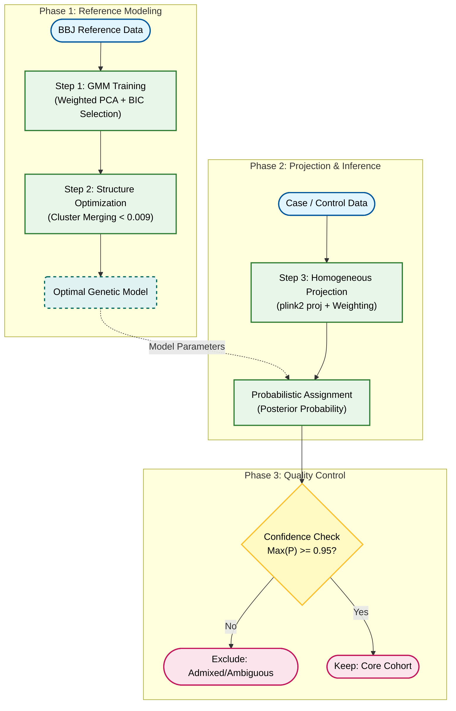

# 基因组人群结构精细校正流程详解 (PCA + GMM)

## 1. 背景与问题定义 (Problem Definition)

在全基因组关联分析 (GWAS) 或其他病例-对照 (Case-Control) 研究中，**人群分层 (Population Stratification)** 是导致假阳性结果的主要混杂因素之一。

如果我们的病例组 (Case) 和对照组 (Control) 来自遗传背景略有不同的亚群（例如，虽然都是日本人群，但可能分别来自关东和关西，或者包含不同比例的琉球血统），那么我们发现的基因差异可能仅仅反映了**人群祖源的差异**，而不是真正的**疾病关联**。

### 我们面临的挑战
1.  **连续的遗传结构**：现代人群往往不是离散的点，而是呈现连续的梯度分布（Clines），传统的硬聚类（如 K-Means）可能强制切割连续群体。
2.  **混合血统 (Admixture)**：部分样本可能处于两个亚群的中间地带，这些样本如果不加区分地纳入分析，会引入噪音。
3.  **样本匹配**：我们需要一种客观、统计学严谨的方法，将病例和对照精准地匹配到同一个遗传背景下进行比较。

---

## 2. 解决方案概览 (Methodology Overview)

本流程采用 **主成分分析 (PCA)** 降维结合 **高斯混合模型 (Gaussian Mixture Models, GMM)** 的无监督学习方法，并在特征加权空间中进行聚类与质控。

### 核心步骤：
1.  **模型构建**：在纯净的参考人群 (如 BBJ) 上训练 GMM 模型，自动寻找最优亚群结构。
2.  **结构优化**：通过基于遗传距离的层次聚类，合并过于接近的微小亚群，还原真实的连续结构。
3.  **样本投射**：将待研究的 Case/Control 样本投射到该模型中，计算归属概率。
4.  **严格质控**：剔除低置信度（混合/模糊）样本，仅保留核心样本进行后续分析。

---

## 3. 详细流程解析

### 步骤一：高斯混合模型与特征空间构建 (Model & Feature Construction)

本步骤旨在构建一个能够精准描述连续群体生物学结构的概率框架。我们采用 **方差解释率加权的主成分分析 (Variance Explained Weighted PCA)** 构建遗传空间，并在此基础上应用 **高斯混合模型 (GMM)** 进行概率建模，以应对基因组数据中普遍存在的非各向同性分布与混合血统现象。

#### 1. 算法选型：生物学适应性分析 (Rationale)

在基因组群体结构分析中，选择 GMM 是基于对生物学数据特性（连续性、混合性、各向异性）的统计学考量。相较于传统的聚类算法，GMM 在处理种群结构时表现出显著优势：

*   **适应遗传漂变导致的非各向同性 (Anisotropy)**
    人群在 PC 空间中的分布往往呈现受遗传漂变影响的拉长椭球体。**K-Means** 强制假设簇为等方差的正圆/球体，容易将单一拉长的群体错误分割。相比之下，GMM 的全协方差模式 (`covariance_type='full'`) 允许模型独立学习每个簇的形状与旋转方向，从而精准拟合自然群体的几何分布。

*   **适应连续梯度分布 (Clines)**
    大规模人群数据通常表现为连续的遗传梯度，而非离散的孤岛。**DBSCAN** 等基于密度的算法依赖显著的低密度断裂 (Gap) 来区分簇，在连续梯度或稀疏边缘区域极易失效。GMM 基于概率分布建模，能够在无明显断裂的情况下，通过概率密度有效区分亚群结构。

*   **量化混合血统 (Admixture Quantification)**
    **K-近邻 (KNN)** 等方法通常基于局部多数投票输出确定性的分类结果，难以描述处于亚群交界处的个体。GMM 提供了软聚类 (Soft Clustering) 框架，能够输出每个样本属于各祖源的**后验概率 (Posterior Probability)**。这不仅符合“基因交流”的生物学现实，也为后续的样本质控提供了量化依据。

    **表1：基因组群体结构分析中不同聚类算法的特性对比**

    | 评估维度 (Dimension) | **GMM (本文方案)** | **K-Means** | **DBSCAN** | **KNN (K-Nearest Neighbors)** |
    | :--- | :--- | :--- | :--- | :--- |
    | **几何形态假设**<br>(Geometric Assumption) | **各向异性 (Anisotropic)**<br>允许簇呈现任意方向的椭圆，精准拟合受遗传漂变影响的自然群体。 | **各向同性 (Isotropic)**<br>强制假设簇为等方差的正圆/球体，无法适配拉长的人群结构。 | **任意形状 (Density)**<br>基于密度连通性，严重依赖数据间存在清晰的密度断裂 (Gap)。 | **局部相似性 (Local Similarity)**<br>无特定全局形状假设，仅关注样本在局部几何空间中的近邻关系。 |
    | **聚类结果性质**<br>(Output Nature) | **概率软聚类 (Soft)**<br>输出后验概率 $P(C_k\|X)$，精确量化样本归属的不确定性。 | **确定性硬聚类 (Hard)**<br>执行“非此即彼”的二元分配 (0或1)，丢失中间态信息。 | **硬聚类 + 噪音判定**<br>区分核心点与噪音点，但缺乏对“混合/过渡”状态的描述能力。 | **确定性判别 (Hard)**<br>基于邻居投票的离散归类，通常丢失中间态的概率信息，难以量化混合度。 |
    | **连续梯度适应性**<br>(Cline Adaptability) | **极佳 (Optimal)**<br>通过概率密度函数有效建模混合血统 (Admixture) 与连续遗传梯度的过渡带。 | **差 (Poor)**<br>Voronoi 切割会将一个连续的梯度群体人为地划分为多个破碎片段。 | **差 (Poor)**<br>在基因组数据常见的“无断裂、连续稀疏”分布中极易失效。 | **中等 (Moderate)**<br>虽然能捕捉局部结构，但缺乏统一的全局概率模型来校正大尺度的遗传梯度。 |

#### 2. 特征工程：构建遗传特征空间 (Feature Engineering)

原始 PCA 得分仅反映几何投影，未考虑不同主成分的生物学权重。为了构建近似真实遗传距离 ($F_{ST}$) 的欧氏空间，我们在输入模型前对纳入分析的主成分进行了**相对方差解释率加权 (Relative Variance Explained Weighting)**。

*   **加权公式**:
    我们将纳入模型的每一维 PC 的方差解释率进行归一化，使其权重之和严格为 1：
    $$ w_j = \frac{\lambda_j}{\sum_{k=1}^{N_{PCs}} \lambda_k}, \quad \text{其中 } \sum_{j=1}^{N_{PCs}} w_j = 1 $$
    $$ X'_{ij} = X_{ij} \times w_j $$
    > **公式详解**：
    > *   $w_j$：第 $j$ 个主成分 (PC) 的归一化权重。
    > *   $\lambda_j$：第 $j$ 个主成分的特征值 (Eigenvalue)，代表该维度解释的遗传变异量。
    > *   $N_{PCs}$：纳入分析的主成分总数。
    > *   $X_{ij}$：样本 $i$ 在第 $j$ 个主成分上的原始得分。
    > *   $X'_{ij}$：加权后的得分，用于后续构建欧氏距离空间。
    该变换确保了模型完全基于各主成分在**当前子空间内**的相对生物学贡献率分配权重。这一处理不仅精准反映了遗传变异的真实结构，也实现了对低贡献率 PC (通常包含更多噪音) 的**软降权**，而非武断的硬截断。

#### 3. 数学定义：概率混合模型 (Mathematical Framework)

我们将人群定义为由 $K$ 个潜在多元高斯分布组成的混合体。在经过**连锁不平衡修剪 (LD Pruning)** 与**相对方差解释率加权**的主成分空间中，单一均匀群体的投影收敛于正态分布，符合中心极限定理 (CLT) 的统计假设。

*   **混合模型定义**:
    $$ P(x) = \sum_{k=1}^{K} \pi_k \mathcal{N}(x | \mu_k, \Sigma_k) $$
    > **公式详解**：
    > *   $P(x)$：观察到样本 $x$ 的总概率密度。
    > *   $K$：假定的亚群（高斯组分）总数量。
    > *   $\pi_k$：第 $k$ 个亚群的混合系数 (Mixing Coefficient)，即该亚群在总人口中的比例，满足 $\sum \pi_k = 1$。
    > *   $\mathcal{N}(x | \mu_k, \Sigma_k)$：第 $k$ 个亚群的多元高斯分布概率密度函数。
    > *   $\mu_k$：第 $k$ 个亚群的均值向量 (Centroid)。
    > *   $\Sigma_k$：第 $k$ 个亚群的协方差矩阵 (Covariance Matrix)，描述了该亚群的形状和方向。
    其中 $\pi_k$ 为第 $k$ 个亚群的混合比例，$\mu_k$ 为均值向量，$\Sigma_k$ 为全协方差矩阵。

*   **代码实现**:
    ```python
    gmm = GaussianMixture(
        n_components=n_c,       # [K]: 亚群数量
        covariance_type='full', # [Σ]: 允许拟合任意方向的椭圆
        n_init=3                # [优化]: 多次初始化以确保全局最优
    )
    ```

#### 4. 策略优选：基于 BIC 的网格搜索 (Model Selection)

为了确定最优的亚群数量 ($K$) 与主成分维数 ($PCs$)，我们采用网格搜索 (Grid Search) 结合**贝叶斯信息准则 (Bayesian Information Criterion, BIC)** 进行评估。

##### 4.1 执行流程 (Algorithm Workflow)
1.  **单模型构建 (EM Convergence)**: 
    针对参数网格中的**每一组特定组合**（即固定的 $K$ 和 $PCs$），我们独立运行 **EM 算法 (Expectation-Maximization)**。该算法迭代更新参数 $\mu, \Sigma, \pi$，直至对数似然函数收敛。此步骤确保了每个候选模型本身在数学上是最优的。
2.  **全局模型选择 (Global Selection)**: 
    在获得所有组合的收敛模型后，我们横向比较它们的 BIC 值。根据 Occam's Razor 原则，我们最终锁定 **BIC 最低** 时所对应的 $K$ 和 $PCs$ 组合及其对应的模型为全局最优解。

##### 4.2 评估核心：贝叶斯信息准则 (The BIC Metric)
在聚类分析中，随着模型复杂度（更多的 PC 或更多的簇）增加，数据的似然度 ($\hat{L}$) 必然上升，但这往往会导致**过拟合 (Overfitting)**——即模型开始拟合随机噪音而非真实的生物学结构。BIC 引入了显式的惩罚项来平衡拟合度与复杂度：

$$ BIC = \underbrace{-2 \ln(\hat{L})}_{\text{模型拟合度 (越小越好)}} + \underbrace{k \ln(n)}_{\text{复杂度惩罚 (越大越惩罚)}} $$
> **公式详解**：
> *   $BIC$：贝叶斯信息准则值，值越小模型越优。
> *   $\hat{L}$：模型的最大似然函数值 (Maximum Likelihood)，反映模型对数据的拟合程度。
> *   $k$：模型中的自由参数总数（由亚群数和PC维度共同决定）。
> *   $n$：用于训练模型的样本总数。
> *   $-2 \ln(\hat{L})$：拟合优度项，模型越准该值越小。
> *   $k \ln(n)$：惩罚项，参数越多或样本越多，该惩罚值越大，用于防止过拟合。

##### 4.3 惩罚机制详解 (Penalty Terms)
在我们的分析体系中，惩罚项 $k$ 由两个关键维度共同决定：
1.  **分簇数量 ($K_{clusters}$)**: 每一个新增的亚群都需要额外的参数来描述其均值 ($\mu$) 和协方差 ($\Sigma$)。
2.  **纳入 PC 数量 ($N_{PCs}$)**: 数据的维度越高，协方差矩阵越复杂（参数量呈平方级增长）。

**因此，BIC 实际上是在寻找一个 “甜蜜点” (Sweet Spot)：** 既使用了足够多的 PC 和 亚群来解释数据变异，又绝对避免了因滥用维度或过度切分亚群而导致的过拟合。

##### 4.4 优选优势 (Advantages)
在基因组学大样本场景下，使用 BIC 具有独特的优势：
*   **严厉的复杂度惩罚**: 相比于 AIC，BIC 对复杂度的惩罚力度更强，倾向于压制不必要的参数，优先选择 **“简约” (Parsimonious)** 的模型。
*   **抑制假阳性亚群**: BIC 的强惩罚特性有效防止了将一个连续的群体错误地分割成无数琐碎的微小簇，从而确保了划分出的亚群具有稳健且可解释的生物学意义。

我们最终选择 **BIC 值最低** 的模型，即实现了拟合精度与模型简约性的最佳平衡。


**图1：模型选择与评估**

*   **A) BIC 热图**: 展示了不同 PC 数(横轴)与亚群数 K(纵轴) 组合下的模型优度。颜色越浅代表 BIC 越低（模型越优），绿框标示了全局最优参数。
*   **B) 亚群结构**: BBJ 参考人群在最优模型下的聚类分布。
*   **C) 归属置信度**: 样本的最大后验概率分布。高亮区域（黄色）代表遗传背景明确的核心样本，暗色区域（紫色）清晰展示了亚群间的遗传混合过渡带。

---

### 步骤二：基于遗传距离的结构优化 (Step 2: Post-hoc Cluster Merging)

GMM 通过线性组合多个高斯分布来拟合数据分布。面对基因组数据中普遍存在的**连续遗传梯度 (Clines)** (Novembre & Stephens, 2008)，为了达到统计上的最优拟合，模型往往会将一个连续的生物学群体分割为多个邻接的数学组分。本步骤旨在基于遗传距离对这些组分进行聚类合并，还原其真实的生物学结构。

#### 1. 合并动因：最大似然导致的过度分割 (Rationale: Over-segmentation driven by Likelihood Maximization)
当人群呈现连续的梯度分布 (Clines) 时，GMM 的求解算法 (**EM 算法**) 为了在数学上追求**似然度 (Likelihood) 最大化**，往往会产生“过度切割”现象。

*   **拟合偏好 (Fitting Bias)**: GMM 使用**椭球体 (Gaussian components)** 作为基本单元。为了尽可能提升对连续梯度数据的拟合精度（即提高 Likelihood），模型倾向于使用多个首尾相接的椭圆进行分段拼接，而不是用一个宽泛的椭圆模糊覆盖。
*   **过度分割 (Over-segmentation)**: 这种“拼接策略”虽然在统计数学上是最优的（BIC 判定增加组件带来的拟合收益超过了复杂度惩罚），但导致选出的亚群数量往往多于生物学真实的亚群数量。
*   **还原策略**: 这些在统计上独立的组分，在生物学上往往属于同一个连续的遗传来源。我们需要通过计算组分间的遗传距离，识别并合并这些仅仅因为“数学拟合需求”而被拆分的邻接组分。


**图2A：似然度最大化导致的过度分割示意**

*   **数据真实分布 (Gray Points)**: 呈现连续的长条形梯度分布或弯曲的 Clines。
*   **数学最优拟合 (Colored Ellipses)**: EM 算法为了最大化似然度 (Likelihood)，倾向于使用多个首尾相接的短椭圆去分段“拼凑”这个连续结构，而不是用一个宽泛的长椭圆（因为长椭圆会覆盖过多无数据的空白区域，降低似然度）。
*   这就是为什么我们需要后续的 **“合并步骤” (Step 2)** 来还原其生物学本质。

#### 2. 距离度量：基于相对方差权重的遗传距离 (Genetic Distance Metric)
为了量化组分之间的相似度，我们计算了每个高斯组分的**几何质心 (Centroid)**，并在前述构建的加权特征空间中衡量它们的欧氏距离。

*   **质心计算**:
    基于 GMM 的初步聚类结果（Hard Assignments），我们计算被归类为第 $k$ 个簇的所有样本在**基于方差解释率加权的特征空间**（即 $X'_{ij}$）中的算术平均值：
    $$ \mu_k = \frac{1}{N_k} \sum_{i \in \text{Cluster}_k} x'_i $$
    > **公式详解**：
    > *   $\mu_k$：第 $k$ 个亚群在加权特征空间中的质心向量。
    > *   $N_k$：被分配到第 $k$ 个亚群的样本数量。
    > *   $x'_i$：属于第 $k$ 个亚群的样本 $i$ 的加权 PC 坐标向量。
    这一步骤锁定了每个亚群在遗传空间中的核心位置。

*   **距离计算**:
    由于质心坐标 $\mu'_k$ 已经在**上一步（质心计算）**中得出（即坐标值已通过 $w_j$ 进行了缩放），我们在此直接计算**标准欧氏距离 (Standard Euclidean Distance)**：
    $$ D(C_a, C_b) = || \mu'_a - \mu'_b ||_2 = \sqrt{\sum_{j=1}^{N_{PCs}} (\mu'_{aj} - \mu'_{bj})^2} $$
    > **公式详解**：
    > *   $D(C_a, C_b)$：亚群 $a$ 和亚群 $b$ 之间的遗传距离。
    > *   $\mu'_a, \mu'_b$：亚群 $a$ 和亚群 $b$ 的加权质心向量。
    > *   $|| \cdot ||_2$：L2 范数（欧几里得范数），数学上代表“向量长度”。在此处，它表示计算两个质心点在多维空间中的**直线几何距离**（即勾股定理在高维空间的推广）。
    > *   $\mu'_{aj}$：亚群 $a$ 在第 $j$ 维加权 PC 上的均值。
    > *   公式含义：在考虑了各 PC 生物学权重的前提下，计算两个亚群中心点的直线几何距离。
    **注意**：在此公式中我们**不再重复加权**。因为特征空间的坐标尺度已经内含了权重信息，所以“加权空间内的标准欧氏距离”在数学上严格等价于“原始 PC 空间内的加权欧氏距离”。该距离有效地屏蔽了低变异维度的噪音，真实反映群体间的主体遗传分化水平（近似 $F_{ST}$）。

#### 3. 执行合并与阈值判定 (Merging & Thresholding)
这一过程可以通过**层次聚类树 (Dendrogram)** 直观展示（如图 2C 所示）：

1.  **树状图构建 (Hierarchical Clustering)**: 
    我们基于亚群质心间的距离矩阵，采用**层次聚类 (Hierarchical Clustering)** 算法构建谱系树。树中连线的高度直接代表了两个组分间的遗传距离。

2.  **阈值选择 (0.009) 的合理性**:
    我们采取 **0.009** 作为截断阈值（图中红色虚线）。这一选择参考了 **Yamamoto et al. (2024)** 在 *Nature Communications* 发表的研究，该阈值被证明在视觉上能最佳地还原 BBJ 人群的精细结构：
    *   **参考文献**: *Yamamoto, K., Namba, S., et al. (2024). Genetic legacy of ancient hunter-gatherer Jomon in Japanese populations.*
    *   **距离 < 0.009**: 视为 **“连续梯度” (Clines)**。如此微小的距离意味着两个组分在生物学上属于同一连续群体，仅因拟合需求被拆分。
    *   **距离 > 0.009**: 视为 **“真实分化” (Differentiation)**。代表存在显著的遗传或地理阻隔，应被视为独立亚群。
3.  **合并执行**: 凡是在红色虚线下方连接在一起的分支，都被合并为一个独立的生物学 **“超级簇” (Merged Cluster)**。

**合并后的概率更新**:
对于属于“超级簇” $M$ 的样本 $x$，其最终归属概率为该超级簇下辖所有子组分 (Components) 的后验概率之和：
$$ P(M|x) = \sum_{k \in M} P(k|x) $$
> **公式详解**：
> *   $P(M|x)$：样本 $x$ 属于合并后“超级簇” $M$ 的总概率。
> *   $M$：包含多个原始子组分（高斯成分）的集合。
> *   $P(k|x)$：样本 $x$ 属于原始子组分 $k$ 的后验概率。
> *   公式含义：通过加法规则，将从属于同一个大类的所有细分亚群的概率累加，得到样本属于该大类的置信度。
这一步对于准确评估处于梯度边缘的样本至关重要。


**图2：GMM 簇合并与结构优化过程**

*   **A) 初始簇与质心 (Initial Components)**: GMM 初始识别的精细亚群结构，白色质心点展示了模型如何使用多个高斯椭圆来拟合连续的遗传梯度。
*   **B) 距离矩阵 (Distance Matrix)**: 亚群质心间的加权欧氏遗传距离热图，浅色区域揭示了遗传背景极度相似的邻接亚群。
*   **C) 层次聚类树 (Dendrogram)**: 基于遗传距离构建的谱系树，红色虚线 (threshold=0.009) 定义了将数学组分合并为生物学“超级簇”的边界。
*   **D) 最终合并结构 (Final Structure)**: 合并后的独立亚群分布，消除了最大似然估计导致的过度切割。
*   **E) 合并置信度 (Merged Confidence)**: 样本属于最终“超级簇”的后验概率分布，深色（低置信度）区域清晰描绘了亚群间的遗传过渡带。

---

### 步骤三：病例与对照的概率指派 (Step 3: Probabilistic Assignment)

利用在纯净参考人群上训练好的模型参数，我们将目标样本（Case 与 Control）映射到同一遗传特征空间，并计算其量化的归属概率。这一步骤不仅仅是分类，更是对样本遗传背景纯度的精细度量。

#### 1. 指派策略：基于后验概率的软聚类 (Strategy: Soft Clustering via Posterior Probabilities)
为了克服传统硬聚类 (Hard Clustering, 如 K-Means) 在处理连续梯度群体时的局限性，我们采用**软指派 (Soft Assignment)** 策略。

*   **捕捉不确定性 (Uncertainty Quantification)**: 
    模型不再输出单一的分类标签，而是为每个样本提供一个概率分布向量 (e.g., $P \in \mathbb{R}^K$)。这种表达方式（例如“98% 属于 Cluster A，2% 属于 Cluster B”）保留了样本在遗传背景上的丰富细节。
*   **识别混合样本 (Admixture Identification)**: 
    通过概率向量，我们可以直观地识别出那些位于亚群交界处的样本。例如，一个 $P(A)=0.55, P(B)=0.45$ 的样本，在硬聚类中会被武断地划入 A 类，但在我们的模型中，它将被标记为“高风险的混合样本”并在后续质控中受到审查。

#### 2. 技术实现：同质空间投射 (Mechanism: Homogeneous Projection)
为了确保 Case/Control 样本与参考人群在几何空间上的严格可比性，我们采用 **Projection PCA** 策略，即“固定坐标系”的方法（详见 *plink2_glm_vs_saige.md* 相关讨论）。

*   **投射执行 (Projection via Linear Combination)**: 
    我们利用在纯净参考人群 (BBJ) 上计算出的**变异权重 (SNP Weights/Loadings)** 和**等位基因频率 (Allele Frequencies)**，通过 `plink2 --score ... read-freq` 命令将待研究样本“被动投射”到既定的 PC 空间中。这一过程确保了坐标轴方向的绝对冻结与一致性。
*   **特征加权的一致性 (Consistency of Feature Weighting)**:
    投射之后，我们**严格沿用 BBJ 参考系的相对方差解释率权重**（基于特征值计算）对 Case/Control 样本的 PC 得分进行加权。这确保了新样本与训练数据在同一个加权特征空间 (Weighted Feature Space) 内，满足 GMM 基于欧氏距离计算似然度的数学前提。
*   **几何稳定性 (Geometric Stability)**: 
    此策略有效避免了因 Case/Control 样本自身的结构偏差干扰基准坐标系的稳定性，确保了位置推断的客观性。

#### 3. 概率推断与聚合 (Inference & Aggregation)
一旦样本进入统一的加权特征空间 ($x_{new}$)，我们利用训练好的 GMM 参数进行统计推断。

*   **贝叶斯后验概率计算**: 
    基于 GMM 的参数集（均值 $\mu$，协方差 $\Sigma$，混合权重 $\pi$），计算样本属于第 $k$ 个高斯组件的后验概率：
    $$ P(z_k=1 | x_{new}) = \frac{\pi_k \mathcal{N}(x_{new} | \mu_k, \Sigma_k)}{\sum_{j=1}^{K} \pi_j \mathcal{N}(x_{new} | \mu_j, \Sigma_j)} $$
    > **公式详解**：
    > *   $P(z_k=1 | x_{new})$：给定新样本 $x_{new}$，它源自第 $k$ 个亚群的后验概率 (Posterior Probability)。此处 $z$ 是一个指示样本真实归属的隐变量 (Latent Variable)，$z_k=1$ 数学上表示“该样本属于第 $k$ 个簇”这一事件发生。
    > *   $\pi_k$：第 $k$ 个亚群的先验概率（混合权重）。
    > *   $\mathcal{N}(x_{new} | \mu_k, \Sigma_k)$：样本 $x_{new}$ 在第 $k$ 个亚群分布下的似然度 (Likelihood)。
    > *   分母部分：全概率公式，所有可能的亚群产生该样本的概率之和，用于归一化确保总概率为 1。

*   **针对超级簇的概率聚合**: 
    对应于**步骤二**中的结构优化，若子组件集合 $\{c_i\}_{i \in M}$ 已被合并为生物学超级簇 $M$，则样本归属于 $M$ 的概率为子组件概率的**标量和**：
    $$ P(M | x) = \sum_{i \in M} P(c_i | x) $$
    > **公式详解**：
    > *   同“合并后的概率更新”公式，此处再次强调在病例/对照投射阶段使用相同的逻辑。
    > *   $P(M | x)$：样本归属于合并簇 $M$ 的概率。
    > *   $P(c_i | x)$：样本归属于构成 $M$ 的基础高斯组分 $c_i$ 的概率。
    最终输出的概率分布向量之和严格为 1，构成了后续质量控制的量化基础。


**图3：病例 (Case) 与对照 (Control) 样本的概率推断与分群**

*   **A) 样本分布**: 展示了 Case (红点) 和 Control (蓝点) 在参考人群背景 (BBJ, 灰色) 上的投射。
*   **B) 聚类推断**: 展示了每个样本被指派到的最终合并亚群 (Cluster ID)。
*   **C) 指派置信度**: 展示了每个样本归属的确定性。高亮黄色区域代表核心样本，深紫色区域代表处于亚群交界处的模糊样本。
*   **D) 统计表**: 详细列出了在每个亚群中 Case 和 Control 的样本数量分布，作为后续匹配的基础。

---

### 步骤四：置信度筛选与质控 (Step 4: Confidence-Based Quality Control)

在获得每个样本的概率归属后，我们实施严格的质量控制。本步骤旨在通过量化筛选，构建遗传背景高度均一的“核心队列”，从而最大限度地降低人群分层带来的统计噪音。

#### 1. 筛选逻辑：宁缺毋滥 (Rationale: Purity over Quantity)
在病例对照研究中，包含混合血统或遗传背景模糊的样本（Ambiguous Samples）往往弊大于利。
*   **噪音抑制**: 处于亚群交界处的样本往往携带复杂的遗传结构，保留它们会显著增加假阳性风险。
*   **核心界定**: 我们只关注那些在统计上能被高置信度归类为某一特定亚群的个体，将其定义为“核心样本 (Core Samples)”。

#### 2. 执行标准：贝叶斯置信度阈值 (Mechanism: Bayesian Confidence Thresholding)
基于贝叶斯后验概率，我们引入了一个严格的判别阈值（通常设定为 $\tau = 0.95$）。

*   **保留准则 (Inclusion Criteria)**:
    只有当样本属于某一特定生物学亚群的概率超过阈值时，才被纳入后续分析：
    $$ \max_{M} P(M | x) \ge 0.95 $$
    > **公式详解**：
    > *   $\max_{M} P(M | x)$：样本 $x$ 在所有可能的超级簇 $M$ 中，最大的那个归属概率值。
    > *   $0.95$：预设的置信度阈值。
    > *   公式含义：只保留那些我们有 95% 以上把握判定其归属的样本，剔除模棱两可的中间态样本。
    这意味着模型排除了一切合理的竞争假设，对该样本的归属具有高度确定性。

*   **剔除策略 (Exclusion Strategy)**:
    任何最大后验概率低于阈值的样本都被视为 **“模糊/混合样本”**。这些样本在几何上通常位于 PC 空间中不同亚群的重叠或过渡区域（如图 3 中的深紫色点），将被从最终关联分析队列中移除。

#### 3. 质控效果评估 (Outcome Assessment)
这一筛选机制充当了高效的“数字筛子”，实现了对群体结构的物理提纯。


**图4：样本归属置信度的分布直方图**

绝大多数保留样本应位于右侧高置信度区间 ($P \approx 1.0$)，表明模型对数据的解释力很强。左侧长尾代表了被剔除的低质量或混合样本。


**图5：高置信度 (P > 0.95) 核心样本集**

对比图3可见，处于亚群交界处颜色较深（低置信度）的 **“模糊地带”** 样本已被精准剔除。剩下的样本（高亮区域）形成了彼此分离、边界清晰的致密簇，构成了后续遗传关联分析的坚实基础。

---

## 4. 最终验证与统计评估 (Final Validation & Statistical Assessment)

经过上述严格流程，我们选取特定的亚群（例如 Cluster 0），对比其中保留下来的 Case 和 Control 样本。我们需要从**中心趋势**和**分布形态**两个维度进行验证。

### 1. 验证目标：排除分层偏差 (Rationale: Exclusion of Stratification Bias)
成功的匹配并不要求两组样本的每一个数据点都重合，而是要求两组样本在遗传空间中的**中心位置 (Centroids)** 高度一致。
*   **系统性偏差 (Systematic Bias)**: 如果 Case 和 Control 的均值存在显著差异，说明存在未校正的人群分层，会导致 GWAS 结果膨胀 (Inflation)。
*   **方差差异 (Variance Difference)**: 控制组 (Control) 样本量通常远大于病例组 (Case)，因此涵盖更广的遗传多样性是预期的。

### 2. 统计检验指标 (Mechanism: Statistical Metrics)
我们采用三维检验体系来评估匹配质量：
*   **Welch's t-test (均值检验)**: 
    *   **关注点**: 两个群体的中心位置是否一致。
    *   **期望结果**: $P > 0.05$ (无显著差异)。这是判断校正是否成功的**核心金标准**。
*   **Mann-Whitney U Test (秩和检验)**:
    *   **关注点**: 两个群体的秩次分布是否存在系统性偏离。
    *   **解读**: 作为非参数检验，它不依赖正态分布假设。当与 T-test 结果不一致（例如 T-test 不显著但 U-test 显著）时，通常提示两组样本的**离散度 (Spread/Variance)** 存在显著差异。
*   **Kolmogorov-Smirnov Test (分布检验)**:
    *   **关注点**: 整体概率分布形状（包括偏度、峰度、尾部）是否一致。
    *   **解读**: 在样本量不平衡 ($N_{control} \gg N_{case}$) 时，该检验经常显著 ($P < 0.05$)，反映了 Control 组拥有更宽的遗传方差 (Broader Variance)，但这并不必然代表分层校正失败。

### 3. 实测数据评估 (Outcome Assessment)
基于实际数据 (Cluster 0) 的统计结果分析，我们获得了如下详细测试报告：

```text
>>> STATISTICAL TESTING (Case vs Control - Cluster 0)

--- PC1 Analysis ---
  Welch's t-test (Mean):      t=-1.2397, p=2.1554e-01
  Mann-Whitney U (Rank Sum):  p=8.6196e-01
  Kolmogorov-Smirnov (Dist):  D=0.1616, p=6.3720e-08
  Result: Not Significant (at alpha=0.05)

--- PC2 Analysis ---
  Welch's t-test (Mean):      t=-0.6983, p=4.8521e-01
  Mann-Whitney U (Rank Sum):  p=2.6462e-04
  Kolmogorov-Smirnov (Dist):  D=0.2079, p=7.2890e-13
  Result: ** SIGNIFICANT ** (at alpha=0.05)
```

由上述数据可见，三个维度的检验结果呈现出了清晰的层级特征：

*   **均值稳定性 (Mean Stability - PASS)**:
    PC1 和 PC2 的 Welch's T-test $p$ 值分别为 **0.21** 和 **0.48**，均远超显著性阈值 0.05。
    $$ \mu_{case} \approx \mu_{control} $$
    > **公式详解**：
    > *   $\mu_{case}$：病例组在特定 PC 维度上的均值。
    > *   $\mu_{control}$：对照组在同一 PC 维度上的均值。
    > *   $\approx$：在统计学上无显著差异 ($P > 0.05$)。
    > *   公式含义：校正成功的标志是两组人群的几何中心重合，消除系统性便宜。
    这提供了最关键的证据：**两组样本的遗传背景中心完全重合**，不存在导致 GWAS 膨胀的系统性平均位置偏移。

*   **秩次与离散度 (Rank & Dispersion - MIXED)**:
    Mann-Whitney U 检验在 PC1 上统计不显著 ($p=0.86$)，但在 PC2 上表现显著 ($p < 0.001$)。由于该非参数检验对分布的“位置”和“形状”均敏感，在 T-test 已证实“位置（均值）”无差异的前提下，PC2 的显著性主要由 **Control 组显著更大的方差**（Std: 0.0086 vs 0.0046）驱动。这反映了 Control 组保留了比 Case 组更丰富的内部遗传多样性。

*   **分布形态 (Distribution Shape - EXPECTED)**:
    KS Test 极其显著 ($p < 10^{-7}$)，这在预料之中。Control 组庞大的样本量使其必然覆盖更宽广的遗传频谱（更长的尾部）。正如 **图6** 所示，Control 组（蓝）与 Case 组（红）的**峰值完全重合**，区别仅在于蓝色曲线底部的宽度。这种“同心不同宽”的模式不影响以加性效应为主的关联分析。


**图6：Cluster 0 内部 Case (红) vs Control (蓝) 的 PC 分布对比**

*   **直方图 (Histogram)**: 展示了样本的计数分布。可见 Control (蓝色) 在拥有与 Case (红色) 相同峰值中心的同时，覆盖了更宽的横轴范围。
*   **结论**: 红蓝曲线的**峰值完全对齐**，证明主要的人群结构已被完美校正。

---

## 5. 后续分析策略建议 (Downstream Analysis Strategies)

鉴于最终验证显示 Case 与 Control 在核心遗传背景上（均值）高度一致，但在分布宽度（方差）上仍存在一定差异，为确保关联分析的稳健性，我们提出三种互补的处理策略：

### 策略一：构建精细匹配队列 (Cohort Composition)
*   **核心逻辑**: **全部保留 Case，精准匹配 Control**。
*   **操作建议**: 鉴于 Case 样本宝贵，建议保留所有通过 GMM 质控的 Case 样本。对于 Control 组，既可以直接使用当前所有通过质控的样本（最大化统计功效），也可以计算样本到 Cluster 中心的马氏距离 (Mahalanobis Distance)，进行更严格的 1:N 匹配，以消除方差不齐的影响。

### 策略二：混合模型校正 (Random Effect Modeling)
*   **适用场景**: 针对簇内可能残留的、无法被 PC 捕捉的微细结构（Fine-scale structure）。
*   **操作建议**: 采用 **广义线性混合模型 (GLMM)**（如 SAIGE 或 REGENIE）。
*   **机制**: 利用全基因组数据构建遗传关系矩阵 (GRM) 并将其作为**随机效应 (Random Effect)** 纳入模型。这能有效模拟簇内的个体间亲缘关系，吸收 Control 组较大方差带来的潜在噪音。

### 策略三：主成分回归校正 (Fixed Effect Adjustment)
*   **适用场景**: 标准 Logistic 回归 (GLM) 分析。
*   **操作建议**: 将主要的主成分 (PCs) 作为**固定效应 (Fixed Effects)** 协变量纳入回归方程。
*   **机制**: $Logit(P) = \beta_0 + \beta_{SNP} G + \sum \beta_i PC_i + \epsilon$。由于 GMM 已经保证了 Case/Control 在 PC 空间上的支撑集重叠 (Combined Support)，在此基础上回归 PC 可以最有效地消除残留的线性梯度混杂。
    > **公式详解**：
    > *   $Logit(P)$：患病概率的对数几率 $\ln(P/(1-P))$。
    > *   $\beta_{SNP}$：我们要研究的遗传变异 (SNP) 的效应值（即目标结果）。
    > *   $G$：个体的基因型 (0, 1, 2)。
    > *   $\beta_i PC_i$：第 $i$ 个主成分作为协变量的效应。将 PC 放入方程是为了扣除其对患病风险的影响。
    > *   $\epsilon$：残差项。

---

## 6. 总结与核心流程图 (Summary & Workflow Diagram)

本流程通过 **PCA降维 -> GMM软聚类 -> 距离合并 -> 概率质控** 这一整套严谨的算法路径，有效地解决了复杂人群结构中的样本匹配问题，为高质量的基因组学研究奠定了坚实基础。

下面是该分析流程的可视化总结：


