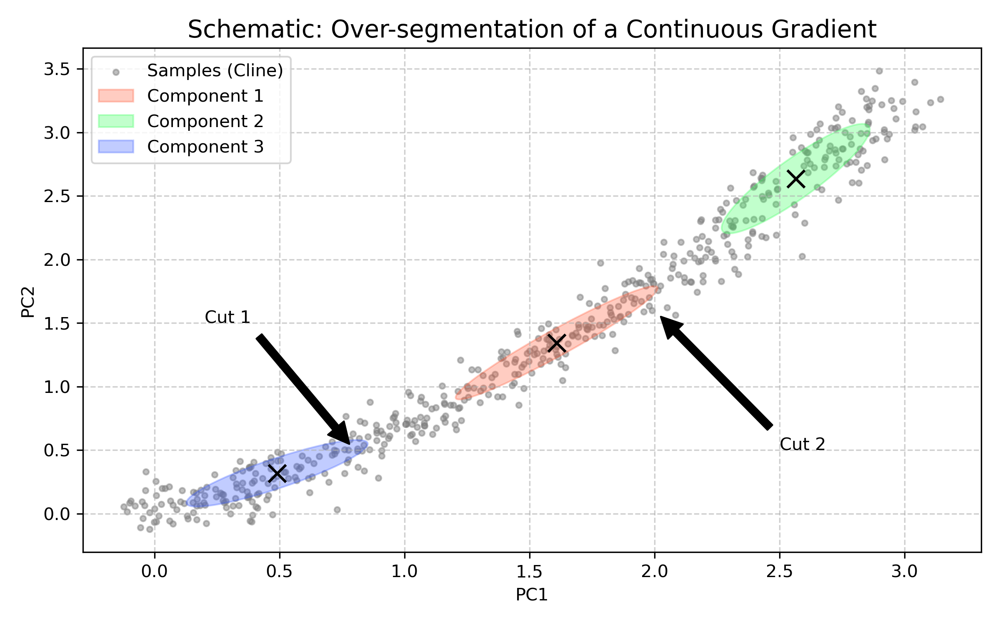
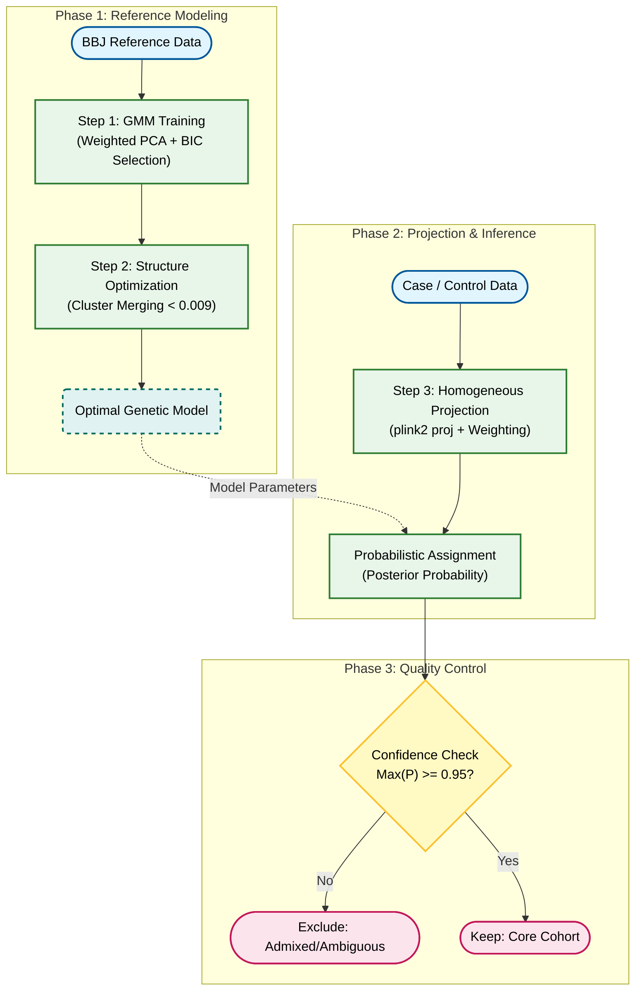

# Detailed Workflow for Fine-Scale Population Structure Correction (PCA + GMM)

## 1. Background & Problem Definition

In Genome-Wide Association Studies (GWAS) or other Case-Control studies, **Population Stratification** is a major confounding factor leading to false positive results.

If our Case and Control groups come from slightly different genetic sub-populations (e.g., both are Japanese, but effectively from Kanto vs. Kansai regions, or containing different proportions of Ryukyuan ancestry), the genetic differences we discover might merely reflect **ancestry differences** rather than true **disease associations**.

### Challenges We Face
1.  **Continuous Genetic Structure**: Modern populations often exhibit continuous **Clines** rather than discrete points. Traditional hard clustering (like K-Means) may forcibly cut continuous groups.
2.  **Admixture**: Some samples may lie in the intermediate zone between two sub-populations. Including these without distinction introduces noise.
3.  **Sample Matching**: We need an objective, statistically rigorous method to precisely match Cases and Controls to the same genetic background for comparison.

---

## 2. Methodology Overview

This workflow employs **Principal Component Analysis (PCA)** for dimensionality reduction combined with **Gaussian Mixture Models (GMM)** for unsupervised learning, performing clustering and quality control in a feature-weighted space.

### Core Steps:
1.  **Model Construction**: Train a GMM on a clean Reference Population (e.g., BBJ) to automatically find the optimal sub-population structure.
2.  **Structure Optimization**: Merge overly similar micro-subpopulations via genetic-distance-based hierarchical clustering to restore the true continuous structure.
3.  **Sample Projection**: Project target Case/Control samples into this model and calculate assignment probabilities.
4.  **Strict QC**: Exclude low-confidence (mixed/ambiguous) samples, retaining only core samples for subsequent analysis.

---

## 3. Detailed Process Analysis

### Step 1: Model & Feature Construction

This step aims to build a probabilistic framework capable of precisely describing the biological structure of continuous populations. We employ **Variance Explained Weighted PCA** to construct the genetic space and apply **Gaussian Mixture Models (GMM)** on this basis to handle anisotropy and admixture phenomena prevalent in genomic data.

#### 1. Algorithm Selection: Biological Rationale

In genomic population structure analysis, the choice of GMM is based on statistical considerations of biological data characteristics (continuity, admixture, anisotropy). Compared to traditional clustering algorithms, GMM shows significant advantages:

*   **Adaptation to Anisotropy (Genetic Drift)**
    Populations in PC space often appear as elongated ellipsoids due to genetic drift. **K-Means** forcibly assumes clusters are spherical with equal variance, easily error-splitting a single elongated group. In contrast, GMM's full covariance mode (`covariance_type='full'`) allows the model to independently learn the shape and rotation of each cluster, precisely fitting the geometric distribution of natural populations.

*   **Adaptation to Clines**
    Large-scale population data usually presents as continuous genetic gradients rather than isolated islands. **DBSCAN** relies on significant density gaps to distinguish clusters and fails easily in continuous gradient or sparse edge regions. GMM models based on probability density, effectively distinguishing sub-population structures through probability density even without clear gaps.

*   **Quantification of Admixture**
    Methods like **K-Nearest Neighbors (KNN)** typically output deterministic classification results based on local majority voting, making it difficult to describe individuals at sub-population boundaries. GMM provides a **Soft Clustering** framework, outputting the **Posterior Probability** of each sample belonging to each ancestry. This not only aligns with the biological reality of "gene flow" but also provides a quantitative basis for subsequent sample QC.

    **Table 1: Comparison of Clustering Algorithms in Genomic Population Structure Analysis**

    | Evaluation Dimension | **GMM (Our Method)** | **K-Means** | **DBSCAN** | **KNN** |
    | :--- | :--- | :--- | :--- | :--- |
    | **Geometric Assumption** | **Anisotropic**<br>Allows clusters to be ellipses of any orientation, precisely fitting natural populations affected by genetic drift. | **Isotropic**<br>Forcibly assumes clusters are spheres of equal variance, unable to adapt to elongated population structures. | **Arbitrary Shape (Density)**<br>Based on density connectivity, heavily relies on clear density gaps between data. | **Local Similarity**<br>No specific global shape assumption, only focuses on nearest neighbor relationships in local geometric space. |
    | **Output Nature** | **Probabilistic Soft Clustering**<br>Outputs posterior probability $P(C_k\|X)$, precisely quantifying assignment uncertainty. | **Deterministic Hard Clustering**<br>Performs binary assignment (0 or 1), losing intermediate state information. | **Hard Clustering + Noise**<br>Distinguishes core points from noise but lacks the ability to describe "mixed/transitional" states. | **Deterministic Hard Discrimination**<br>Discrete classification based on neighbor voting, usually losing probability information of intermediate states. |
    | **Cline Adaptability** | **Optimal**<br>Effectively models transition zones of Admixture and continuous genetic gradients via probability density functions. | **Poor**<br>Voronoi tessellation artificially cuts a continuous gradient population into multiple fragmented pieces. | **Poor**<br>Easily fails in the "gapless, continuous sparse" distributions common in genomic data. | **Moderate**<br>Can capture local structure but lacks a unified global probabilistic model to correct large-scale genetic gradients. |

#### 2. Feature Engineering: Constructing Genetic Feature Space

Raw PCA scores only reflect geometric projection, ignoring the biological weight of different principal components. To construct a Euclidean space approximating the true genetic distance ($F_{ST}$), we apply **Relative Variance Explained Weighting** to the PCs included in the analysis.

*   **Weighting Formula**:
    We normalize the variance explained ratio of each PC included in the model so that their weights sum to exactly 1:
    $$ w_j = \frac{\lambda_j}{\sum_{k=1}^{N_{PCs}} \lambda_k}, \quad \text{where } \sum_{j=1}^{N_{PCs}} w_j = 1 $$
    $$ X'_{ij} = X_{ij} \times w_j $$
    > **Formula Explanation**:
    > *   $w_j$: Recognized normalized weight for the $j$-th Principal Component (PC).
    > *   $\lambda_j$: Eigenvalue of the $j$-th PC, representing the amount of genetic variance explained by this dimension.
    > *   $N_{PCs}$: Total number of PCs included in the analysis.
    > *   $X_{ij}$: Raw score of sample $i$ on the $j$-th PC.
    > *   $X'_{ij}$: Weighted score, used for subsequent construction of Euclidean distance space.
    This transformation ensures the model assigns weights completely based on the relative biological contribution of each PC within the **current subspace**. This not only accurately reflects the true structure of genetic variation but also achieves **soft down-weighting** for low-contribution PCs (which usually contain more noise), rather than arbitrary hard truncation.

#### 3. Mathematical Framework: Probabilistic Mixture Model

We define the population as a mixture composed of $K$ latent multivariate Gaussian distributions. In the PC space processed by **LD Pruning** and **Relative Variance Explained Weighting**, the projection of a single homogeneous population converges to a normal distribution, satisfying the statistical assumptions of the Central Limit Theorem (CLT).

*   **Mixture Model Definition**:
    $$ P(x) = \sum_{k=1}^{K} \pi_k \mathcal{N}(x | \mu_k, \Sigma_k) $$
    > **Formula Explanation**:
    > *   $P(x)$: Total probability density of observing sample $x$.
    > *   $K$: Total number of assumed sub-populations (Gaussian components).
    > *   $\pi_k$: Mixing Coefficient for the $k$-th sub-population, i.e., the proportion of this sub-population in the total population, satisfying $\sum \pi_k = 1$.
    > *   $\mathcal{N}(x | \mu_k, \Sigma_k)$：Probability Density Function (PDF) of the multivariate Gaussian distribution for the $k$-th sub-population.
    > *   $\mu_k$: Mean vector (Centroid) of the $k$-th sub-population.
    > *   $\Sigma_k$: Covariance Matrix of the $k$-th sub-population, describing its shape and direction.

*   **Code Implementation**:
    ```python
    gmm = GaussianMixture(
        n_components=n_c,       # [K]: Number of sub-populations
        covariance_type='full', # [Σ]: Allow fitting ellipses of any direction
        n_init=3                # [Opt]: Multiple initializations to ensure global optimum
    )
    ```

#### 4. Model Selection: Grid Search & BIC

To determine the optimal number of sub-populations ($K$) and PC dimensions ($PCs$), we employ Grid Search combined with the **Bayesian Information Criterion (BIC)** for evaluation.

##### 4.1 Algorithm Workflow
1.  **EM Convergence**: 
    For **each specific combination** in the parameter grid (fixed $K$ and $PCs$), we independently run the **EM Algorithm (Expectation-Maximization)**. The algorithm iteratively updates parameters $\mu, \Sigma, \pi$ until the log-likelihood function converges. This ensures each candidate model is mathematically optimal.
2.  **Global Selection**: 
    After obtaining determining models for all combinations, we compare their BIC values. Following Occam's Razor, we lock the combination of $K$ and $PCs$ corresponding to the **lowest BIC** as the global optimal solution.

##### 4.2 The BIC Metric
In clustering analysis, as model complexity (more PCs or more clusters) increases, the likelihood of the data ($\hat{L}$) inevitably rises, but this often leads to **Overfitting**—where the model starts fitting random noise rather than true biological structure. BIC introduces an explicit penalty term to balance fit and complexity:

$$ BIC = \underbrace{-2 \ln(\hat{L})}_{\text{Goodness of Fit (Lower is Better)}} + \underbrace{k \ln(n)}_{\text{Complexity Penalty (Higher is more Penalized)}} $$
> **Formula Explanation**:
> *   $BIC$: Bayesian Information Criterion value; smaller is better.
> *   $\hat{L}$: Maximum Likelihood value of the model, reflecting how well the model fits the data.
> *   $k$: Total number of free parameters in the model (determined by sub-population count and PC dimensions).
> *   $n$: Total number of samples used for training.
> *   $-2 \ln(\hat{L})$: Goodness of fit term; the accurate the model, the smaller this value.
> *   $k \ln(n)$: Penalty term; the more parameters or samples, the larger this penalty, used to prevent overfitting.

##### 4.3 Penalty Mechanism
In our analysis system, the penalty term $k$ is determined by two key dimensions:
1.  **Cluster Count ($K_{clusters}$)**: Each new sub-population requires additional parameters to describe its mean ($\mu$) and covariance ($\Sigma$).
2.  **PC Count ($N_{PCs}$)**: The higher the data dimension, the more complex the covariance matrix (parameters grow quadratically).

**Therefore, BIC is essentially looking for a "Sweet Spot":** Using enough PCs and sub-populations to explain data variation while absolutely avoiding overfitting caused by abusing dimensions or over-splitting sub-populations.

##### 4.4 Advantages
In large-scale genomic scenarios, using BIC has unique advantages:
*   **Strict Complexity Penalty**: Compared to AIC, BIC has a stronger penalty for complexity, tending to suppress unnecessary parameters and favoring **"Parsimonious"** models.
*   **Suppression of False Positives**: BIC's strong penalty effectively prevents correctly splitting a continuous population into countless trivial micro-clusters, ensuring the identified sub-populations have robust and interpretable biological significance.

We ultimately choose the model with the **lowest BIC**, achieving the best balance between fitting accuracy and model parsimony.


**Figure 1: Model Selection & Evaluation**

*   **A) BIC Heatmap**: Shows model goodness under different PC counts (x-axis) and sub-population counts K (y-axis). Lighter colors represent lower BIC (better models); the green box indicates the global optimal parameters.
*   **B) Sub-population Structure**: Clustering distribution of the BBJ reference population under the optimal model.
*   **C) Assignment Confidence**: Maximum posterior probability distribution of samples. Highlighted areas (yellow) represent core samples with clear genetic backgrounds, while dark areas (purple) clearly show genetic transition zones between sub-populations.

---

### Step 2: Structure Optimization (Post-hoc Cluster Merging)

GMM fits data distribution by linearly combining multiple Gaussian distributions. Facing the **Continuous Genetic Gradients (Clines)** prevalent in genomic data (Novembre & Stephens, 2008), to achieve statistical optimal fit, the model often splits a continuous biological population into multiple adjacent mathematical components. This step aims to merge these components based on genetic distance to restore their true biological structure.

#### 1. Rationale: Over-segmentation driven by Likelihood Maximization
When populations exhibit continuous gradient distributions (Clines), GMM's solver (**EM Algorithm**) typically produces "over-segmentation" in its mathematical pursuit of **Likelihood Maximization**.

*   **Fitting Bias**: GMM uses **Ellipsoids (Gaussian components)** as basic units. To improve fitting accuracy for continuous gradient data (raise Likelihood), the model tends to use multiple end-to-end connected ellipses to piece segments together, rather than using one broad ellipse to cover loosely.
*   **Over-segmentation**: While this "piecing strategy" is statistically optimal (BIC determines the fit gain from adding components exceeds the complexity penalty), it leads to a number of sub-populations often greater than the true biological count.
*   **Restoration Strategy**: These statistically independent components often belong to the same continuous genetic source biologically. We need to calculate genetic distance between components to identify and merge these adjacent components split merely for "mathematical fitting needs".



**Figure 2A: Schematic of Over-segmentation due to Likelihood Maximization**

*   **True Data Distribution (Gray Points)**: Exhibits continuous elongated gradient distribution or curved Clines.
*   **Mathematical Optimal Fit (Colored Ellipses)**: To maximize Likelihood, the EM algorithm tends to use multiple short ellipses connected end-to-end to "piece together" this continuous structure, rather than using one broad long ellipse (as a long ellipse would cover too much empty space without data, reducing likelihood).
*   This illustrates why we need the subsequent **"Merging Step" (Step 2)** to restore the biological essence.

#### 2. Genetic Distance Metric: Relative Variance Weighted Distance
To quantify similarity between components, we calculate the **Geometric Centroid** of each Gaussian component and measure their Euclidean distance in the aforementioned weighted feature space.

*   **Centroid Calculation**:
    Based on preliminary GMM clustering (Hard Assignments), we calculate the arithmetic mean of all samples classified into cluster $k$ in the **Variance Explained Weighted Feature Space** ($X'_{ij}$):
    $$ \mu_k = \frac{1}{N_k} \sum_{i \in \text{Cluster}_k} x'_i $$
    > **Formula Explanation**:
    > *   $\mu_k$: Centroid vector of the $k$-th sub-population in the weighted feature space.
    > *   $N_k$: Number of samples assigned to the $k$-th sub-population.
    > *   $x'_i$: Weighted PC coordinate vector of sample $i$ belonging to the $k$-th sub-population.
    This step locks the core position of each sub-population in genetic space.

*   **Distance Calculation**:
    Since centroid coordinates $\mu'_k$ were already derived in the **previous step** (scaled by $w_j$), we directly calculate the **Standard Euclidean Distance**:
    $$ D(C_a, C_b) = || \mu'_a - \mu'_b ||_2 = \sqrt{\sum_{j=1}^{N_{PCs}} (\mu'_{aj} - \mu'_{bj})^2} $$
    > **Formula Explanation**:
    > *   $D(C_a, C_b)$: Genetic distance between sub-population $a$ and sub-population $b$.
    > *   $\mu'_a, \mu'_b$: Weighted centroid vectors of sub-population $a$ and $b$.
    > *   $|| \cdot ||_2$: L2 Norm (Euclidean Norm), mathematically representing "vector length". Here, it denotes the **straight-line geometric distance** between two centroid points in multi-dimensional space (generalization of Pythagorean theorem).
    > *   $\mu'_{aj}$: Mean of sub-population $a$ on the $j$-th weighted PC.
    > *   Formula Meaning: Calculating the straight-line geometric distance between two sub-population centers given the biological weights of each PC.
    **Note**: We **do not re-weight** in this formula. Since the feature space coordinates already contain weight information, "Standard Euclidean Distance in Weighted Space" is mathematically strictly equivalent to "Weighted Euclidean Distance in Raw PC Space". This distance effectively shields noise from low-variation dimensions, truly reflecting the main genetic differentiation level between populations (approximating $F_{ST}$).

#### 3. Execution & Thresholding
This process is visualized via a **Dendrogram** (as shown in Figure 2C):

1.  **Dendrogram Construction**: 
    We build a lineage tree using **Hierarchical Clustering** based on the distance matrix between sub-population centroids. The height of connections in the tree directly represents the genetic distance between two components.

2.  **Rationale for Threshold (0.009)**:
    We adopt **0.009** as the cutoff threshold (red dashed line). This choice references the study published in *Nature Communications* by **Yamamoto et al. (2024)**, where this threshold was proven to visually best restore the fine structure of the BBJ population:
    *   **Reference**: *Yamamoto, K., Namba, S., et al. (2024). Genetic legacy of ancient hunter-gatherer Jomon in Japanese populations.*
    *   **Distance < 0.009**: Regarded as **"Continuous Clines"**. Such minute distance implies two components belong to the same continuous biological population, split only for fitting needs.
    *   **Distance > 0.009**: Regarded as **"True Differentiation"**. Represents significant genetic or geographic barriers, treated as independent sub-populations.
3.  **Merging Execution**: Branches connected below the red dashed line are merged into a single biological **"Merged Cluster"**.

**Probability Update After Merging**:
For a sample $x$ belonging to "Merged Cluster" $M$, its final assignment probability is the sum of posterior probabilities of all sub-components contained in that super-cluster:
$$ P(M|x) = \sum_{k \in M} P(k|x) $$
> **Formula Explanation**:
> *   $P(M|x)$: Total probability that sample $x$ belongs to the merged "Super-Cluster" $M$.
> *   $M$: A set containing multiple original sub-components (Gaussian components).
> *   $P(k|x)$: Posterior probability that sample $x$ belongs to initial sub-component $k$.
> *   Formula Meaning: Using the addition rule, summing the probabilities of all subdivisions belonging to the same broad category to get the sample's confidence for that category.
This step is crucial for accurately assessing samples at gradient edges.


**Figure 2: GMM Cluster Merging & Structure Optimization**

*   **A) Initial Components**: Fine sub-population structure initially identified by GMM. White centroids show how the model uses multiple Gaussian ellipses to fit continuous genetic gradients.
*   **B) Distance Matrix**: Heatmap of weighted Euclidean genetic distances between sub-population centroids. Lighter areas reveal adjacent sub-populations with extremely similar genetic backgrounds.
*   **C) Dendrogram**: Lineage tree built on genetic distance. The red dashed line (threshold=0.009) defines the boundary for merging mathematical components into biological "Super-Clusters".
*   **D) Final Structure**: Independent sub-population distribution after merging, eliminating over-segmentation caused by Maximum Likelihood Estimation.
*   **E) Merged Confidence**: Posterior probability distribution of samples belonging to the final "Super-Clusters". Dark (low confidence) areas clearly depict genetic transition zones between sub-populations.

---

### Step 3: Probabilistic Assignment of Case/Control

Using model parameters trained on the clean reference population, we map target samples (Case & Control) into the same genetic feature space and calculate their quantified assignment probabilities. This step is not just classification, but a fine measurement of sample genetic background purity.

#### 1. Assignment Strategy: Soft Clustering via Posterior Probabilities
To overcome the limitations of traditional Hard Clustering (e.g., K-Means) in handling continuous gradient populations, we adopt a **Soft Assignment** strategy.

*   **Uncertainty Quantification**: 
    The model no longer outputs a single classification label but provides a probability distribution vector for each sample (e.g., $P \in \mathbb{R}^K$). this expression (e.g., "98% belongs to Cluster A, 2% to Cluster B") preserves rich details of the sample's genetic background.
*   **Admixture Identification**: 
    Through the probability vector, we can visually identify samples located at sub-population boundaries. For instance, a sample with $P(A)=0.55, P(B)=0.45$ would be assigned to Class A in Hard Clustering, but in our model, it will be marked as a "High-Risk Mixed Sample" and reviewed in subsequent QC.

#### 2. Technical Implementation: Homogeneous Projection
To ensure strict comparability between Case/Control samples and the reference population in geometric space, we adopt the **Projection PCA** strategy, i.e., "Fixed Coordinate System" (see *plink2_glm_vs_saige.md* for discussion).

*   **Projection via Linear Combination**: 
    We use **Variant Weights (SNP Weights/Loadings)** and **Allele Frequencies** calculated on the clean reference population (BBJ) to "passively project" study samples into the established PC space using `plink2 --score ... read-freq`. This ensures absolute freezing and consistency of coordinate axes.
*   **Consistency of Feature Weighting**:
    After projection, we **strictly follow the relative variance explanation weights of the BBJ reference frame** (calculated based on eigenvalues) to weight the PC scores of Case/Control samples. This ensures new samples and training data are in the same **Weighted Feature Space**, satisfying the mathematical premise of GMM likelihood calculation based on Euclidean distance.
*   **Geometric Stability**: 
    This strategy effectively avoids interference from structural biases within Case/Control samples themselves on the baseline coordinate system, ensuring objectivity of location inference.

#### 3. Inference & Aggregation
Once samples enter the unified weighted feature space ($x_{new}$), we perform statistical inference using trained GMM parameters.

*   **Bayesian Posterior Probability Calculation**: 
    Based on the GMM parameter set (Mean $\mu$, Covariance $\Sigma$, Mixing Weight $\pi$), calculate the posterior probability of the sample belonging to the $k$-th Gaussian component:
    $$ P(z_k=1 | x_{new}) = \frac{\pi_k \mathcal{N}(x_{new} | \mu_k, \Sigma_k)}{\sum_{j=1}^{K} \pi_j \mathcal{N}(x_{new} | \mu_j, \Sigma_j)} $$
    > **Formula Explanation**:
    > *   $P(z_k=1 | x_{new})$: Posterior Probability that the new sample $x_{new}$ originates from the $k$-th sub-population. Here $z$ is a latent variable indicating the sample's true assignment; $z_k=1$ mathematically denotes the event "this sample belongs to cluster $k$" occurring.
    > *   $\pi_k$: Prior probability (Mixing Weight) of the $k$-th sub-population.
    > *   $\mathcal{N}(x_{new} | \mu_k, \Sigma_k)$：Likelihood of sample $x_{new}$ under the distribution of the $k$-th sub-population.
    > *   Denominator: Total probability formula, the sum of probabilities of all possible sub-populations generating this sample, used for normalization to ensure total probability equals 1.

*   **Aggregation for Super-Clusters**: 
    Corresponding to the structure optimization in **Step 2**, if the sub-component set $\{c_i\}_{i \in M}$ has been merged into biological super-cluster $M$, the probability of sample belonging to $M$ is the **scalar sum** of sub-component probabilities:
    $$ P(M | x) = \sum_{i \in M} P(c_i | x) $$
    > **Formula Explanation**:
    > *   Same as "Probability Update After Merging" formula; emphasized here again for applying the same logic during Case/Control projection.
    > *   $P(M | x)$: Probability that sample belongs to merged cluster $M$.
    > *   $P(c_i | x)$: Probability that sample belongs to basic Gaussian component $c_i$ constituting $M$.
    The sum of the final output probability distribution vector is strictly 1, forming the quantitative basis for subsequent quality control.


**Figure 3: Probabilistic Inference & Grouping of Case & Control Samples**

*   **A) Sample Distribution**: Projection of Case (Red) and Control (Blue) samples on the reference population background (BBJ, Gray).
*   **B) Cluster Inference**: Final merged sub-population (Cluster ID) assigned to each sample.
*   **C) Assignment Confidence**: Certainty of each sample's assignment. Highlighted yellow areas represent core samples; dark purple areas represent ambiguous samples at sub-population boundaries.
*   **D) Statistics Table**: Detailed sample count distribution of Cases and Controls in each sub-population, serving as the basis for subsequent matching.

---

### Step 4: Confidence-Based Quality Control

After obtaining the assignment probability for each sample, we implement strict quality control. This step aims to build a "Core Cohort" with highly homogeneous genetic background via quantitative screening, maximizing reduction of statistical noise caused by population stratification.

#### 1. Screening Rationale: Purity over Quantity
In Case-Control studies, samples with mixed ancestry or ambiguous genetic backgrounds often do more harm than good.
*   **Noise Suppression**: Samples at sub-population boundaries often carry complex genetic structures; retaining them significantly increases false positive risk.
*   **Core Definition**: We only focus on individuals statistically classified into a specific sub-population with high confidence, defining them as "Core Samples".

#### 2. Execution Standard: Bayesian Confidence Thresholding
Based on Bayesian posterior probability, we introduce a strict discriminant threshold (typically set at $\tau = 0.95$).

*   **Inclusion Criteria**:
    Only when the probability of a sample belonging to a specific biological sub-population exceeds the threshold is it included in subsequent analysis:
    $$ \max_{M} P(M | x) \ge 0.95 $$
    > **Formula Explanation**:
    > *   $\max_{M} P(M | x)$：The maximum assignment probability value of sample $x$ among all possible super-clusters $M$.
    > *   $0.95$: Preset confidence threshold.
    > *   Formula Meaning: Only retain samples where we are more than 95% certain of their assignment, discarding ambiguous intermediate samples.
    This means the model rules out all other reasonable competing hypotheses, holding high certainty for that sample's assignment.

*   **Exclusion Strategy**:
    Any sample with a maximum posterior probability below the threshold is considered an **"Ambiguous/Mixed Sample"**. These samples typically locate geometrically in overlap or transition regions of different sub-populations in PC space (dark purple points in Figure 3) and will be removed from the final association analysis cohort.

#### 3. QC Outcome Assessment
This screening mechanism acts as an efficient "Digital Sieve", achieving physical purification of population structure.


**Figure 4: Histogram of Sample Assignment Confidence**

The vast majority of retained samples should lie in the right-side high-confidence interval ($P \approx 1.0$), indicating strong explanatory power of the model. The left-side long tail represents discarded low-quality or mixed samples.


**Figure 5: High-Confidence (P > 0.95) Core Sample Set**

Comparing with Figure 3, **"Grey Zone"** samples with darker colors (low confidence) at sub-population boundaries have been precisely removed. The remaining samples (highlighted regions) form dense clusters separated with clear boundaries, constituting a solid foundation for subsequent genetic association analysis.

---

## 4. Final Validation & Statistical Assessment

After the strict process above, we select specific sub-populations (e.g., Cluster 0) to compare the retained Case and Control samples within. We need to validate from two dimensions: **Central Tendency** and **Distribution Shape**.

### 1. Validation Goal: Exclusion of Stratification Bias
Successful matching does not require every data point of two groups to overlap, but requires the **Centroids** of two groups in genetic space to be highly consistent.
*   **Systematic Bias**: If there is a significant difference in means between Case and Control, it indicates uncorrected population stratification, leading to GWAS Inflation.
*   **Variance Difference**: Control sample size is usually much larger than Case, so covering a wider genetic diversity is expected.

### 2. Statistical Metrics
We employ a 3D testing system to evaluate matching quality:
*   **Welch's t-test (Mean Test)**: 
    *   **Focus**: Whether the centers of two populations are consistent.
    *   **Expected Result**: $P > 0.05$ (No significant difference). This is the **Core Gold Standard** for judging correction success.
*   **Mann-Whitney U Test (Rank Sum Test)**:
    *   **Focus**: Whether there is systematic deviation in rank distribution of two populations.
    *   **Interpretation**: As a non-parametric test, it doesn't rely on normal distribution assumptions. When inconsistent with T-test results (e.g., T-test insignificant but U-test significant), it usually hints at significant differences in **Dispersion (Spread/Variance)**.
*   **Kolmogorov-Smirnov Test (Distribution Test)**:
    *   **Focus**: Whether the overall probability distribution shape (including skewness, kurtosis, tails) is consistent.
    *   **Interpretation**: When sample sizes are unbalanced ($N_{control} \gg N_{case}$), this test is often significant ($P < 0.05$), reflecting Control group having broader variance, but this does not necessarily mean stratification correction failed.

### 3. Empirical Data Assessment
Based on statistical analysis of actual data (Cluster 0), we obtained the following detailed report:

```text
>>> STATISTICAL TESTING (Case vs Control - Cluster 0)

--- PC1 Analysis ---
  Welch's t-test (Mean):      t=-1.2397, p=2.1554e-01
  Mann-Whitney U (Rank Sum):  p=8.6196e-01
  Kolmogorov-Smirnov (Dist):  D=0.1616, p=6.3720e-08
  Result: Not Significant (at alpha=0.05)

--- PC2 Analysis ---
  Welch's t-test (Mean):      t=-0.6983, p=4.8521e-01
  Mann-Whitney U (Rank Sum):  p=2.6462e-04
  Kolmogorov-Smirnov (Dist):  D=0.2079, p=7.2890e-13
  Result: ** SIGNIFICANT ** (at alpha=0.05)
```

From the data above, the three dimensions of test results show clear hierarchical characteristics:

*   **Mean Stability - PASS**:
    Welch's T-test $p$-values for PC1 and PC2 are **0.21** and **0.48** respectively, far exceeding the significance threshold of 0.05.
    $$ \mu_{case} \approx \mu_{control} $$
    > **Formula Explanation**:
    > *   $\mu_{case}$: Mean of Case group on a specific PC dimension.
    > *   $\mu_{control}$: Mean of Control group on the same PC dimension.
    > *   $\approx$: No statistically significant difference ($P > 0.05$).
    > *   Formula Meaning: The mark of successful correction is the coincidence of geometric centers of two groups, eliminating systematic bias.
    This provides the most critical evidence: **The genetic background centers of the two sample groups coincide completely**, with no systematic mean offset causing GWAS inflation.

*   **Rank & Dispersion - MIXED**:
    Mann-Whitney U test is not significant on PC1 ($p=0.86$) but significant on PC2 ($p < 0.001$). Since this non-parametric test is sensitive to both "location" and "shape", given T-test confirmed no difference in "location (mean)", the significance in PC2 is mainly driven by the **significantly larger variance of the Control group** (Std: 0.0086 vs 0.0046). This reflects the Control group retaining richer internal genetic diversity than Cases.

*   **Distribution Shape - EXPECTED**:
    KS Test is extremely significant ($p < 10^{-7}$), which is expected. The huge sample size of the Control group inevitably covers a wider genetic spectrum (longer tails). As shown in **Figure 6**, the **peaks coincide completely** for Control (Blue) and Case (Red), with the difference only being the width of the blue curve's base. This "concentric but different width" pattern does not affect association analysis dominated by additive effects.


**Figure 6: PC Distribution Comparison of Case (Red) vs Control (Blue) within Cluster 0**

*   **Histogram**: Shows sample count distribution. Control (Blue) shares the same peak center with Case (Red) while covering a wider horizontal range.
*   **Conclusion**: The **peaks align perfectly**, proving the main population structure has been perfectly corrected.

---

## 5. Downstream Analysis Strategies

Given final validation shows Case and Control are highly consistent in core genetic background (means) but differ in distribution width (variance), to ensure robustness of association analysis, we propose three complementary strategies:

### Strategy 1: Cohort Composition
*   **Core Logic**: **Keep all Cases, Precisely Match Controls**.
*   **Suggestion**: Given Case samples are precious, retain all GMM-quality-controlled Case samples. For the Control group, you can either use all quality-controlled samples (maximizing statistical power) or calculate Mahalanobis Distance of samples to Cluster center for stricter 1:N matching to eliminate uneven variance.

### Strategy 2: Random Effect Modeling
*   **Scenario**: For fine-scale structures potentially remaining within clusters not captured by PCs.
*   **Suggestion**: Adopt **Generalized Linear Mixed Models (GLMM)** (e.g., SAIGE or REGENIE).
*   **Mechanism**: Use genome-wide data to construct a Genetic Relationship Matrix (GRM) and include it as a **Random Effect** in the model. This effectively simulates kinship between individuals within clusters, absorbing potential noise from the larger variance of the Control group.

### Strategy 3: Fixed Effect Adjustment
*   **Scenario**: Standard Logistic Regression (GLM).
*   **Suggestion**: Include major Principal Components (PCs) as **Fixed Effects** covariates in the regression equation.
*   **Mechanism**: $Logit(P) = \beta_0 + \beta_{SNP} G + \sum \beta_i PC_i + \epsilon$. Since GMM has ensured Combined Support overlap of Case/Control in PC space, regressing PCs on this basis can most effectively eliminate residual linear gradient confounding.
    > **Formula Explanation**:
    > *   $Logit(P)$: Log-odds of disease probability $\ln(P/(1-P))$.
    > *   $\beta_{SNP}$: Effect size of the genetic variant (SNP) we want to study (target result).
    > *   $G$: Genotype of the individual (0, 1, 2).
    > *   $\beta_i PC_i$: Effect of the $i$-th PC as a covariate. Putting PCs in the equation is to deduct their impact on disease risk.
    > *   $\epsilon$: Residual term.

---

## 6. Summary & Workflow Diagram

This workflow effectively solves the sample matching problem in complex population structures through the rigorous algorithmic path of **PCA Reduction -> GMM Soft Clustering -> Distance Merging -> Probability QC**, laying a solid foundation for high-quality genomic research.

Below is the visual summary of this analysis workflow:


