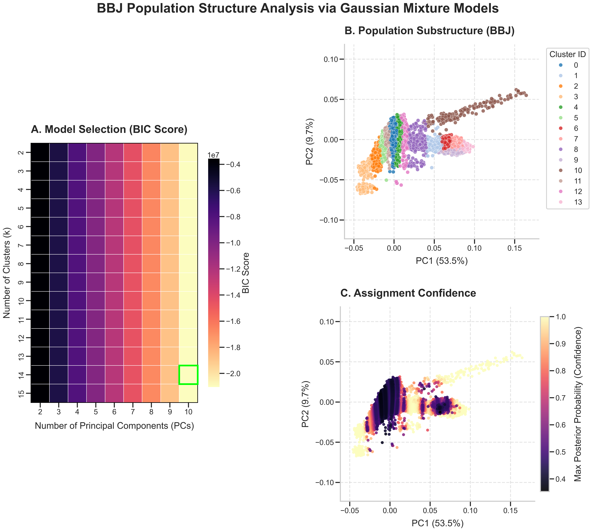
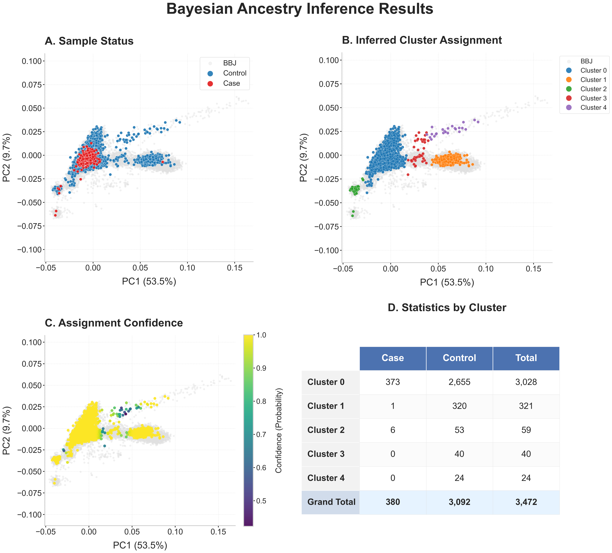
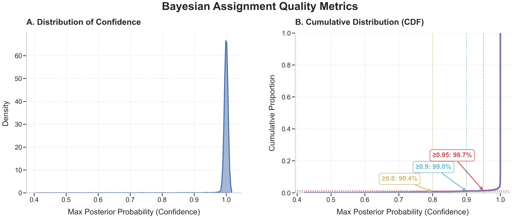
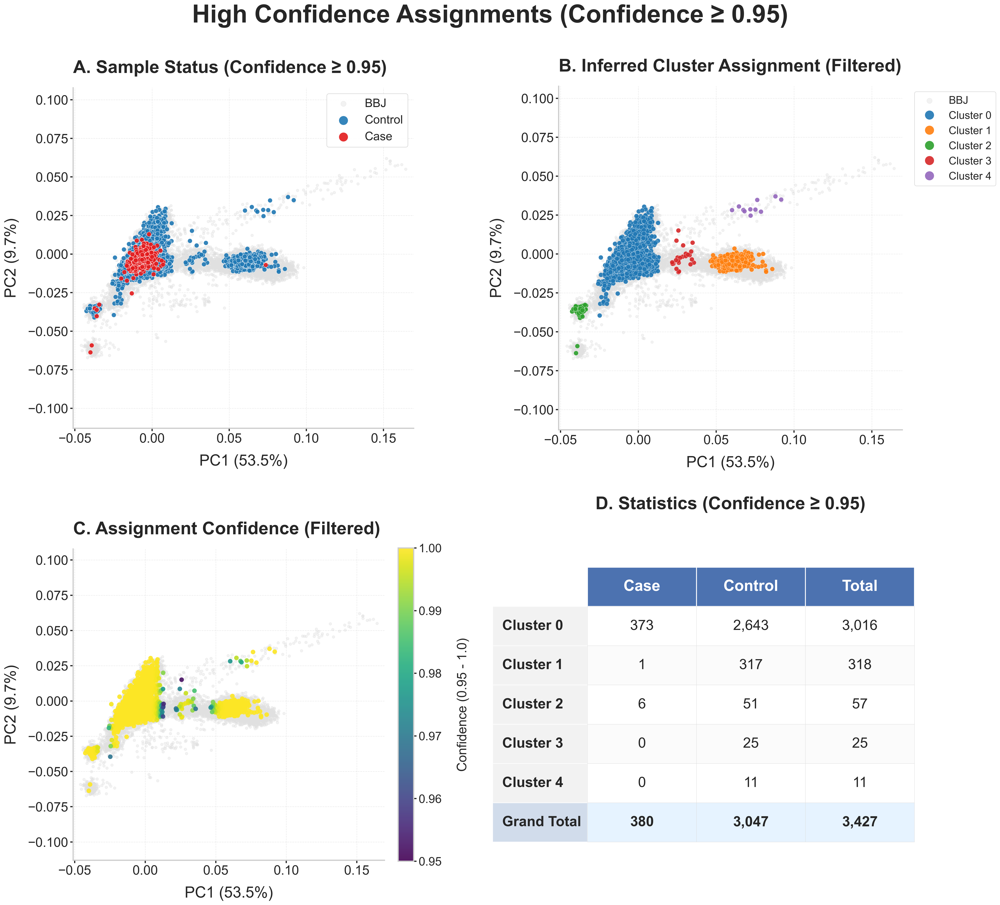
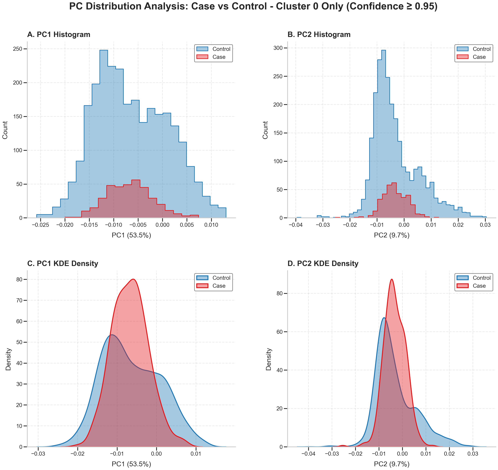

# Detailed Workflow for Fine-Scale Population Structure Correction (PCA + GMM)

## 1. Background & Problem Definition

In Genome-Wide Association Studies (GWAS) or other Case-Control studies, **Population Stratification** is a major confounding factor leading to false-positive results.

If our Case and Control groups originate from subpopulations with slightly different genetic backgrounds (e.g., although both are Japanese populations, they may come from Kanto and Kansai regions respectively, or contain different proportions of Ryukyuan ancestry), the genetic differences we discover may merely reflect **ancestry differences** rather than true **disease associations**.

### Challenges We Face
1.  **Continuous Genetic Structure**: Modern populations are often not discrete clusters but exhibit continuous gradients (Clines). Traditional hard clustering (like K-Means) may forcibly cut through continuous populations.
2.  **Admixture**: Some samples may reside in the intermediate zone between two subpopulations. Including these samples without discrimination introduces noise.
3.  **Sample Matching**: We need an objective, statistically rigorous method to precisely match Cases and Controls within the same genetic background for comparison.

---

## 2. Methodology Overview

This workflow employs **Principal Component Analysis (PCA)** for dimensionality reduction combined with **Gaussian Mixture Models (GMM)** as an unsupervised learning method, performing clustering and quality control within a feature-weighted space.

### Core Steps:
1.  **Model Construction**: Train GMM models on a clean reference population (e.g., BBJ) to automatically discover optimal subpopulation structures.
2.  **Structure Optimization**: Merge overly similar micro-subpopulations through hierarchical clustering based on genetic distance to restore the true continuous structure.
3.  **Sample Projection**: Project the target Case/Control samples into this model and calculate assignment probabilities.
4.  **Strict Quality Control**: Exclude low-confidence (admixed/ambiguous) samples, retaining only core samples for downstream analysis.

---

## 3. Detailed Process Analysis

### Step 1: Model & Feature Construction

This step aims to construct a probabilistic framework capable of accurately describing the biological structure of continuous populations. We use **Variance Explained Weighted PCA** to construct the genetic space and apply **Gaussian Mixture Models (GMM)** for probabilistic modeling to address the anisotropic distributions and admixture phenomena prevalent in genomic data.

#### 1. Rationale: Biological Adaptability

In genomic population structure analysis, the choice of GMM is based on statistical considerations of biological data characteristics (continuity, admixture, anisotropy). Compared to traditional clustering algorithms, GMM demonstrates significant advantages in handling population structure:

*   **Adaptation to Anisotropy caused by Genetic Drift**
    Population distributions in PC space often appear as elongated ellipsoids due to genetic drift. **K-Means** forces an assumption of equal-variance circles/spheres for clusters, easily mis-segmenting a single elongated population. In contrast, GMM's full covariance mode (`covariance_type='full'`) allows the model to independently learn the shape and rotation of each cluster, precisely fitting the geometric distribution of natural populations.

*   **Adaptation to Continuous Gradients (Clines)**
    Large-scale population data typically exhibit continuous genetic gradients rather than discrete islands. Density-based algorithms like **DBSCAN** rely on significant low-density gaps to distinguish clusters and fail easily in continuous gradients or sparse edge regions. GMM, based on probabilistic distribution modeling, can effectively distinguish subpopulation structures through probability density even without obvious breaks.

*   **Admixture Quantification**
    Methods like **K-Nearest Neighbors (KNN)** usually output deterministic classification results based on local majority voting, making it difficult to describe individuals at the boundaries of subpopulations. GMM provides a **Soft Clustering** framework, capable of outputting the **Posterior Probability** of each sample belonging to each ancestry. This not only aligns with the biological reality of "gene flow" but also provides a quantitative basis for subsequent sample quality control.

    **Table 1: Comparison of Characteristics of Different Clustering Algorithms in Genomic Population Structure Analysis**

    | Dimension | **GMM (Our Approach)** | **K-Means** | **DBSCAN** | **KNN (K-Nearest Neighbors)** |
    | :--- | :--- | :--- | :--- | :--- |
    | **Geometric Assumption** | **Anisotropic**<br>Allows clusters to form ellipsoids in any direction, accurately fitting natural populations affected by genetic drift. | **Isotropic**<br>Forces assumption of equal-variance circles/spheres, unable to adapt to elongated population structures. | **Arbitrary Shape (Density)**<br>Based on density connectivity, heavily relies on clear density gaps between data. | **Local Similarity**<br>No specific global shape assumption, only focuses on nearest neighbor relationships in local geometric space. |
    | **Output Nature** | **Soft Clustering**<br>Outputs posterior probability $P(C_k\|X)$, precisely quantifying uncertainty in sample assignment. | **Hard Clustering**<br>Performs "all-or-nothing" binary assignment (0 or 1), losing intermediate state information. | **Hard Clustering + Noise**<br>Distinguishes core points from noise but lacks the ability to describe "mixed/transition" states. | **Hard Discrimination**<br>Discrete classification based on neighbor voting, typically losing probabilistic information of intermediate states, difficult to quantify admixture. |
    | **Cline Adaptability** | **Optimal**<br>Effectively models the transition zones of admixture and continuous genetic gradients via probability density functions. | **Poor**<br>Voronoi tessellation artificially divides a continuous gradient population into multiple fragmented segments. | **Poor**<br>Easily fails in the "gapless, continuous sparse" distributions common in genomic data. | **Moderate**<br>While capturing local structure, it lacks a unified global probabilistic model to correct large-scale genetic gradients. |

#### 2. Feature Engineering: Constructing Genetic Feature Space

Raw PCA scores only reflect geometric projections and do not consider the biological weight of different principal components. To construct an Euclidean space approximating true genetic distance ($F_{ST}$), we applied **Relative Variance Explained Weighting** to the principal components included in the analysis before inputting them into the model.

*   **Weighting Formula**:
    We normalize the variance explained ratio of each PC included in the model so that the sum of their weights is strictly 1:
    $$ w_j = \frac{\lambda_j}{\sum_{k=1}^{N_{PCs}} \lambda_k}, \quad \text{where } \sum_{j=1}^{N_{PCs}} w_j = 1 $$
    $$ X'_{ij} = X_{ij} \times w_j $$
    This transformation ensures that the model allocates weights completely based on the relative biological contribution rate of each principal component **within the current subspace**. This processing not only accurately reflects the true structure of genetic variation but also achieves **soft down-weighting** of low-contribution PCs (which usually contain more noise) rather than arbitrary hard truncation.

#### 3. Mathematical Framework: Probabilistic Mixture Model

We define the population as a mixture composed of $K$ latent multivariate Gaussian distributions. In the principal component space subjected to **Linkage Disequilibrium (LD) Pruning** and **Relative Variance Explained Weighting**, the projection of a single homogeneous population converges to a normal distribution, consistent with the statistical assumptions of the Central Limit Theorem (CLT).

*   **Mixture Model Definition**:
    $$ P(x) = \sum_{k=1}^{K} \pi_k \mathcal{N}(x | \mu_k, \Sigma_k) $$
    Where $\pi_k$ is the mixture proportion of the $k$-th subpopulation, $\mu_k$ is the mean vector, and $\Sigma_k$ is the full covariance matrix.

*   **Code Implementation**:
    ```python
    gmm = GaussianMixture(
        n_components=n_c,       # [K]: Number of subpopulations
        covariance_type='full', # [Σ]: Allow fitting of ellipsoids in any direction
        n_init=3                # [Optimization]: Multiple initializations to ensure global optimum
    )
    ```

#### 4. Model Selection: Grid Search based on BIC

To determine the optimal number of subpopulations ($K$) and principal component dimensions ($PCs$), we use Grid Search combined with the **Bayesian Information Criterion (BIC)** for assessment.

##### 4.1 Algorithm Workflow
1.  **EM Convergence**: 
    For **each specific combination** in the parameter grid (i.e., fixed $K$ and $PCs$), we independently run the **EM Algorithm (Expectation-Maximization)**. This algorithm iteratively updates parameters $\mu, \Sigma, \pi$ until the log-likelihood function converges. This ensures each candidate model is mathematically optimal in itself.
2.  **Global Selection**: 
    After obtaining convergent models for all combinations, we compare their BIC values laterally. According to Occam's Razor principle, we finally lock the combination of $K$ and $PCs$ corresponding to the **lowest BIC** and its corresponding model as the global optimal solution.

##### 4.2 The BIC Metric
In cluster analysis, as model complexity (more PCs or more clusters) increases, the likelihood of the data ($\hat{L}$) inevitably rises, but this often leads to **Overfitting**—the model starts fitting random noise rather than true biological structure. BIC introduces an explicit penalty term to balance fit and complexity:

$$ BIC = \underbrace{-2 \ln(\hat{L})}_{\text{Model Fit (Smaller is better)}} + \underbrace{k \ln(n)}_{\text{Complexity Penalty (Larger implies more penalty)}} $$

##### 4.3 Penalty Terms
In our analysis system, the penalty term $k$ is jointly determined by two key dimensions:
1.  **Number of Clusters ($K_{clusters}$)**: Each new subpopulation requires additional parameters to describe its mean ($\mu$) and covariance ($\Sigma$).
2.  **Number of Included PCs ($N_{PCs}$)**: The higher the dimension of data, the more complex the covariance matrix (parameter count grows quadratically).

**Therefore, BIC essentially seeks a “Sweet Spot”:** It uses enough PCs and subpopulations to explain data variation while absolutely avoiding overfitting caused by dimension abuse or excessive subpopulation splitting.

##### 4.4 Advantages
In large-sample genomic scenarios, using BIC offers unique advantages:
*   **Severe Complexity Penalty**: Compared to AIC, BIC imposes stronger penalties on complexity, tending to suppress unnecessary parameters and prioritizing **“Parsimonious”** models.
*   **Suppression of False Positive Subpopulations**: The strong penalty characteristic of BIC effectively prevents incorrectly splitting a continuous population into countless trivial micro-clusters, ensuring that the defined subpopulations have robust and interpretable biological significance.

We ultimately select the model with the **lowest BIC value**, achieving the best balance between fitting accuracy and model parsimony.



**Figure 1: Model Selection and Assessment**

*   **A) BIC Heatmap**: Shows model goodness under different combinations of PC counts (X-axis) and subpopulation numbers K (Y-axis). Darker colors indicate lower BIC (better model); the green box marks the global optimal parameters.
*   **B) Subpopulation Structure**: Clustering distribution of the BBJ reference population under the optimal model.
*   **C) Assignment Confidence**: Maximum posterior probability distribution of samples. Highlighted areas (yellow) represent core samples with clear genetic backgrounds, while dark areas (purple) clearly visualize the genetic admixture transition zones between subpopulations.

---

### Step 2: Structure Optimization (Post-hoc Cluster Merging)

GMM fits data distributions by linearly combining multiple Gaussian distributions. Facing the ubiquitous **Continuous Genetic Gradients (Clines)** in genomic data (Novembre & Stephens, 2008), to achieve statistical optimal fit, the model often divides a continuous biological population into multiple adjacent mathematical components. This step aims to merge these components based on genetic distance to restore their true biological structure.

#### 1. Rationale: Over-segmentation driven by Likelihood Maximization
When a population presents a continuous gradient distribution (Clines), GMM's solution algorithm (**EM Algorithm**), in its pursuit of mathematical **Likelihood Maximization**, often produces "over-segmentation".

*   **Fitting Bias**: GMM uses **Ellipsoids (Gaussian components)** as basic units. To maximize fitting accuracy for continuous gradient data (i.e., increase Likelihood), the model tends to use multiple end-to-end ellipsoids for segmented splicing rather than covering vaguely with a single broad ellipsoid.
*   **Over-segmentation**: Although this "splicing strategy" is statistically optimal (BIC determines that the fitting gain from adding components exceeds the complexity penalty), the number of selected subpopulations is often greater than the biologically true number of subpopulations.
*   **Restoration Strategy**: These statistically independent components often belong to the same continuous genetic source biologically. We need to identify and merge these adjacent components split solely due to "mathematical fitting needs" by calculating genetic distances between components.

#### 2. Genetic Distance Metric: Based on Relative Variance Weights
To quantify the similarity between components, we calculate the **Geometric Centroid** of each Gaussian component and measure their Euclidean distance in the weighted feature space constructed previously.

*   **Centroid Calculation**:
    Based on preliminary GMM clustering results (Hard Assignments), we calculate the arithmetic mean of all samples classified into the $k$-th cluster in the **Variance Explained Weighted Feature Space** (i.e., $X'_{ij}$):
    $$ \mu_k = \frac{1}{N_k} \sum_{i \in \text{Cluster}_k} x'_i $$
    This step locks the core position of each subpopulation in the genetic space.

*   **Distance Calculation**:
    Since the centroid coordinates $\mu'_k$ were already obtained in the **previous step (Centroid Calculation)** (the coordinate values have been scaled by $w_j$), we directly calculate the **Standard Euclidean Distance**:
    $$ D(C_a, C_b) = || \mu'_a - \mu'_b ||_2 = \sqrt{\sum_{j=1}^{N_{PCs}} (\mu'_{aj} - \mu'_{bj})^2} $$
    **Note**: We **do not re-weight** in this formula. Because the coordinate scale of the feature space already implicitly contains weight information, the "Standard Euclidean Distance in Weighted Space" is mathematically strictly equivalent to the "Weighted Euclidean Distance in Original PC Space". This distance effectively shields noise from low-variation dimensions and accurately reflects the main genetic differentiation level between populations (approximating $F_{ST}$).

#### 3. Merging & Thresholding
This process can be intuitively visualized via a **Dendrogram** (as shown in Figure 2C):

1.  **Dendrogram Construction (Hierarchical Clustering)**: 
    We construct a lineage tree using the **Hierarchical Clustering** algorithm based on the distance matrix between subpopulation centroids. The height of the connecting lines in the tree directly represents the genetic distance between two components.

2.  **Rationality of Threshold Selection (0.009)**:
    We adopt **0.009** as the cutoff threshold (red dashed line in the figure). This choice references the study published in *Nature Communications* by **Yamamoto et al. (2024)**, where this threshold was proven to best visually restore the fine structure of the BBJ population:
    *   **Reference**: *Yamamoto, K., Namba, S., et al. (2024). Genetic legacy of ancient hunter-gatherer Jomon in Japanese populations.*
    *   **Distance < 0.009**: Regarded as **"Continuous Gradient" (Clines)**. Such a minute distance implies that two components belong to the same continuous biological population and were split only due to fitting needs.
    *   **Distance > 0.009**: Regarded as **"True Differentiation"**. Represents significant genetic or geographic barriers, should be treated as independent subpopulations.
3.  **Merging Execution**: Branches connected below the red dashed line are merged into an independent biological **"Super Cluster" (Merged Cluster)**.

**Probability Update after Merging**:
For sample $x$ belonging to "Super Cluster" $M$, its final assignment probability is the scalar sum of the posterior probabilities of all sub-components contained in that super cluster:
$$ P(M|x) = \sum_{k \in M} P(k|x) $$
This step is crucial for accurately assessing samples at the edges of gradients.


**Figure 2: GMM Cluster Merging and Structure Optimization Process**

*   **A) Initial Components**: Fine subpopulation structure initially identified by GMM. White centroid points show how the model uses multiple Gaussian ellipsoids to fit continuous genetic gradients.
*   **B) Distance Matrix**: Weighted Euclidean genetic distance heatmap between subpopulation centroids. Light areas reveal adjacent subpopulations with extremely similar genetic backgrounds.
*   **C) Dendrogram**: Lineage tree constructed based on genetic distance. The red dashed line (threshold=0.009) defines the boundary for merging mathematical components into biological "Super Clusters".
*   **D) Final Structure**: Independent subpopulation distribution after merging, eliminating over-segmentation caused by maximum likelihood estimation.
*   **E) Merged Confidence**: Posterior probability distribution of samples belonging to the final "Super Cluster". Dark (low confidence) areas clearly depict genetic transition zones between subpopulations.

---

### Step 3: Probabilistic Assignment of Case and Control

Using model parameters trained on the clean reference population, we project target samples (Case and Control) onto the same genetic feature space and calculate their quantified assignment probabilities. This step is not just classification, but a precise measurement of the purity of the sample's genetic background.

#### 1. Strategy: Soft Clustering via Posterior Probabilities
To overcome the limitations of traditional Hard Clustering (e.g., K-Means) in dealing with continuous gradient populations, we adopt a **Soft Assignment** strategy.

*   **Uncertainty Quantification**: 
    The model no longer outputs a single classification label but provides a probability distribution vector for each sample (e.g., $P \in \mathbb{R}^K$). This representation (e.g., "98% belongs to Cluster A, 2% belongs to Cluster B") preserves rich details of the sample's genetic background.
*   **Admixture Identification**: 
    Through probability vectors, we can intuitively identify samples located at the boundaries of subpopulations. For example, a sample with $P(A)=0.55, P(B)=0.45$ would be arbitrarily assigned to Class A in hard clustering, but in our model, it will be flagged as a "high-risk admixed sample" and scrutinized in subsequent quality control.

#### 2. Mechanism: Homogeneous Projection
To ensure strict comparability between Case/Control samples and the reference population in geometric space, we adopt the **Projection PCA** strategy, i.e., the "Fixed Coordinate System" method.

*   **Projection via Linear Combination**: 
    We use **SNP Weights/Loadings** and **Allele Frequencies** calculated on the clean reference population (BBJ) to "passively project" study samples into the established PC space via the `plink2 --score ... read-freq` command. This process guarantees absolute freezing and consistency of coordinate axis directions.
*   **Consistency of Feature Weighting**:
    After projection, we **strictly follow the relative variance explained weights of the BBJ reference system** (calculated based on eigenvalues) to weight the PC scores of Case/Control samples. This ensures that new samples and training data are within the same **Weighted Feature Space**, meeting the mathematical premise of GMM likelihood calculation based on Euclidean distance.
*   **Geometric Stability**: 
    This strategy effectively avoids disturbing the stability of the baseline coordinate system due to structural biases in the Case/Control samples themselves, ensuring objectivity in location inference.

#### 3. Inference & Aggregation
Once a sample enters the unified weighted feature space ($x_{new}$), we perform statistical inference using trained GMM parameters.

*   **Bayesian Posterior Probability Calculation**: 
    Based on GMM parameter sets (mean $\mu$, covariance $\Sigma$, mixture weight $\pi$), calculate the posterior probability of a sample belonging to the $k$-th Gaussian component:
    $$ P(z_k=1 | x_{new}) = \frac{\pi_k \mathcal{N}(x_{new} | \mu_k, \Sigma_k)}{\sum_{j=1}^{K} \pi_j \mathcal{N}(x_{new} | \mu_j, \Sigma_j)} $$

*   **Probability Aggregation for Super Clusters**: 
    Corresponding to the structure optimization in **Step 2**, if the sub-component set $\{c_i\}_{i \in M}$ has been merged into biological super cluster $M$, the probability of the sample belonging to $M$ is the **scalar sum** of probabilities of sub-components:
    $$ P(M | x) = \sum_{i \in M} P(c_i | x) $$
    The sum of the final output probability distribution vector is strictly 1, forming the quantitative basis for subsequent quality control.



**Figure 3: Probabilistic Inference and Clustering of Case and Control Samples**

*   **A) Sample Distribution**: Shows projection of Case (Red dots) and Control (Blue dots) on reference population background (BBJ, Gray).
*   **B) Clustering Inference**: Shows final merged subpopulation (Cluster ID) assigned to each sample.
*   **C) Assignment Confidence**: Shows certainty of each sample's assignment. Highlighted yellow areas represent core samples, dark purple areas represent ambiguous samples at subpopulation boundaries.
*   **D) Statistics Table**: Detailed counts of Case and Control samples in each subpopulation, serving as the basis for subsequent matching.

---

### Step 4: Confidence-Based Quality Control

After obtaining probabilistic assignment for each sample, we implement strict quality control. This step aims to construct a "Core Cohort" with highly homogeneous genetic backgrounds via quantitative screening, thereby maximizing statistical noise reduction from population stratification.

#### 1. Rationale: Purity over Quantity
In Case-Control studies, including samples with admixed or ambiguous genetic backgrounds often does more harm than good.
*   **Noise Suppression**: Samples at subpopulation boundaries often carry complex genetic structures; retaining them significantly increases false-positive risks.
*   **Core Definition**: We focus only on individuals that can be statistically classified into a specific subpopulation with high confidence, defining them as "Core Samples".

#### 2. Mechanism: Bayesian Confidence Thresholding
Based on Bayesian posterior probabilities, we introduce a strict discrimination threshold (typically set at $\tau = 0.95$).

*   **Inclusion Criteria**:
    A sample is included in subsequent analysis only when its probability of belonging to a specific biological subpopulation exceeds the threshold:
    $$ \max_{M} P(M | x) \ge 0.95 $$
    This means the model excludes all reasonable competing hypotheses and has high certainty about the sample's assignment.

*   **Exclusion Strategy**:
    Any sample with a maximum posterior probability below the threshold is considered an **"Ambiguous/Admixed Sample"**. These samples are geometrically usually located in overlap or transition regions of different subpopulations in PC space (dark purple dots in Figure 3) and will be removed from the final association analysis cohort.

#### 3. Outcome Assessment
This screening mechanism acts as an efficient "digital sieve", achieving physical purification of population structure.



**Figure 4: Histogram of Sample Assignment Confidence**

Most retained samples should be in the high-confidence interval on the right ($P \approx 1.0$), indicating strong explanatory power of the model on data. The long tail on the left represents excluded low-quality or admixed samples.



**Figure 5: High-Confidence (P > 0.95) Core Sample Set**

Comparing to Figure 3, the samples in the **"Ambiguous Zone"** with darker colors (low confidence) at subpopulation boundaries have been precisely eliminated. The remaining samples (highlighted regions) form dense clusters separated with clear boundaries, constituting a solid foundation for subsequent genetic association analysis.

---

## 4. Final Validation & Statistical Assessment

After the strict process above, we select specific subpopulations (e.g., Cluster 0) and compare the retained Case and Control samples within. We need to validate from two dimensions: **Central Tendency** and **Distribution Shape**.

### 1. Rationale: Exclusion of Stratification Bias
Successful matching does not require every data point of two groups to overlap, but requires the **Centroids** of two groups in genetic space to be highly consistent.
*   **Systematic Bias**: If there is a significant difference in the means of Case and Control, it indicates uncorrected population stratification, which will lead to GWAS result inflation.
*   **Variance Difference**: The Control group sample size is usually much larger than the Case group, so covering wider genetic diversity is expected.

### 2. Mechanism: Statistical Metrics
We employ a three-dimensional testing system to assess matching quality:
*   **Welch's t-test (Mean Test)**: 
    *   **Focus**: Whether the central positions of two groups are consistent.
    *   **Expected Result**: $P > 0.05$ (No significant difference). This is the **Core Gold Standard** for judging successful correction.
*   **Mann-Whitney U Test (Rank Sum Test)**:
    *   **Focus**: Whether there is a systematic deviation in the rank distribution of two groups.
    *   **Interpretation**: As a non-parametric test, it does not rely on normality assumptions. When inconsistent with T-test results (e.g., T-test not significant but U-test significant), it usually hints at significant difference in **Spread/Variance** between two groups.
*   **Kolmogorov-Smirnov Test (Distribution Test)**:
    *   **Focus**: Whether the overall probability distribution shape (including skewness, kurtosis, tails) is consistent.
    *   **Interpretation**: Given unbalanced sample sizes ($N_{control} \gg N_{case}$), this test is often significant ($P < 0.05$), reflecting broader genetic variance in the Control group, but this does not necessarily mean stratification correction failure.

### 3. Outcome Assessment
Based on statistical results from real data (Cluster 0), we obtained the following detailed test report:

```text
>>> STATISTICAL TESTING (Case vs Control - Cluster 0)

--- PC1 Analysis ---
  Welch's t-test (Mean):      t=-1.2397, p=2.1554e-01
  Mann-Whitney U (Rank Sum):  p=8.6196e-01
  Kolmogorov-Smirnov (Dist):  D=0.1616, p=6.3720e-08
  Result: Not Significant (at alpha=0.05)

--- PC2 Analysis ---
  Welch's t-test (Mean):      t=-0.6983, p=4.8521e-01
  Mann-Whitney U (Rank Sum):  p=2.6462e-04
  Kolmogorov-Smirnov (Dist):  D=0.2079, p=7.2890e-13
  Result: ** SIGNIFICANT ** (at alpha=0.05)
```

As seen from the data above, the results of the three-dimensional tests show clear hierarchical characteristics:

*   **Mean Stability - PASS**:
    Welch's T-test $p$-values for PC1 and PC2 are **0.21** and **0.48** respectively, both far exceeding the significance threshold of 0.05.
    $$ \mu_{case} \approx \mu_{control} $$
    This provides the most critical evidence: **The genetic background centers of both groups overlap completely**, with no systematic mean position shift leading to GWAS inflation.

*   **Rank & Dispersion - MIXED**:
    Mann-Whitney U test is not statistically significant on PC1 ($p=0.86$) but significant on PC2 ($p < 0.001$). Since this non-parametric test is sensitive to both "location" and "shape" of distribution, given that the T-test has confirmed no difference in "position (mean)", the significance in PC2 is mainly driven by the **significantly larger variance in the Control group** (Std: 0.0086 vs 0.0046). This reflects that the Control group retains richer internal genetic diversity than the Case group.

*   **Distribution Shape - EXPECTED**:
    KS Test is extremely significant ($p < 10^{-7}$), which is expected. The huge sample size of the Control group makes it inevitably cover a broader genetic spectrum (longer tails). As shown in **Figure 6**, the **peaks of the Control group (blue) and Case group (red) overlap completely**, the difference lying only in the width of the blue curve's base. This "concentric but different width" pattern does not affect association analyses dominated by additive effects.



**Figure 6: PC Distribution Comparison of Case (Red) vs Control (Blue) within Cluster 0**

*   **Histogram**: Displays sample count distribution. It is visible that Control (Blue) covers a wider X-axis range while possessing the same peak center as Case (Red).
*   **Conclusion**: The **peaks of red and blue curves align completely**, proving that the main population structure has been perfectly corrected.

---

## 5. Downstream Analysis Strategies

Given that final verification shows Case and Control are highly consistent in core genetic background (mean) but still show certain differences in distribution width (variance), to ensure the robustness of association analysis, we propose three complementary processing strategies:

### Strategy 1: Cohort Composition
*   **Core Logic**: **Keep all Cases, precisely match Controls**.
*   **Operational Suggestion**: Given the value of Case samples, it is recommended to retain all Case samples that pass GMM quality control. For the Control group, one can either directly use all samples passing quality control (maximizing statistical power) or calculate Mahalanobis Distance of samples to the Cluster center for stricter 1:N matching to eliminate uneven variance effects.

### Strategy 2: Random Effect Modeling
*   **Applicable Scenario**: Addressing fine-scale structures potentially remaining within clusters that cannot be captured by PCs.
*   **Operational Suggestion**: Adopt **Generalized Linear Mixed Models (GLMM)** (e.g., SAIGE or REGENIE).
*   **Mechanism**: Construct a Genetic Relationship Matrix (GRM) using whole-genome data and include it as a **Random Effect** in the model. This effectively simulates kinship between individuals within clusters and absorbs potential noise caused by larger variance in the Control group.

### Strategy 3: Fixed Effect Adjustment
*   **Applicable Scenario**: Standard Logistic Regression (GLM) analysis.
*   **Operational Suggestion**: Include principal PCs as **Fixed Effects** covariates in the regression equation.
*   **Mechanism**: $Logit(P) = \beta_0 + \beta_{SNP} G + \sum \beta_i PC_i + \epsilon$. Since GMM has ensured the Combined Support of Case/Control in PC space, regressing PCs on this basis can most effectively eliminate residual linear gradient confounding.

---

## 6. Summary & Workflow Diagram

This workflow effectively solves the sample matching problem in complex population structures via a rigorous algorithmic path of **PCA Dimensionality Reduction -> GMM Soft Clustering -> Distance Merging -> Probability QC**, laying a solid foundation for high-quality genomic research.

Below is the visualized summary of this analysis workflow:


